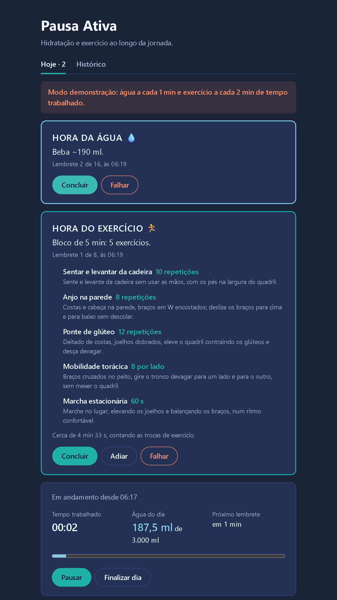
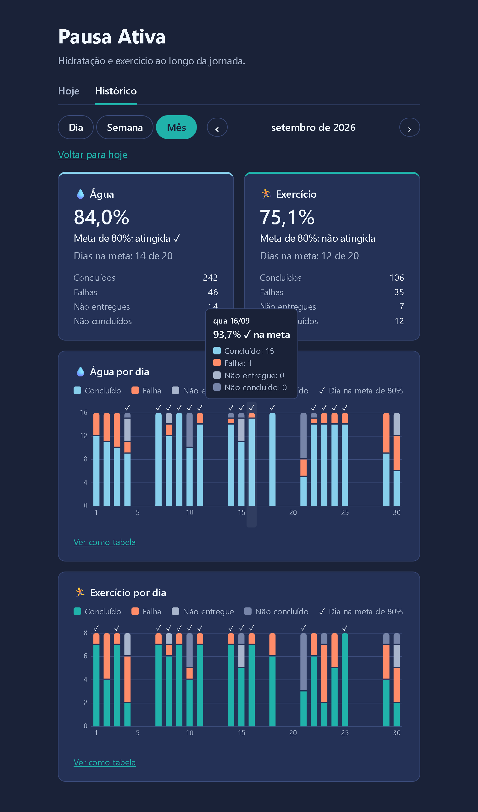

# Pausa Ativa

Aplicação web que roda no seu computador e distribui hidratação e exercício curto ao longo da jornada de home office.

> **Versão atual: v0.5.0 (métricas e backup).** Você inicia o dia, e a cada 30 min de trabalho o Chrome lembra de beber água. A cada hora, propõe um bloco curto de exercícios, montado para o seu perfil físico. A aba Histórico mostra a taxa de sucesso por dia, semana e mês, com gráficos. Um painel do Grafana acompanha os lembretes e a saúde da aplicação, e um comando faz o backup do banco. Veja o [plano completo](docs/epico-pausa-ativa.md) e [o que mudou](docs/releases/v0.5.0.md).

<table>
  <tr>
    <td width="50%"></td>
    <td width="50%"></td>
  </tr>
</table>

A [apresentação](docs/apresentacao.md) mostra a jornada de um dia, tela por tela, do perfil físico ao painel de métricas.

## O que você precisa

- **Docker Desktop** instalado e **aberto**. No Linux, Docker Engine com o plugin Compose v2.
- **Git**, para baixar o projeto.
- **Google Chrome**, o único navegador testado.

Não é preciso instalar Java, Node nem banco de dados: tudo roda dentro do Docker.

## Subir a aplicação

Os comandos funcionam no PowerShell, no Git Bash, no Linux e no macOS.

**1. Baixe o projeto**

```sh
git clone https://github.com/lincolnnaraujo/pausa-ativa.git
cd pausa-ativa
```

**2. Crie o arquivo de configuração**

```sh
cp .env.example .env
```

Abra o `.env` e troque `troque-esta-senha` por uma senha sua. Esse arquivo não vai para o git.

**3. Suba tudo**

```sh
docker compose up -d --wait
```

Na primeira vez leva alguns minutos, porque o Docker baixa e monta as imagens. O comando só termina quando tudo estiver pronto.

**Pronto.** Abra **http://127.0.0.1:38742** no Chrome. O painel de métricas fica em **http://127.0.0.1:38744** (veja [Painel de métricas](#painel-de-métricas)).

## Como usar

1. **Na primeira vez, preencha o perfil físico.** São quatro perguntas: articulações a poupar (joelho, ombro, punho, lombar, cervical), nível (iniciante ou intermediário), equipamentos que você tem (apoio de flexão, halteres de 2 kg) e se pode fazer exercícios no chão. Cadeira e mesa já contam como disponíveis. Sem o perfil, o dia não começa.
2. **Comece o dia.** Confira a meta de água (padrão 3.000 ml), escolha blocos de exercício de **5 min** (padrão) ou **10 min** e clique em **Iniciar dia**. O Chrome pergunta se pode mostrar notificações: clique em **Permitir**.
3. **Deixe a aba aberta.** Pode ficar em segundo plano, mas não feche: é por ela que os lembretes chegam.
4. **A cada 30 min de trabalho**, chega um lembrete para beber ~190 ml de água (a meta dividida em 16), como notificação do Chrome e com um som curto. Nos lembretes da meia hora (0:30, 1:30…), aproveite para levantar e buscar a água.
5. **A cada hora de trabalho**, chega também um bloco de exercícios: a lista, com quantidade e uma linha de como fazer cada um. Na hora cheia, água e exercício vêm numa notificação só, e a página mostra os dois cartões, cada um com os seus botões.
6. **Responda na página.** Clicar na notificação traz a aba para a frente. Lá, clique em **Concluir** se fez, em **Falhar** se não deu, ou, no exercício, em **Adiar** (veja abaixo).
7. **No almoço, clique em Pausar.** O tempo trabalhado para, e os lembretes esperam. Na volta, clique em **Retomar**.
8. **No fim do expediente, clique em Finalizar dia** e confirme. A tela mostra o resumo do dia, por categoria, com a taxa de sucesso e a meta de 80%.
9. **Veja como foram os dias na aba Histórico** (abaixo).

**Adiar um bloco de exercício.** O bloco adiado passa para a hora seguinte, e o bloco seguinte vem com 10 min para compensar. Concluir esse bloco conta como concluídos os dois; marcar falha conta os dois como falha. Só dá para adiar uma vez seguida, e o último bloco do dia não pode ser adiado: nesses casos, o botão não aparece.

O que acontece com cada lembrete:

| Situação | Quando |
|---|---|
| **Concluído** | Você clicou em Concluir. Na água, entra na água do dia. |
| **Falha** | Você clicou em Falhar, ou o lembrete chegou e ficou sem resposta até o seguinte. |
| **Adiado** | Você adiou o bloco de exercício. Ele fica com a situação do bloco seguinte. |
| **Não entregue** | O lembrete não chegou: a aba estava fechada ou o servidor estava fora. Não conta contra você. |
| **Não concluído** | O dia foi finalizado antes da hora do lembrete. |

**Corrigir um lembrete de hoje.** Clicou em Concluir sem querer, ou fez e marcou falha? Na lista **Lembretes do dia**, clique em **Corrigir** ao lado da situação e confirme na própria linha. O lembrete fica marcado "editado". Vale até a meia-noite do dia, mesmo com o dia finalizado, e só entre Concluído e Falha. Num bloco adiado, a correção vale para os dois blocos.

- **Uma jornada por dia.** Depois de finalizar, o próximo dia começa amanhã.
- **Esqueceu o dia aberto?** A aplicação encerra sozinha a jornada que ficou de um dia para o outro, e a tela volta a mostrar **Iniciar dia**.
- **Mudar o perfil:** **Editar perfil**, na tela de início, ou **Editar perfil físico**, no rodapé durante o dia. A mudança vale para os próximos blocos; os que já saíram não mudam.
- **Som:** a caixa **Tocar um som nos lembretes**, no rodapé, liga e desliga. A escolha fica salva no navegador.

> Este app não substitui orientação médica. Os exercícios e as quantidades são pontos de partida.

### Histórico e gráficos

A aba **Histórico**, no topo, mostra como foram os dias. A aba **Hoje** continua funcionando por baixo: os lembretes chegam do mesmo jeito, e a aba mostra "Hoje · 1" quando um espera resposta.

- **Escolha o período:** **Dia**, **Semana** (segunda a domingo) ou **Mês**, e ande com **‹** e **›**. **Voltar para hoje** traz o período de hoje.
- **Taxa de sucesso:** concluídos ÷ (concluídos + falhas), separada para a água e para o exercício. Não entregue e não concluído ficam fora da conta, e um dia sem jornada não conta como falha. A **meta** é chegar a 80%. Na semana e no mês, "Dias na meta: 3 de 4" diz em quantos dias você chegou lá.
- **Gráficos:** uma coluna por dia, com as situações empilhadas, e um ✓ nos dias na meta. Passe o mouse (ou use o Tab) numa coluna para ver os números, e clique para abrir o dia. **Ver como tabela** mostra os mesmos números.
- **O dia:** a água, o horário de cada lembrete e, clicando num exercício, o bloco que foi proposto.

### Modo demonstração

Para ver o dia inteiro em 16 min, com um lembrete de água por minuto e um bloco de exercício a cada 2 min, sem mexer na aplicação de uso diário. Na primeira subida, a demonstração também cria 45 dias de histórico de exemplo, para o Histórico ter o que mostrar:

```sh
docker compose -f docker-compose.yml -f docker-compose.demo.yml up -d --build --wait
```

Abra **http://127.0.0.1:38743**, e o painel de métricas em **http://127.0.0.1:38745**. A demonstração tem banco próprio, e o histórico de exemplo só é criado com o banco vazio de dias anteriores. O painel começa vazio e enche com o dia ao vivo: o histórico de exemplo não passa pelas métricas. Para apagá-lo ao terminar (e ter o histórico de exemplo de novo na próxima subida):

```sh
docker compose -f docker-compose.yml -f docker-compose.demo.yml down -v
```

O backup e a restauração também funcionam na demonstração, com `-f docker-compose.yml -f docker-compose.demo.yml` antes do `run`.

## Painel de métricas

Abra **http://127.0.0.1:38744** no Chrome. O painel **Pausa Ativa** abre direto, sem login, no intervalo "hoje". O seletor de tempo, no alto, troca para a semana ou o mês.

- **Lembretes:** água e exercício por situação, em barras por hora; quantos lembretes foram disparados, adiados e corrigidos; o atraso do disparo (o épico pede até 5 s); e quantas abas da aplicação estão abertas. Sem nenhuma aberta, os lembretes viram "não entregue".
- **Aplicação:** se o backend está no ar, o tempo de cada operação da API (limite de 200 ms) e da consulta do histórico (limite de 500 ms), a memória da JVM, a CPU, as pausas do GC, os erros da API e as conexões do banco.

A taxa de sucesso oficial é a da aba **Histórico**. O painel conta a resposta original: um lembrete corrigido de concluído para falha continua concluído nas barras, e a correção aparece em "Respostas corrigidas". Os números recomeçam a cada subida do backend, mas o Prometheus soma os trechos. As métricas ficam guardadas por 90 dias ou até 1 GB.

O painel é só para leitura. Para mudá-lo, edite `observabilidade/grafana/paineis/pausa-ativa.json`: o Grafana relê o arquivo em até 30 s. Nada sai para a internet, e a aplicação não depende do painel: com o Grafana ou o Prometheus parado, ela segue igual.

## Backup e restauração

**Fazer um backup:**

```sh
docker compose run --rm backup
```

O backup vai para a pasta `backups`, com a data e a hora no nome, por exemplo `pausa-ativa-2026-10-08-055151.dump`, e a tela diz quantas jornadas ele tem. A aplicação precisa estar no ar. **Faça um por semana** e guarde uma cópia fora do computador: um backup no mesmo disco não protege contra a perda do disco. Para gravar em outra pasta, por exemplo uma sincronizada com a nuvem, mude `BACKUP_DIR` no `.env`.

**Restaurar um backup** (substitui todos os dados atuais):

```sh
docker compose stop backend
docker compose run --rm restauracao pausa-ativa-2026-10-08-055151.dump
docker compose up -d --wait
```

A restauração pede para digitar `RESTAURAR`. Antes de trocar os dados, ela guarda o banco atual em `backups/antes-da-restauracao-<data>.dump`, para o caso de você se arrepender. Ou volta tudo, ou nada muda. Sem o nome do arquivo, ela lista os backups da pasta. Um backup de uma versão anterior é atualizado sozinho na subida.

**Restaurar num computador novo** (ou depois de um `down -v`): suba só o banco, restaure e suba o resto. Assim nada escreve no banco vazio antes da restauração.

```sh
docker compose up -d --wait postgres
docker compose run --rm restauracao pausa-ativa-2026-10-08-055151.dump
docker compose up -d --wait
```

No Linux, crie a pasta antes do primeiro backup (`mkdir backups`): se ela não existir, o Docker a cria como `root`, e você não consegue apagar os arquivos sem `sudo`.

## Conferir se está funcionando

A página mostra as abas **Hoje** e **Histórico**; em Hoje, o perfil físico (na primeira vez), **Iniciar dia** ou a jornada em andamento e, no rodapé, **Conectado ao servidor**, com a versão.

Se quiser conferir pelo terminal:

```sh
docker compose ps
```

Os cinco serviços (`postgres`, `backend`, `frontend`, `prometheus` e `grafana`) devem aparecer como `healthy`. O `backup` e a `restauracao` só aparecem enquanto rodam.

## Parar e voltar

| Quero… | Comando |
|---|---|
| Parar, mantendo os dados | `docker compose down` |
| Subir de novo | `docker compose up -d --wait` |
| Atualizar para uma versão nova | `git pull` e depois `docker compose up -d --build --wait` |
| **Apagar todos os dados** (não tem volta) | `docker compose down -v` |

A aplicação volta sozinha quando o Docker Desktop abre, por exemplo depois de reiniciar o computador.

**Vindo da v0.4.0?** Os dados continuam, e o `.env` antigo vale sem mudança: as novidades têm valores padrão (`GRAFANA_PORT=38744` e `BACKUP_DIR=./backups`). Depois do `up`, a stack tem dois serviços a mais, o Prometheus e o Grafana, e usa uns 350 MB a mais de memória. O painel começa a contar a partir da atualização.

**Vindo da v0.3.0?** Os dados continuam, e os dias anteriores já aparecem no Histórico.

**Vindo da v0.2.0?** Os dados continuam. Na primeira vez, a tela pede o perfil físico. Uma jornada que estava aberta na atualização continua só com água até o fim do dia; os blocos de exercício começam no próximo dia. No Histórico, os dias da v0.2.0 mostram o exercício como "sem dados".

## Se algo der errado

**`required variable POSTGRES_... is missing a value`**
Falta o arquivo `.env`. Faça o passo 2.

**`failed to connect to the docker API` ou `Cannot connect to the Docker daemon`**
O Docker Desktop está fechado. Abra-o, espere ele terminar de iniciar e repita o passo 3.

**`port is already allocated`, `address already in use` ou `forbidden by its access permissions` ao subir**
Outro programa usa a porta 38742 (ou a 38744, do painel). No `.env`, troque `FRONTEND_PORT` (ou `GRAFANA_PORT`) por outra porta **abaixo de 49152** (no Windows, as portas acima disso podem estar reservadas pelo sistema) e repita o passo 3. O endereço passa a ser `http://127.0.0.1:<nova porta>`.

**O backup diz "O banco não respondeu"**
O banco está parado. Suba a aplicação com `docker compose up -d --wait` e repita. Nenhum arquivo fica para trás.

**A restauração diz "O backend está conectado ao banco"**
Pare o backend com `docker compose stop backend` e repita. Depois da restauração, suba tudo com `docker compose up -d --wait`.

**A restauração diz "Restauração cancelada: nada mudou"**
A resposta não foi `RESTAURAR`. Em scripts, sem ninguém para digitar, use `--sim` depois do nome do arquivo.

**O painel mostra o backend "Fora do ar" ou fica sem dados**
O backend está parado ou ainda subindo: veja `docker compose ps`. Depois que ele volta, o painel se atualiza em até 30 s.

**A página mostra "Reconectando…" ou "Não foi possível carregar a jornada"**
O servidor ainda está iniciando ou parou. Veja o estado com `docker compose ps` e os erros com `docker compose logs backend`. Quando o servidor volta, a página se reconecta sozinha.

**As notificações não aparecem**
- Se a página mostra o aviso **As notificações estão bloqueadas**, siga o que ele diz: clique no ícone à esquerda do endereço, ative **Notificações** e, se o aviso continuar, recarregue a página.
- No Windows, confira em **Configurações > Sistema > Notificações** que o Google Chrome está ativado e que o **Não perturbe** está desligado. No macOS, em **Ajustes do Sistema > Notificações > Google Chrome**.
- Mesmo sem notificação, o lembrete aparece na página enquanto a aba estiver aberta.

**O som não toca**
Depois de recarregar a página, o Chrome só libera o som depois de um clique. A página avisa, e basta clicar em qualquer lugar dela. Confira também se a caixa **Tocar um som nos lembretes** está marcada.

**Não aparece "Iniciar dia"**
Se a tela mostra **Seu perfil físico**, preencha e salve: sem o perfil, o dia não começa. Se mostra o resumo, já houve uma jornada hoje, e é uma por dia.

**O botão Adiar não aparece**
O bloco já compensa um adiado (só dá para adiar uma vez seguida) ou é o último do dia. Conclua ou marque falha.

**O botão Corrigir não aparece**
Só se corrige um lembrete de hoje que está **Concluído** ou com **Falha**, e só na aba Hoje: a lista do Histórico é só para leitura. Não entregue e não concluído não se corrigem, e depois da meia-noite o dia anterior fica como está.

**O Histórico diz que um dia "ainda não chegou"**
A tela usa o relógio do computador para saber que dia é hoje. Confira se a data e a hora do computador estão certas e recarregue a página.

**Mudei o perfil e o bloco na tela não mudou**
O bloco é montado na hora em que chega e não muda depois. O perfil novo vale a partir do próximo bloco.

**Troquei a senha do `.env` (ou baixei o projeto de novo) e o `backend` não sobe**
O banco guarda a senha usada na **primeira** subida e ignora mudanças depois disso. Volte a senha antiga no `.env` ou, se puder perder os dados, apague o banco com `docker compose down -v` e suba de novo.

## Documentação

| Documento | Conteúdo |
|---|---|
| [Apresentação](docs/apresentacao.md) | A jornada de um dia em capturas de tela, para conhecer ou apresentar a aplicação |
| [Épico](docs/epico-pausa-ativa.md) | Objetivo, regras de negócio, histórias e critérios de aceitação |
| [Arquitetura](docs/arquitetura/README.md) | Diagramas C4 (contexto, containers e componentes) e regras de arquitetura |
| [Contrato da API](docs/api/openapi.json) | OpenAPI 3.1, gerado pelo código e conferido em teste |
| [Releases](docs/releases/) | O que cada versão entregou |
| [Specs](docs/specs/) | Especificação de cada história, escrita antes do código |

## Para desenvolvedores

Requisitos: **Java 25**, **Node 24.12+** e **Docker** (os testes do backend sobem um Postgres real).

**Backend** (`cd backend`)

| Comando | Para quê |
|---|---|
| `./mvnw verify` | Tudo que o CI roda: formatação, testes, regras de arquitetura, contrato OpenAPI e cobertura mínima de 80% |
| `./mvnw spotless:apply` | Corrige a formatação do Java |
| `./mvnw spring-boot:test-run` | Sobe só o backend em `http://localhost:8080`, com um Postgres temporário em container |
| `./mvnw verify -Dopenapi.atualizar=true` | Regenera `docs/api/openapi.json` depois de mudar a API (revise o diff) |

**Frontend** (`cd frontend`, depois `npm ci` uma vez)

| Comando | Para quê |
|---|---|
| `npm run dev` | Página em `http://localhost:5173`, falando com o backend local da porta 8080 |
| `npm run lint` | ESLint |
| `npm run typecheck` | Checagem de tipos (`vue-tsc`) |
| `npm test` | Testes com cobertura mínima de 80% |
| `npm run contrato` | Regenera os tipos de `src/api/contrato.ts` a partir de `docs/api/openapi.json` (o CI confere) |

O fluxo de trabalho é SDD (Spec-Driven Development): cada história ganha uma spec em `docs/specs/` antes do código e é entregue como uma release. Todo pull request passa pelo CI (backend, frontend e subida com `docker compose`).

### Estrutura

```
backend/          API em Spring Boot 4 (Java 25), arquitetura hexagonal
frontend/         Página em Vue 3 + TypeScript, servida por nginx
observabilidade/  Configuração do Prometheus e do Grafana, com o painel em JSON
scripts/          Backup e restauração, rodados pelos serviços do compose
docs/             Épico, specs, arquitetura, contrato da API, releases e apresentação
docker-compose.yml
.env.example
```
