# Pausa Ativa: a jornada de um dia

O Pausa Ativa roda no seu computador e distribui água e exercício curto ao longo do dia de home office. Você começa o dia, e a cada 30 min de trabalho o Chrome lembra de beber água. A cada hora, propõe um bloco de exercícios montado para o seu perfil físico. No fim do dia, um resumo mostra como foi, e a aba Histórico acompanha as semanas e os meses.

Este documento mostra um dia inteiro, tela por tela, para conhecer ou apresentar a aplicação. Para subir a aplicação, veja o [README](../README.md).

> **Como as capturas foram feitas.** Na v0.5.0, em 08/10/2026, no Chrome, com o [modo demonstração](../README.md#modo-demonstração): um lembrete de água por minuto e um bloco de exercício a cada 2 min, para o dia inteiro caber em 16 min. Por isso os horários ficam próximos e a faixa laranja "Modo demonstração" aparece no alto. No uso normal, os lembretes vêm a cada 30 min, e a faixa não aparece. Os dias anteriores do Histórico são o histórico de exemplo da demonstração.

## 1. Primeiro acesso: o perfil físico

Antes do primeiro dia, quatro perguntas: articulações a poupar, nível, equipamentos e se dá para fazer exercícios no chão. Os blocos de exercício são montados com essas respostas, e dá para mudá-las depois.

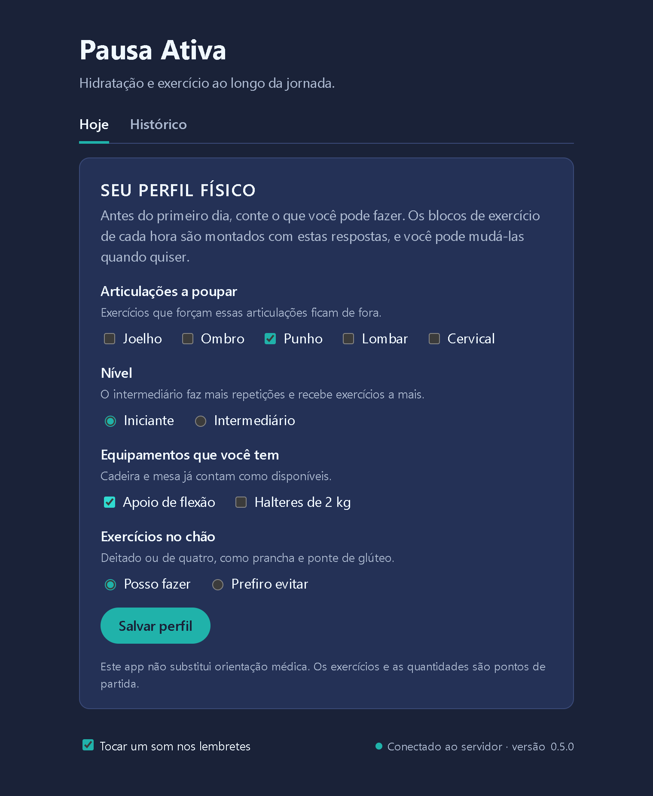

## 2. Começar o dia

A meta de água (padrão de 3.000 ml, dividida em 16 lembretes) e a duração dos blocos de exercício: 5 min ou 10 min, para os dias mais tranquilos. Ao clicar em **Iniciar dia**, o Chrome pede permissão para mostrar notificações.

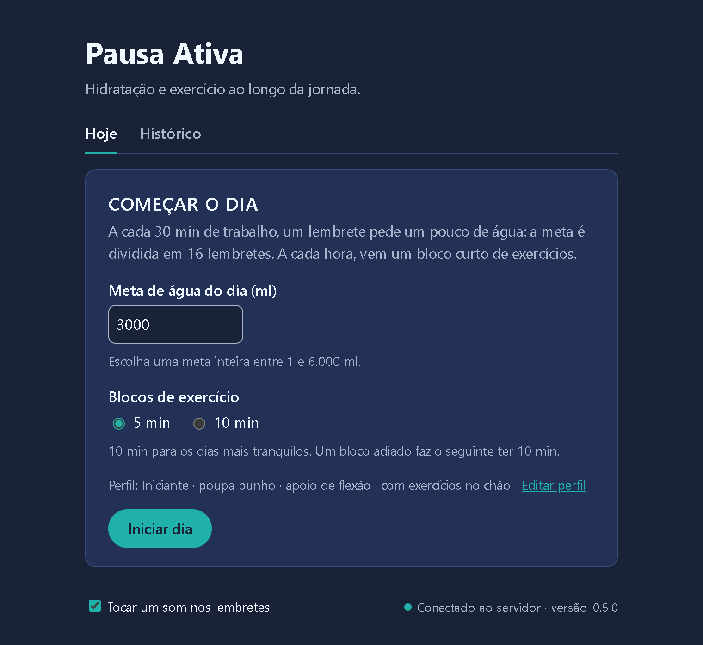

## 3. O dia em andamento

O tempo trabalhado, a água do dia em relação à meta e quanto falta para o próximo lembrete. A aba precisa ficar aberta, mas pode ficar em segundo plano: é por ela que os lembretes chegam.

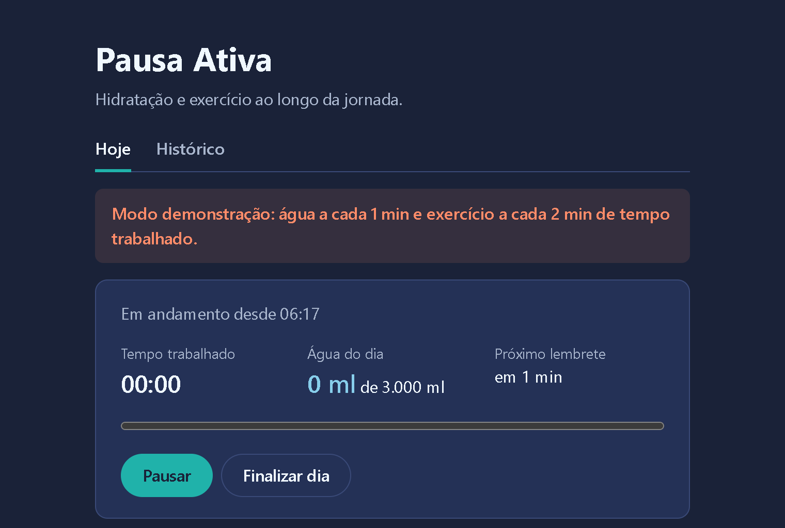

## 4. Hora da água

O lembrete chega como notificação do Chrome, com um som curto, e aparece no alto da página com os botões **Concluir** e **Falhar**. Sem resposta até o lembrete seguinte, ele conta como falha. A notificação do sistema não aparece nas capturas.

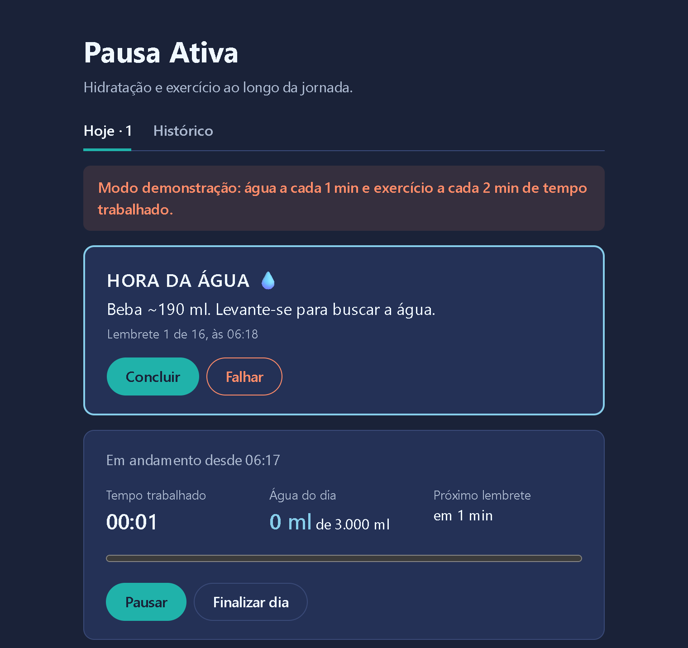

## 5. Hora cheia: água e exercício

A cada hora de trabalho, chega também um bloco de exercícios: cada um com a quantidade e uma linha de como fazer, e quanto tempo o bloco leva. Água e exercício vêm numa notificação só, e cada cartão tem os seus botões. O bloco pode ser adiado uma vez: o seguinte vem com 10 min, para compensar.


## 6. Pausa para o almoço

**Pausar** congela o tempo trabalhado, e os lembretes esperam. **Retomar** continua de onde parou.

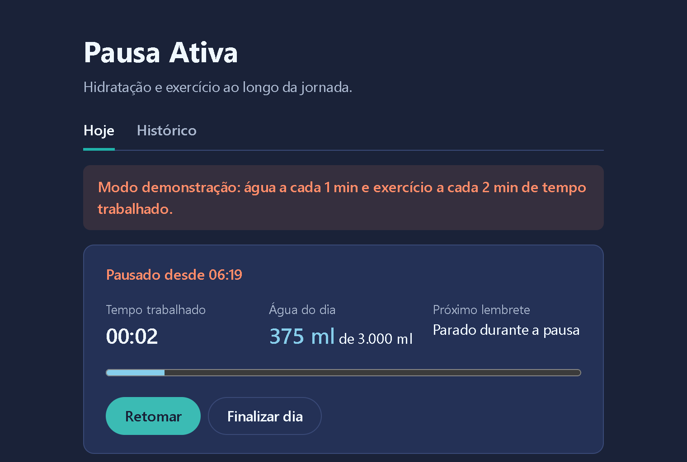

## 7. Corrigir um lembrete

Marcou falha num lembrete que fez, ou o contrário? Na lista **Lembretes do dia**, **Corrigir** troca entre concluído e falha, com a confirmação na própria linha. O lembrete fica marcado "editado". Vale até a meia-noite do dia.

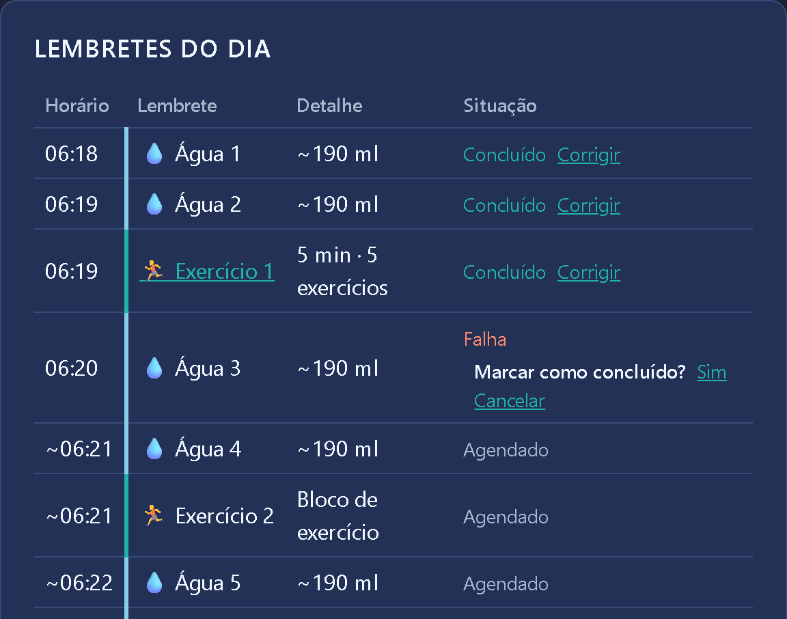

## 8. Fim do dia

**Finalizar dia** pede confirmação: os lembretes que ainda viriam não contam. O resumo mostra a água do dia e, por categoria, os lembretes por situação, a taxa de sucesso e se a meta de 80% foi atingida. Neste dia, a água ficou em 87,5% (14 concluídos e 2 falhas: uma marcada e uma sem resposta até o lembrete seguinte), e o exercício também, com um bloco adiado e concluído junto com o seguinte.

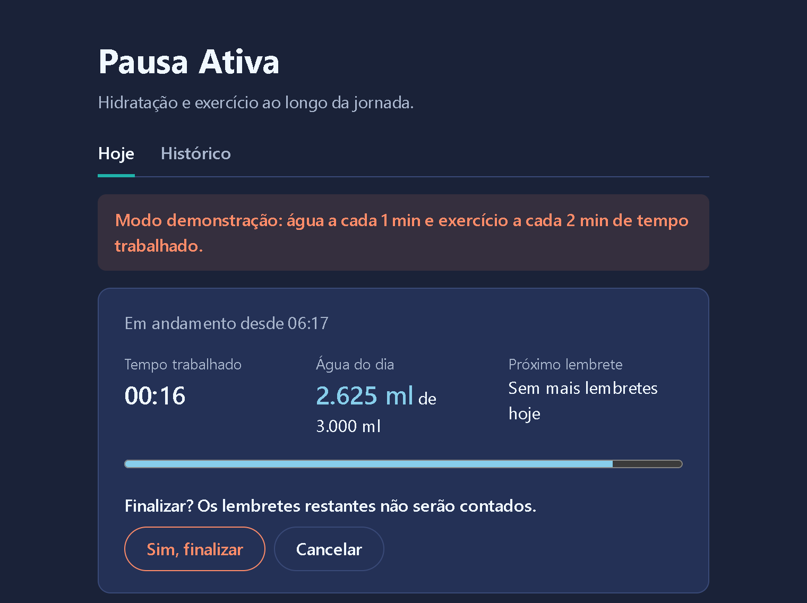

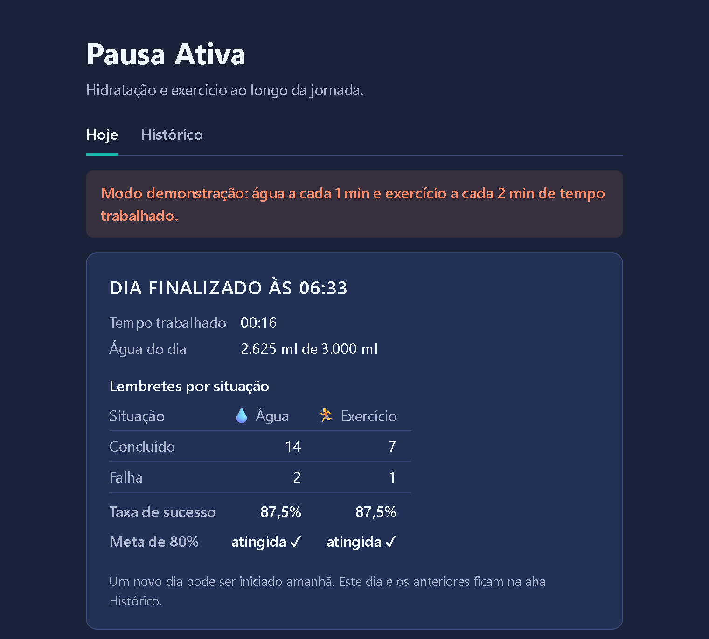

## 9. Histórico

A aba **Histórico** mostra a taxa de sucesso por dia, semana ou mês, separada para a água e o exercício, e quantos dias bateram a meta. Os gráficos têm uma coluna por dia, com as situações empilhadas e um ✓ nos dias na meta.

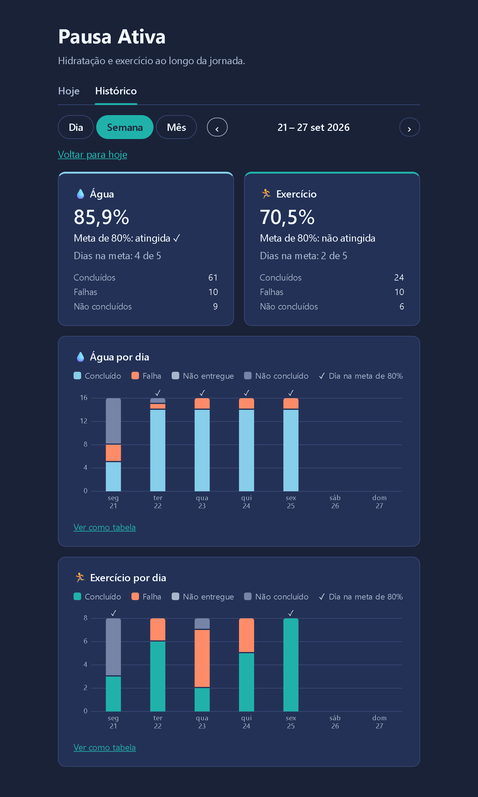

Passar o mouse numa coluna mostra os números do dia; clicar abre o dia.


O dia mostra o início, o fim, o tempo trabalhado, a água e cada lembrete. Um bloco de exercício abre os exercícios que foram propostos.

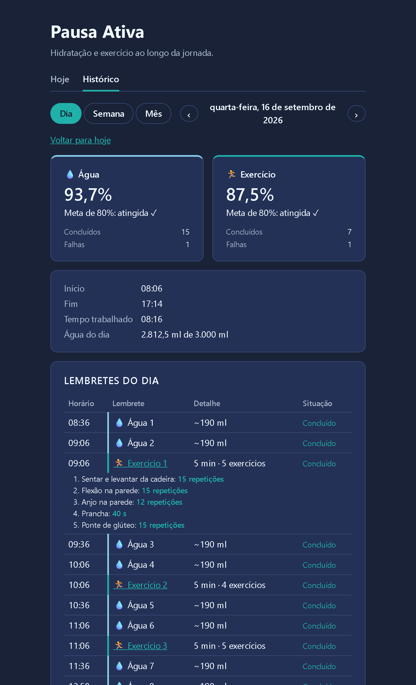

## 10. Em janela estreita

A página se ajusta a uma janela estreita, de 400 px, por exemplo ao lado de outra janela. A aplicação roda no próprio computador: o acesso pelo celular está fora do escopo.

<table>
  <tr>
    <td width="50%">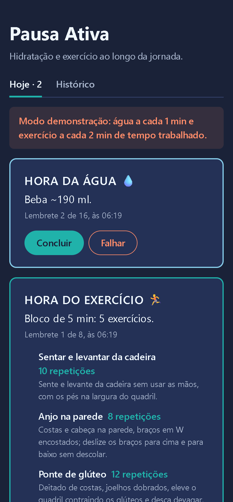</td>
    <td width="50%">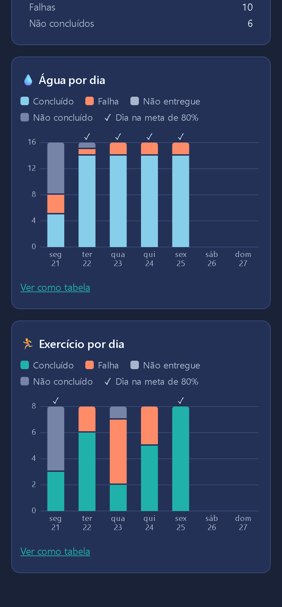</td>
  </tr>
</table>

## 11. Painel de métricas

Em **http://127.0.0.1:38744**, o Grafana abre o painel **Pausa Ativa** sem login. Na linha **Lembretes**: água e exercício por situação, as contagens do período, o atraso do disparo e as abas abertas. Na linha **Aplicação**: o backend no ar, o tempo das operações da API e da consulta do histórico contra os limites do épico, a memória, a CPU, o GC, os erros e as conexões do banco. O painel abre no intervalo "hoje", com as situações em barras por hora: o dia de demonstração, de 16 min, cabe numa barra só.

As barras contam a resposta original: a água 3, marcada como falha e corrigida para concluída (seção 7), segue como falha no painel, e a correção aparece em "Respostas corrigidas". A taxa de sucesso oficial é a da aba Histórico.

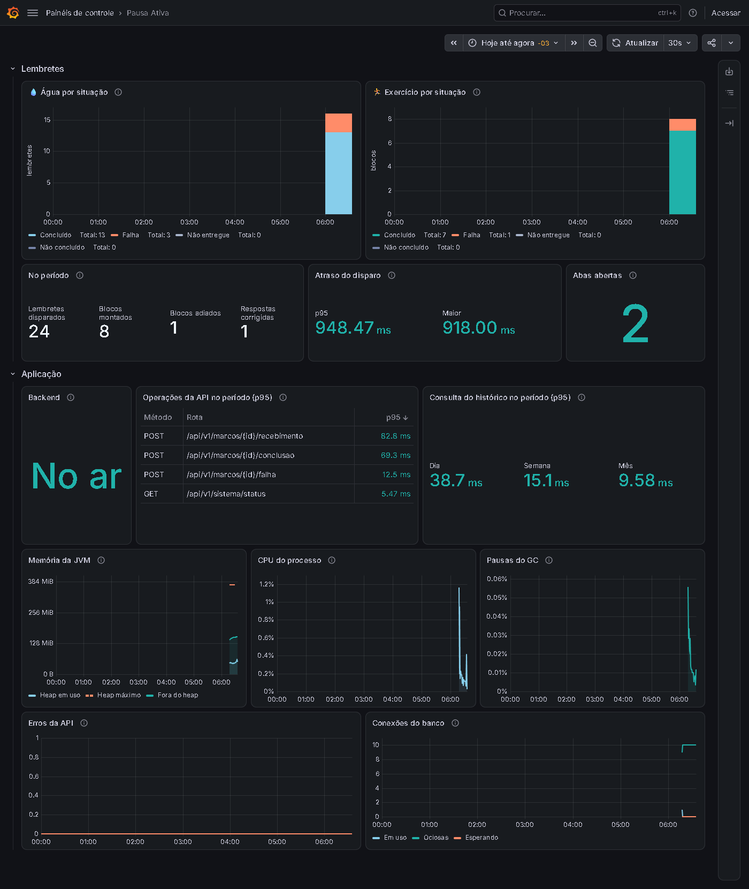

## 12. Backup e restauração

Pelo terminal, com o mesmo comando no PowerShell, no Git Bash, no Linux e no macOS:

```text
> docker compose run --rm backup
Backup gravado em ./backups/pausa-ativa-2026-10-08-063532.dump (68.0K, 31 jornadas).
```

A restauração exige o backend parado, pede para digitar `RESTAURAR` e guarda antes o banco atual:

```text
> docker compose stop backend
> docker compose run --rm restauracao pausa-ativa-2026-10-08-063532.dump
Isto substitui todos os dados atuais pelos do backup pausa-ativa-2026-10-08-063532.dump.
Digite RESTAURAR para continuar: RESTAURAR
O banco atual foi guardado em ./backups/antes-da-restauracao-2026-10-08-063534.dump.
Backup pausa-ativa-2026-10-08-063532.dump restaurado: 31 jornadas, a última em 08/10/2026.
Suba a aplicação com docker compose up -d --wait.
```

Os passos completos estão no [README](../README.md#backup-e-restauração).

## Para apresentar ao vivo

O modo demonstração deixa mostrar um dia inteiro em 16 min, com o histórico de exemplo já preenchido:

```sh
docker compose -f docker-compose.yml -f docker-compose.demo.yml down -v
docker compose -f docker-compose.yml -f docker-compose.demo.yml up -d --build --wait
```

Abra **http://127.0.0.1:38743** (a aplicação) e **http://127.0.0.1:38745** (o painel). Um roteiro de uns 15 min:

1. Preencha o perfil e inicie o dia (seções 1 e 2).
2. Enquanto o primeiro lembrete não chega, mostre a aba **Histórico** com os dias de exemplo (seção 9).
3. Em 1 min chega a água, e em 2 min, a hora cheia com o bloco de exercícios (seções 4 e 5).
4. Pause e retome; corrija um lembrete; finalize o dia (seções 6 a 8).
5. Abra o painel do Grafana: os lembretes da apresentação já estão lá (seção 11).

Ao terminar, `down -v` apaga a demonstração.
