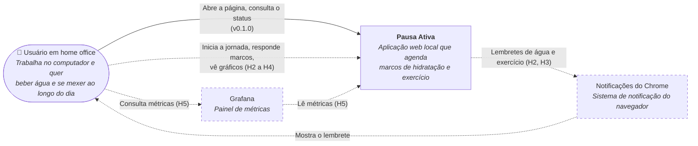

# C4 Nível 1: Contexto

O Pausa Ativa é usado por **uma pessoa**, no próprio computador, sem login. Não depende de nenhum serviço na internet.

## Elementos

| Elemento | Tipo | Papel | Desde |
|---|---|---|---|
| Usuário | Pessoa | Única pessoa que usa o sistema, no próprio computador | v0.1.0 |
| Pausa Ativa | Sistema | Este sistema | v0.1.0 |
| Notificações do Chrome | Sistema externo | Exibe os lembretes, mesmo com a aba fora de foco | H2 (planejado) |
| Grafana | Sistema externo | Painel de métricas técnicas e de negócio | H5 (planejado) |

## Restrições

- Tudo roda localmente, via Docker Compose. Nada fica exposto fora de `127.0.0.1`.
- Sem autenticação: o sistema assume um único usuário.
- O Chrome é o único navegador garantido.
