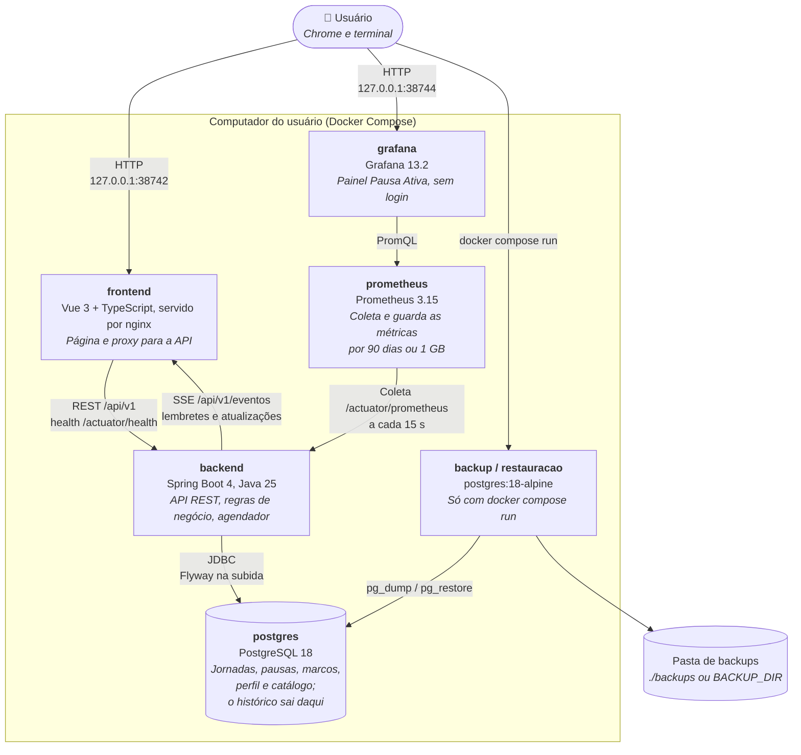

# C4 Nível 2: Containers

Cada caixa é um processo que roda num container do `docker-compose.yml`. Só o **frontend** e o **grafana** têm porta no computador do usuário, e só em `127.0.0.1`; o resto fica na rede interna do Docker.

## Containers

| Container | Tecnologia | Imagem base | Porta no host | Usuário | Saúde |
|---|---|---|---|---|---|
| `frontend` | Vue 3.5, Vite 8, TypeScript 6.0; nginx 1.31 | `nginxinc/nginx-unprivileged:1.31-alpine` | `127.0.0.1:38742` → 8080 (configurável em `FRONTEND_PORT`) | `nginx` (uid 101) | `GET /` |
| `backend` | Spring Boot 4.1, Java 25 (threads virtuais), Hibernate, Flyway | `eclipse-temurin:25-jre-alpine` | nenhuma | `app` (uid 100) | `GET /actuator/health/liveness` |
| `postgres` | PostgreSQL 18 | `postgres:18-alpine` | nenhuma | `postgres` | `pg_isready` |
| `prometheus` | Prometheus 3.15 | `prom/prometheus:v3.15.0` | nenhuma | `nobody` | `GET /-/ready` |
| `grafana` | Grafana 13.2, com a fonte de dados e o painel provisionados como arquivos | `grafana/grafana:13.2.3` | `127.0.0.1:38744` → 3000 (configurável em `GRAFANA_PORT`) | `grafana` (uid 472) | `GET /api/health` |
| `backup`, `restauracao` | `pg_dump`, `pg_restore` e `psql`, com os scripts de `scripts/` em `sh` | `postgres:18-alpine` | nenhuma | `root`, o padrão da imagem; falam com o banco pela rede, com as credenciais do `.env` | Não ficam no ar: só existem durante o `docker compose run` |

Ordem de subida: `postgres` saudável → `backend` saudável → `frontend`, e `prometheus` saudável → `grafana`. O backend não depende do Prometheus nem do Grafana: sem eles, a aplicação segue igual. Todos com `restart: unless-stopped`. O `backup` e a `restauracao` ficam no perfil `ferramentas`, que o `up` não sobe, e não dependem do `postgres`: com o banco parado, o backup recusa em vez de subir o banco sozinho.

## Comunicação

| De → Para | Protocolo | Detalhe |
|---|---|---|
| Chrome → frontend | HTTP | Página estática (SPA) e as chamadas da API, na mesma origem |
| frontend → backend | HTTP (proxy do nginx) | `/api/*` e `/actuator/health`. Qualquer outro `/actuator/*` responde 404. O nginx resolve o nome `backend` a cada requisição: sobe mesmo com o backend fora e acompanha uma troca de IP. |
| backend → Chrome | SSE (`/api/v1/eventos`, pelo nginx) | Conexão aberta o dia todo: `marco-disparado` (o do exercício já com o bloco) e `jornada-atualizada`, enviados só depois do commit, e um ping a cada 20 s. Na hora cheia, os dois `marco-disparado` chegam antes do `jornada-atualizada` da mesma alteração, e a tela os junta numa notificação. O nginx não guarda buffer e espera até 1 h. Se a conexão cai, a página reconecta sozinha e busca a situação atual. |
| backend → postgres | JDBC (Hikari) | Timeouts curtos: o health fica `DOWN` em segundos sem banco e volta sozinho |
| prometheus → backend | HTTP, rede interna | `backend:8080/actuator/prometheus` a cada 15 s. No host, o nginx continua respondendo 404 para esse caminho. Com o backend fora, a métrica `up` vira 0, e o painel mostra "Fora do ar". |
| Chrome → grafana | HTTP | O painel "Pausa Ativa" abre direto, sem login, só para leitura. Mudar o painel é mudar `observabilidade/grafana/paineis/pausa-ativa.json`. Nada sai para a internet: relatório de uso, busca de atualizações, notícias e plugins ficam desligados. |
| grafana → prometheus | PromQL, rede interna | Fonte de dados provisionada com `uid: prometheus` |
| backup, restauracao → postgres | Protocolo do Postgres, rede interna | O backup grava `pausa-ativa-AAAA-MM-DD-HHMMSS.dump` (formato custom) primeiro num `.parcial`. A restauração exige o backend parado, pede a confirmação e guarda antes um backup do banco atual; depois recria o esquema a partir do backup numa transação só. |

O contrato REST é o [`docs/api/openapi.json`](../api/openapi.json):

| Recurso | Endpoints |
|---|---|
| Sistema | `GET /api/v1/sistema/status` |
| Perfil | `GET /api/v1/perfil` (204 enquanto não preenchido) e `PUT /api/v1/perfil` |
| Jornada | `GET /api/v1/jornadas/atual`, `GET /api/v1/jornadas?data=` (a jornada de um dia; 204 sem jornada), `POST /api/v1/jornadas` (409 sem perfil) e `POST /api/v1/jornadas/{id}/` + `pausa`, `retomada` ou `finalizacao` |
| Marco | `POST /api/v1/marcos/{id}/` + `conclusao`, `falha`, `adiamento` (só exercício), `recebimento` ou `correcao` (corpo `{status}`; 409 fora do dia) |
| Histórico | `GET /api/v1/historico?periodo=DIA\|SEMANA\|MES&data=` (400 com data futura) |
| Eventos | `GET /api/v1/eventos` (SSE) |

Erros em Problem Details (RFC 9457), com a mensagem em português no `detail`. Os tipos do frontend são gerados desse contrato.

**Modo demonstração.** O `docker-compose.demo.yml` sobe a mesma stack como outro projeto (`pausa-ativa-demo`), com banco próprio, porta `127.0.0.1:38743` (o Grafana em `38745`), um lembrete de água por minuto e um bloco de exercício a cada 2 min (`PAUSA_ATIVA_INTERVALO=1m`; o exercício usa o dobro do intervalo). Com `PAUSA_ATIVA_DEMO_HISTORICO=true`, o backend cria na subida 45 dias de histórico de exemplo, se o banco não tiver jornada de dia anterior. O compose de uso diário não liga nenhuma das duas.

## Saúde do backend

| Endpoint | Inclui o banco? | Uso |
|---|---|---|
| `/actuator/health` | Sim | Exposto ao host pelo nginx. `DOWN` (503) se o banco cair. |
| `/actuator/health/liveness` | Não | Healthcheck do container. O banco fora não faz o Docker considerar o backend doente. |
| `/actuator/health/readiness` | Sim | Rede interna |

## Recursos e segurança

- Limites de memória: `backend` e `grafana` com 512 MB, `prometheus` com 256 MB. A JVM usa até 75% do limite do backend de heap. Na demonstração, com o painel aberto, o Grafana usou uns 311 MiB e o Prometheus uns 39 MiB.
- Credenciais do banco vêm do `.env`, que fica fora do git.
- Logs em JSON (formato ECS) no stdout: `docker compose logs backend`.
- Volumes: `pausa-ativa_pgdata` (Postgres, montado em `/var/lib/postgresql`, layout do Postgres 18), `pausa-ativa_prometheus-dados` (métricas) e `pausa-ativa_grafana-dados` (o banco interno do Grafana). Os backups ficam numa pasta do computador, fora dos volumes e do git.
- Ao receber o sinal de parada, o backend fecha as conexões SSE antes do encerramento gracioso e para em menos de 1 s, mesmo com abas abertas.
