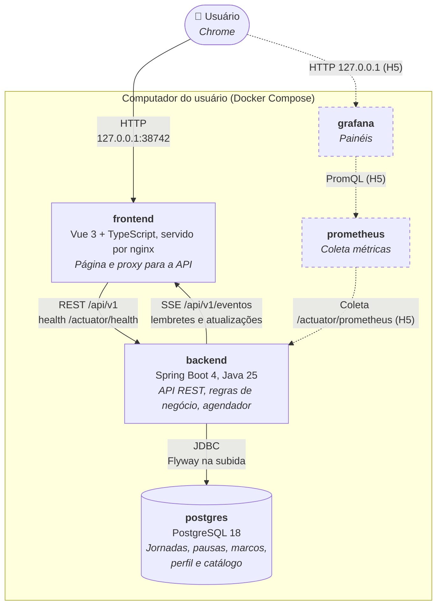

# C4 Nível 2: Containers

Cada caixa é um processo que roda num container do `docker-compose.yml`. Só o **frontend** tem porta no computador do usuário; o resto fica na rede interna do Docker.

## Containers

| Container | Tecnologia | Imagem base | Porta no host | Usuário | Saúde |
|---|---|---|---|---|---|
| `frontend` | Vue 3.5, Vite 8, TypeScript 6.0; nginx 1.31 | `nginxinc/nginx-unprivileged:1.31-alpine` | `127.0.0.1:38742` → 8080 (configurável em `FRONTEND_PORT`) | `nginx` (uid 101) | `GET /` |
| `backend` | Spring Boot 4.1, Java 25 (threads virtuais), Hibernate, Flyway | `eclipse-temurin:25-jre-alpine` | nenhuma | `app` (uid 100) | `GET /actuator/health/liveness` |
| `postgres` | PostgreSQL 18 | `postgres:18-alpine` | nenhuma | `postgres` | `pg_isready` |

Ordem de subida: `postgres` saudável → `backend` saudável → `frontend`. Todos com `restart: unless-stopped`.

## Comunicação

| De → Para | Protocolo | Detalhe |
|---|---|---|
| Chrome → frontend | HTTP | Página estática (SPA) e as chamadas da API, na mesma origem |
| frontend → backend | HTTP (proxy do nginx) | `/api/*` e `/actuator/health`. Qualquer outro `/actuator/*` responde 404. O nginx resolve o nome `backend` a cada requisição: sobe mesmo com o backend fora e acompanha uma troca de IP. |
| backend → Chrome | SSE (`/api/v1/eventos`, pelo nginx) | Conexão aberta o dia todo: `marco-disparado` (o do exercício já com o bloco) e `jornada-atualizada`, enviados só depois do commit, e um ping a cada 20 s. Na hora cheia, os dois `marco-disparado` chegam antes do `jornada-atualizada` da mesma alteração, e a tela os junta numa notificação. O nginx não guarda buffer e espera até 1 h. Se a conexão cai, a página reconecta sozinha e busca a situação atual. |
| backend → postgres | JDBC (Hikari) | Timeouts curtos: o health fica `DOWN` em segundos sem banco e volta sozinho |

O contrato REST é o [`docs/api/openapi.json`](../api/openapi.json):

| Recurso | Endpoints |
|---|---|
| Sistema | `GET /api/v1/sistema/status` |
| Perfil | `GET /api/v1/perfil` (204 enquanto não preenchido) e `PUT /api/v1/perfil` |
| Jornada | `GET /api/v1/jornadas/atual`, `POST /api/v1/jornadas` (409 sem perfil) e `POST /api/v1/jornadas/{id}/` + `pausa`, `retomada` ou `finalizacao` |
| Marco | `POST /api/v1/marcos/{id}/` + `conclusao`, `falha`, `adiamento` (só exercício) ou `recebimento` |
| Eventos | `GET /api/v1/eventos` (SSE) |

Erros em Problem Details (RFC 9457), com a mensagem em português no `detail`. Os tipos do frontend são gerados desse contrato.

**Modo demonstração.** O `docker-compose.demo.yml` sobe a mesma stack como outro projeto (`pausa-ativa-demo`), com banco próprio, porta `127.0.0.1:38743`, um lembrete de água por minuto e um bloco de exercício a cada 2 min (`PAUSA_ATIVA_INTERVALO=1m`; o exercício usa o dobro do intervalo).

## Saúde do backend

| Endpoint | Inclui o banco? | Uso |
|---|---|---|
| `/actuator/health` | Sim | Exposto ao host pelo nginx. `DOWN` (503) se o banco cair. |
| `/actuator/health/liveness` | Não | Healthcheck do container. O banco fora não faz o Docker considerar o backend doente. |
| `/actuator/health/readiness` | Sim | Rede interna |

## Recursos e segurança

- O `backend` tem limite de 512 MB; a JVM usa até 75% disso de heap.
- Credenciais do banco vêm do `.env`, que fica fora do git.
- Logs em JSON (formato ECS) no stdout: `docker compose logs backend`.
- Dados do Postgres no volume `pausa-ativa_pgdata`, montado em `/var/lib/postgresql` (layout do Postgres 18).
