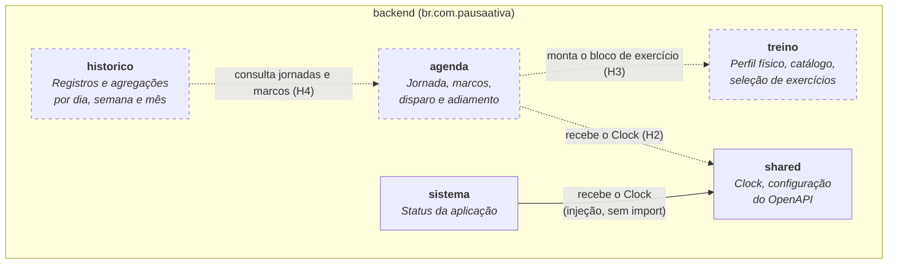
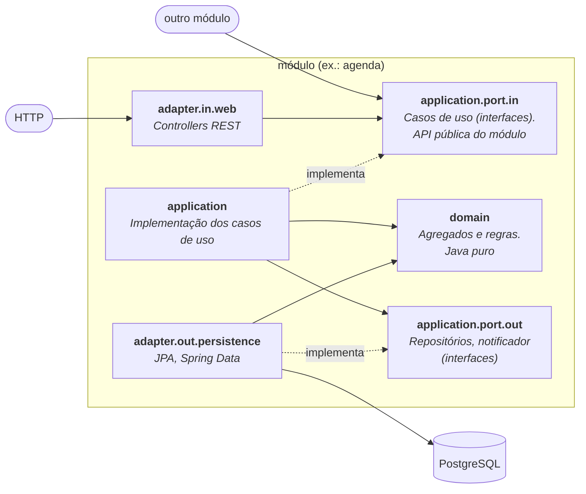

# C4 Nível 3: Componentes do backend

O backend é um **monólito modular** com **arquitetura hexagonal**: cada módulo protege o próprio domínio, e o mundo externo (HTTP, banco) só entra por adapters.

## Módulos

| Módulo | Tipo | Conteúdo na v0.1.0 | Recebe código em |
|---|---|---|---|
| `agenda` | Bounded context | Só a estrutura de pacotes | H2 |
| `treino` | Bounded context | Só a estrutura de pacotes | H3 |
| `historico` | Bounded context | Só a estrutura de pacotes | H4 |
| `sistema` | Técnico | `StatusController` (`GET /api/v1/sistema/status`) | — |
| `shared` | Transversal | `RelogioConfig` (o `Clock` único), `OpenApiConfig` | — |

Um módulo só fala com outro pela **porta de entrada** dele (`application.port.in`). As setas tracejadas mostram as dependências planejadas.

## Estrutura hexagonal de cada módulo

| Pacote | Responsabilidade | Pode usar |
|---|---|---|
| `domain` | Agregados, entidades, value objects, regras | Só o JDK. O tempo vem de um `Clock` recebido. |
| `application.port.in` | Interfaces dos casos de uso, comandos e consultas | `domain` |
| `application.port.out` | Interfaces do que o módulo precisa de fora | `domain` |
| `application` | Implementação dos casos de uso | `domain`, portas; `@Service` e `@Transactional` |
| `adapter.in.web` | Traduz HTTP para as portas de entrada | `application.port.in` |
| `adapter.out.persistence` | Implementa as portas de saída com JPA | `application.port.out`, `domain` |

## Regras de arquitetura

Verificadas pelo ArchUnit em toda build (`ArquiteturaTest`). Uma violação quebra o `./mvnw verify` e o CI.

| Regra | O que proíbe |
|---|---|
| **R1** | `domain` dependendo de Spring, JPA, Hibernate ou Jackson |
| **R2** | `domain` dependendo de `application` ou `adapter` |
| **R3** | `application` dependendo de `adapter` ou de JPA |
| **R4** | Um módulo acessando outro fora do `application.port.in` dele |
| **R5** | Ciclos entre módulos |

Cada regra tem uma classe de exemplo que a viola de propósito (`backend/src/test/java/fixtures/arquitetura/rN`), e o `RegrasDeArquiteturaTest` confere que a regra a pega. Assim as regras são comprovadas mesmo enquanto os módulos estão vazios.

## Componentes transversais

| Componente | Papel |
|---|---|
| `RelogioConfig` | Único `Clock` da aplicação, em `America/Sao_Paulo`. A JVM e o banco trabalham em UTC. Os testes trocam o `Clock` por um fixo. |
| `OpenApiConfig` | Metadados do contrato OpenAPI (springdoc). O `ContratoOpenApiTest` compara o gerado com `docs/api/openapi.json`. |
| Spring Boot Actuator | Health (com liveness e readiness), info e métricas Prometheus |
| Flyway | Migrações em `src/main/resources/db/migration`. A `V1` é só o baseline; as tabelas começam na `V2` (H2). |
| HikariCP | Pool de conexões com timeouts curtos e `socketTimeout` de 10 s, para nenhuma thread travar com o banco sem resposta |
