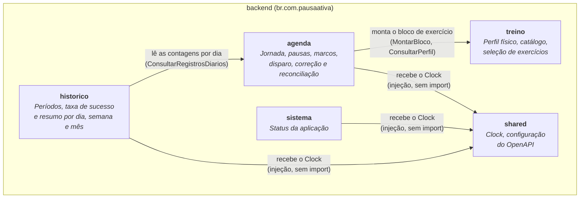
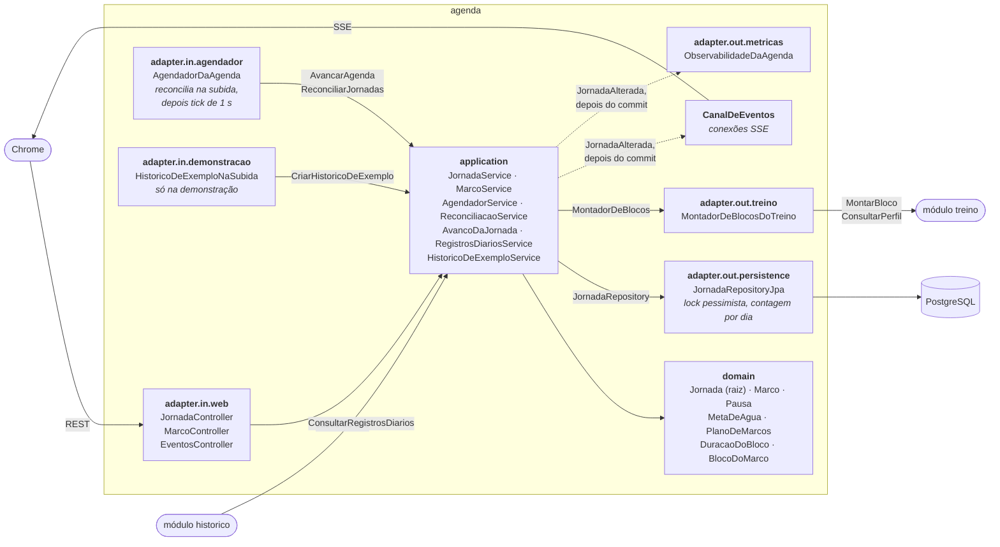
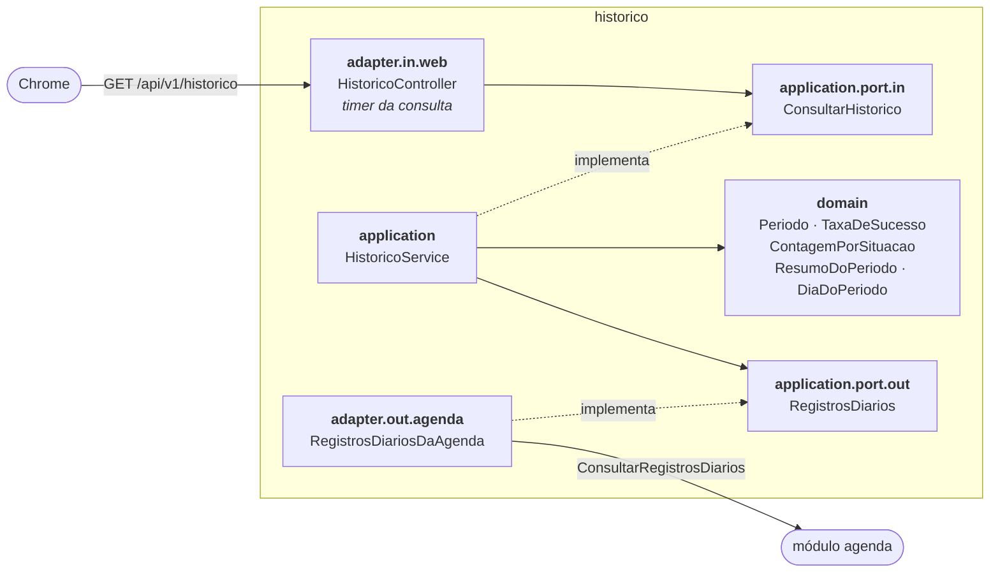
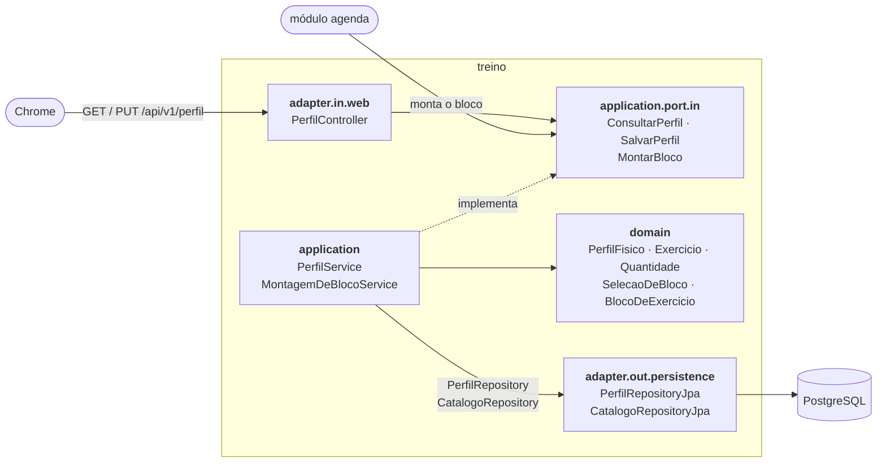

# C4 Nível 3: Componentes

O backend é um **monólito modular** com **arquitetura hexagonal**: cada módulo protege o próprio domínio, e o mundo externo (HTTP, banco, agendador) só entra por adapters. O frontend está no [fim desta página](#frontend).

## Módulos

| Módulo | Tipo | Conteúdo na v0.4.0 | Recebe código em |
|---|---|---|---|
| `agenda` | Bounded context | Jornada com marcos de hidratação e de exercício, adiamento, correção no mesmo dia, agendador, reconciliação, consulta agregada por dia, histórico de exemplo da demonstração, API REST, SSE e métricas ([abaixo](#agenda-por-dentro)) | H2, H3 e H4 |
| `treino` | Bounded context | Perfil físico, catálogo de 22 exercícios e seleção do bloco, com a API do perfil ([abaixo](#treino-por-dentro)) | H3 |
| `historico` | Bounded context | Períodos, taxa de sucesso, resumo do período e a API do histórico, sem tabela própria ([abaixo](#histórico-por-dentro)) | H4 |
| `sistema` | Técnico | `StatusController` (`GET /api/v1/sistema/status`) | — |
| `shared` | Transversal | `RelogioConfig` (o `Clock` único), `OpenApiConfig` | — |

Um módulo só fala com outro pela **porta de entrada** dele (`application.port.in`). O Histórico depende da Agenda, e a Agenda depende do Treino; nenhum deles conhece quem depende dele: sem ciclos.

## Estrutura hexagonal de cada módulo

| Pacote | Responsabilidade | Pode usar |
|---|---|---|
| `domain` | Agregados, entidades, value objects, regras | Só o JDK. O tempo vem de um `Clock` recebido. |
| `application.port.in` | Interfaces dos casos de uso, comandos e consultas | `domain` |
| `application.port.out` | Interfaces do que o módulo precisa de fora | `domain` |
| `application` | Implementação dos casos de uso | `domain`, portas; `@Service` e `@Transactional` |
| `adapter.in.web` | Traduz HTTP para as portas de entrada | `application.port.in` |
| `adapter.out.persistence` | Implementa as portas de saída com JPA | `application.port.out`, `domain` |

## Agenda por dentro

| Componente | Papel |
|---|---|
| `Jornada` | Raiz do agregado: dona das pausas, dos 16 marcos de água e dos 8 de exercício. Calcula o tempo trabalhado, dispara marcos, vence prazos, adia e resolve o adiado, finaliza e reconcilia. Corrige uma resposta (concluído ↔ falha) até a meia-noite do dia da jornada, junto com o par adiado, e diz se o Corrigir vale (`podeCorrigir`). Recebe o instante atual como parâmetro e registra `MarcoDisparado`, `MarcoEncerrado`, `MarcoAdiado` e `MarcoCorrigido`. |
| `BlocoDoMarco` | Bloco de um marco de exercício: duração (5 ou 10 min), se compensa um adiado e a cópia dos exercícios propostos. Nasce no disparo, sem exercícios, e recebe a lista uma vez só. |
| `AvancoDaJornada` | Avança a jornada e, para cada exercício disparado, pede o bloco ao `MontadorDeBlocos` e o entrega à jornada, na mesma transação e antes de gravar. O tick, os comandos da jornada e as respostas aos marcos passam por ele, então nenhum exercício pendente fica sem bloco. |
| `MontadorDeBlocosDoTreino` | Implementa a porta `MontadorDeBlocos` chamando o `MontarBloco` e o `ConsultarPerfil` do Treino. É a única peça da Agenda que conhece o Treino. |
| `JornadaService`, `MarcoService` | Comandos da tela, incluindo a correção, e a consulta da jornada de um dia (`ConsultarJornadaDoDia`). Antes de agir, põem a jornada em dia, como o próximo tick faria. Sem perfil físico, iniciar o dia é recusado (409). |
| `RegistrosDiariosService` | Implementa `ConsultarRegistrosDiarios`, a porta que o Histórico usa: agrupa por dia as contagens que o banco devolve e as entrega só com tipos do JDK, porque a regra R4 não deixa o Histórico usar os tipos da Agenda. |
| `HistoricoDeExemploService`, `HistoricoDeExemplo` | Só na demonstração: vivem 45 dias pelo domínio, minuto a minuto, com uma semente fixa somada à data, e gravam as jornadas sem publicar eventos nem métricas. Os blocos usam o `montarDeExemplo` do Treino, com um perfil fixo que não é gravado. |
| `HistoricoDeExemploNaSubida` | Existe só com `pausa-ativa.demonstracao.historico=true`. Na subida, cria o histórico de exemplo se não houver jornada de dia anterior; uma falha só gera um aviso no log. |
| `AgendadorService` | O tick: avança a jornada aberta e encerra a esquecida (spec H2, seção 3.5). |
| `ReconciliacaoService` | Na subida: marcos que passaram com o backend fora viram `NAO_ENTREGUE`, sem disparo atrasado. |
| `AgendadorDaAgenda` | Chama a reconciliação e **só depois** liga o tick de 1 s. Um `@Scheduled` comum poderia rodar antes. |
| `PublicadorDeAlteracoes` | Depois de gravar, publica `JornadaAlterada` (situação + eventos). Comandos sem mudança não publicam. |
| `CanalDeEventos` | Conexões SSE das abas. Recebe `JornadaAlterada` depois do commit e envia `marco-disparado` e `jornada-atualizada`; ping a cada 20 s. Ao parar o backend (`ContextClosedEvent`), fecha as conexões antes do encerramento gracioso, que senão esperaria por elas (v0.5.0). |
| `ObservabilidadeDaAgenda` | Métricas `pausaativa.marcos.*` (com a tag `categoria`), `pausaativa.marcos.adiados`, `pausaativa.marcos.corrigidos` (tag `para`), `pausaativa.blocos.montados` e `pausaativa.blocos.itens`; logs JSON com `jornadaId`, `marcoId`, os códigos dos exercícios do bloco e a situação antes e depois de cada correção. Desde a v0.5.0, cria as séries zeradas na subida, para o `increase()` do painel não perder o primeiro evento depois de cada subida. |
| `JornadaRepositoryJpa` | Carrega a jornada com lock pessimista (`SELECT … FOR NO KEY UPDATE`): o tick e os cliques nunca alteram a mesma jornada ao mesmo tempo. Os itens dos blocos vêm numa consulta só (`@BatchSize`), porque o tick lê a jornada a cada segundo. Para o Histórico, conta os marcos por dia, categoria e situação numa JPQL com `group by`: um mês devolve no máximo 434 linhas, e o Histórico não carrega jornadas inteiras. |
| `TratamentoDeErrosDaAgenda` | Regras recusadas viram Problem Details: 400, 404 ou 409, com a mensagem do domínio. |

**Tabelas** (migrações `V2`, `V4` e `V5`): `jornada`, `pausa`, `marco` e `item_do_bloco`. Uma restrição única por dia e um índice parcial barram a segunda jornada aberta, mesmo com dois "Iniciar dia" simultâneos; `unique (jornada_id, categoria, sequencia)` barra marco duplicado. A `V4` acrescenta a duração do bloco na jornada e no marco, o status `ADIADO` (só no exercício) e a tabela `item_do_bloco`, cópia do catálogo no instante do disparo, sem chave estrangeira para o catálogo. A `V5` acrescenta `marco.editado_em`, o instante da última correção, que só existe em concluído ou falha (`ck_marco_editado`).

## Histórico por dentro

| Componente | Papel |
|---|---|
| `Periodo` | O dia, a semana (segunda a domingo) ou o mês que contém uma data. Recusa uma data depois de hoje (`DataFuturaException`, 400). |
| `TaxaDeSucesso` | Concluídos ÷ (concluídos + falhas). Só existe com pelo menos uma resposta; sem nenhuma, a ausência é "sem dados". Mostra uma casa, truncada, e decide a meta de 80% pela fração exata, com inteiros: a tela nunca mostra 80,0% numa taxa abaixo da meta. |
| `ResumoDoPeriodo` | Soma os marcos do período (e não a média das taxas dos dias), conta os dias com dados e os dias na meta, e completa os dias sem jornada e os futuros. Hoje entra com os números parciais, marcado em andamento. |
| `HistoricoService` | Implementa `ConsultarHistorico`: monta o período com o `Clock` da aplicação e pede à porta de saída só os dias até hoje. |
| `RegistrosDiariosDaAgenda` | Implementa a porta `RegistrosDiarios` chamando a `ConsultarRegistrosDiarios` da Agenda e traduz o texto das situações para o domínio do Histórico, com agendado, pendente e adiado em "em aberto". É a única peça do Histórico que conhece a Agenda. |
| `HistoricoController` | `GET /api/v1/historico?periodo=&data=`. Mede cada consulta no timer `pausaativa.historico.consultas` (tag `periodo`, com as séries zeradas na subida), o requisito de 500 ms da agregação mensal. |

**Sem tabela própria** (decisão D1 da H4): o Histórico calcula tudo a partir das contagens da Agenda. O pacote `adapter.out.persistence` do módulo continua vazio.

## Treino por dentro

| Componente | Papel |
|---|---|
| `SelecaoDeBloco` | A regra da seleção, em Java puro: filtra os exercícios elegíveis pelo perfil, percorre os grupos musculares em rodízio a partir do grupo do marco, prefere os exercícios usados há mais tempo no dia e preenche a duração pela estimativa (3 s por repetição, 15 s por troca). Sobrando tempo, repete os exercícios de reserva. É determinística: a mesma entrada dá sempre o mesmo bloco. |
| `PerfilFisico`, `Exercicio`, `Quantidade` | O perfil (articulações a poupar, nível, equipamentos, chão), o exercício do catálogo e a quantidade por nível (repetições, por lado ou segundos). |
| `MontagemDeBlocoService` | Implementa `MontarBloco`: carrega o perfil e o catálogo e aplica a `SelecaoDeBloco`. O pedido traz a duração, o número do marco e os exercícios já propostos no dia, que a Agenda conhece. Assim, o Treino não consulta a Agenda. O `montarDeExemplo` usa um perfil fixo, sem ler nem gravar o do usuário, para o histórico de exemplo da demonstração. |
| `PerfilService` | Implementa `ConsultarPerfil` e `SalvarPerfil`. Existe um perfil só, porque o usuário é único. |
| `PerfilController` | `GET /api/v1/perfil` (204 enquanto não preenchido) e `PUT /api/v1/perfil`, que substitui o perfil inteiro. |
| `TratamentoDeErrosDoTreino` | Perfil inválido vira Problem Details 400, com a mensagem em português. |

**Tabelas** (migração `V3`): `exercicio` e `exercicio_restricao`, com os 22 exercícios do catálogo inseridos pela própria migração (o catálogo não muda pela tela); `perfil_fisico`, com `check (id = 1)`, e as filhas `perfil_articulacao` e `perfil_equipamento`. Restrições e equipamentos ficam em tabelas filhas, e não em arrays do Postgres, para o Hibernate validar o esquema e o banco conferir os valores com `check`.

## Regras de arquitetura

Verificadas pelo ArchUnit em toda build (`ArquiteturaTest`). Uma violação quebra o `./mvnw verify` e o CI.

| Regra | O que proíbe |
|---|---|
| **R1** | `domain` dependendo de Spring, JPA, Hibernate ou Jackson |
| **R2** | `domain` dependendo de `application` ou `adapter` |
| **R3** | `application` dependendo de `adapter` ou de JPA |
| **R4** | Um módulo acessando outro fora do `application.port.in` dele |
| **R5** | Ciclos entre módulos |
| **R6** | Ler o relógio do sistema (`Instant.now()`, `LocalDate.now()`, `System.currentTimeMillis()`…) sem um `Clock`. Desde a v0.2.0. |

Cada regra tem uma classe de exemplo que a viola de propósito (`backend/src/test/java/fixtures/arquitetura/rN`), e o `RegrasDeArquiteturaTest` confere que a regra a pega. Assim as regras ficam comprovadas mesmo em pacotes ainda vazios, como o `historico.adapter.out.persistence`.

## Componentes transversais

| Componente | Papel |
|---|---|
| `RelogioConfig` | Único `Clock` da aplicação, em `America/Sao_Paulo`, com precisão de milissegundos. A JVM e o banco trabalham em UTC. Os testes trocam o `Clock` por um controlável, que avança sem `sleep`. |
| `OpenApiConfig` | Metadados do contrato OpenAPI (springdoc). Reescreve as referências anuláveis (como o `bloco` do marco) em `oneOf: [$ref, null]`, para o tipo TypeScript gerado aceitar `null`. O `ContratoOpenApiTest` compara o gerado com `docs/api/openapi.json`. |
| Spring Boot Actuator e Micrometer | Health (com liveness e readiness), info e `/actuator/prometheus`, lido só pelo Prometheus, na rede interna. Todas as métricas levam a tag `application="pausa-ativa"`. Desde a v0.5.0, as de tempo publicam histogramas, com faixas nos limites do épico: `http.server.requests` (200 ms), `pausaativa.marcos.atraso.disparo` (1 s e 5 s) e `pausaativa.historico.consultas` (500 ms). A configuração fica no `application.yml`. |
| Flyway | Migrações em `src/main/resources/db/migration`. A `V1` é só o baseline; a `V2`, a `V4` e a `V5` são da Agenda, e a `V3`, do Treino. O Histórico não tem migração. |
| HikariCP | Pool de conexões com timeouts curtos e `socketTimeout` de 10 s, para nenhuma thread travar com o banco sem resposta |
| Threads virtuais | `spring.threads.virtual.enabled`: as conexões SSE ficam abertas o dia todo sem prender threads de plataforma |

## Frontend

Duas abas, **Hoje** e **Histórico**, sem router nem Pinia (decisão D9 da H4). O estado fica em composables do Vue.

| Peça | Papel |
|---|---|
| `App.vue` e `useAba` | O cabeçalho e as abas, que são links para `#hoje` e `#historico`: recarregar volta para a aba, e o Voltar do navegador troca de aba. A tela Hoje fica sempre montada (`v-show`), para os eventos, as notificações e o som não pararem. O Histórico é montado na primeira visita e depois só se esconde. A tela Hoje conta ao App os pendentes, para o "Hoje · 1", e cada `jornada-atualizada`, para o Histórico. |
| `JornadaView` | A tela Hoje. Liga os composables: confirma o recebimento dos lembretes pendentes que aparecem e anuncia os novos. Os `marco-disparado` entram num lote, fechado pelo `jornada-atualizada` seguinte (ou depois de 1 s), e o lote vira uma notificação e um som: na hora cheia, água e exercício juntos. Sem perfil, mostra o formulário antes do Iniciar dia. |
| `HistoricoView` e `useHistorico` | A tela Histórico: os filtros, o resumo das categorias, os gráficos com a tabela equivalente e a visão do dia. Só a resposta do último pedido aparece, e o período anterior fica esmaecido enquanto o novo chega. Com o período de hoje à vista, cada `jornada-atualizada` faz buscar de novo, no máximo a cada 2 s. |
| `GraficoDoPeriodo` e `grafico.ts` | O gráfico de uma categoria: SVG próprio, sem biblioteca, com a geometria num módulo puro. Colunas empilhadas por situação, escala fixa (16 na água, 8 no exercício) e ✓ nos dias na meta. O SVG é uma imagem com título e descrição; por cima dele, um botão transparente por dia recebe o mouse, o foco e o clique, mostra a dica de valores e abre o dia. A largura é medida com `ResizeObserver`, e no celular o mês cabe sem rolar. |
| `periodo.ts` | Contas de calendário em `AAAA-MM-DD`, sem depender do fuso do computador: hoje em São Paulo, o início e o fim do período, o vizinho e o período por extenso. |
| `useJornada` | Situação da jornada e comandos, incluindo o Adiar e o Corrigir. Mantém o cronômetro com `performance.now()` e descarta respostas mais velhas que a da tela. Em 404 ou 409, busca a situação real. |
| `usePerfil` | Busca e salva o perfil físico. |
| `useEventos` | `EventSource` em `/api/v1/eventos`. Quando o navegador desiste (502 do nginx), abre outra conexão com espera de 2 s, dobrando até 30 s. Cada abertura busca a jornada atual. |
| `useNotificacoes` | Permissão e notificação do Chrome. A `tag` junta os ids dos marcos do lote com "+": com várias abas abertas, o Chrome mostra uma notificação só. |
| `useSom` | Tom de 880 Hz por Web Audio; sabe quando o Chrome ainda bloqueia o som. |
| `api/` | Cliente HTTP com timeout de 5 s e Problem Details; tipos gerados do contrato (`contrato.ts`). |
| `assets/main.css` | Tokens da identidade visual Sereno & Balanceado, só tema escuro, com os cinzas do não entregue e do não concluído nos gráficos. Os componentes usam as cores só por eles; o `identidadeVisual.spec.ts` confere a paleta, o contraste mínimo de 4,5:1 do texto e de 3:1 das marcas dos gráficos, e que nenhum componente tenha cor fixa. |
| Componentes | `FormularioDoPerfil`, `IniciarDia`, `PainelDaJornada`, `CartaoDoMarco` (água ou exercício, com o bloco), `ListaDeMarcos` (blocos que se abrem; Corrigir e "editado" na aba Hoje), `ResumoDoDia` (por categoria, com a taxa e a meta), `FiltrosDoHistorico`, `ResumoDaCategoria`, `TabelaDoPeriodo`, `AvisosDoNavegador`, `RodapeDeConexao` |
