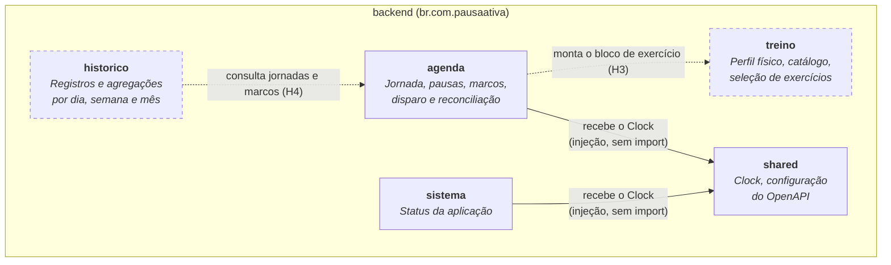
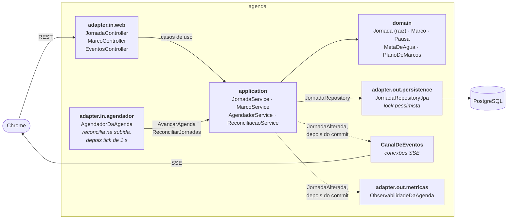

# C4 Nível 3: Componentes

O backend é um **monólito modular** com **arquitetura hexagonal**: cada módulo protege o próprio domínio, e o mundo externo (HTTP, banco, agendador) só entra por adapters. O frontend está no [fim desta página](#frontend).

## Módulos

| Módulo | Tipo | Conteúdo na v0.2.0 | Recebe código em |
|---|---|---|---|
| `agenda` | Bounded context | Jornada e marcos de hidratação, agendador, reconciliação, API REST, SSE e métricas ([abaixo](#agenda-por-dentro)) | H2; marcos de exercício na H3 |
| `treino` | Bounded context | Só a estrutura de pacotes | H3 |
| `historico` | Bounded context | Só a estrutura de pacotes | H4 |
| `sistema` | Técnico | `StatusController` (`GET /api/v1/sistema/status`) | — |
| `shared` | Transversal | `RelogioConfig` (o `Clock` único), `OpenApiConfig` | — |

Um módulo só fala com outro pela **porta de entrada** dele (`application.port.in`). As setas tracejadas mostram as dependências planejadas.

## Estrutura hexagonal de cada módulo

| Pacote | Responsabilidade | Pode usar |
|---|---|---|
| `domain` | Agregados, entidades, value objects, regras | Só o JDK. O tempo vem de um `Clock` recebido. |
| `application.port.in` | Interfaces dos casos de uso, comandos e consultas | `domain` |
| `application.port.out` | Interfaces do que o módulo precisa de fora | `domain` |
| `application` | Implementação dos casos de uso | `domain`, portas; `@Service` e `@Transactional` |
| `adapter.in.web` | Traduz HTTP para as portas de entrada | `application.port.in` |
| `adapter.out.persistence` | Implementa as portas de saída com JPA | `application.port.out`, `domain` |

## Agenda por dentro

| Componente | Papel |
|---|---|
| `Jornada` | Raiz do agregado: dona das pausas e dos 16 marcos. Calcula o tempo trabalhado, dispara marcos, vence prazos, finaliza e reconcilia. Recebe o instante atual como parâmetro e registra `MarcoDisparado` e `MarcoEncerrado`. |
| `JornadaService`, `MarcoService` | Comandos da tela. Antes de agir, põem a jornada em dia (`avancar`), como o próximo tick faria. |
| `AgendadorService` | O tick: avança a jornada aberta e encerra a esquecida (spec H2, seção 3.5). |
| `ReconciliacaoService` | Na subida: marcos que passaram com o backend fora viram `NAO_ENTREGUE`, sem disparo atrasado. |
| `AgendadorDaAgenda` | Chama a reconciliação e **só depois** liga o tick de 1 s. Um `@Scheduled` comum poderia rodar antes. |
| `PublicadorDeAlteracoes` | Depois de gravar, publica `JornadaAlterada` (situação + eventos). Comandos sem mudança não publicam. |
| `CanalDeEventos` | Conexões SSE das abas. Recebe `JornadaAlterada` depois do commit e envia `marco-disparado` e `jornada-atualizada`; ping a cada 20 s. |
| `ObservabilidadeDaAgenda` | Métricas `pausaativa.marcos.*` e logs JSON com `jornadaId` e `marcoId`. |
| `JornadaRepositoryJpa` | Carrega a jornada com lock pessimista (`SELECT … FOR NO KEY UPDATE`): o tick e os cliques nunca alteram a mesma jornada ao mesmo tempo. |
| `TratamentoDeErrosDaAgenda` | Regras recusadas viram Problem Details: 400, 404 ou 409, com a mensagem do domínio. |

**Tabelas** (migração `V2`): `jornada`, `pausa` e `marco`. Uma restrição única por dia e um índice parcial barram a segunda jornada aberta, mesmo com dois "Iniciar dia" simultâneos; `unique (jornada_id, categoria, sequencia)` barra marco duplicado.

## Regras de arquitetura

Verificadas pelo ArchUnit em toda build (`ArquiteturaTest`). Uma violação quebra o `./mvnw verify` e o CI.

| Regra | O que proíbe |
|---|---|
| **R1** | `domain` dependendo de Spring, JPA, Hibernate ou Jackson |
| **R2** | `domain` dependendo de `application` ou `adapter` |
| **R3** | `application` dependendo de `adapter` ou de JPA |
| **R4** | Um módulo acessando outro fora do `application.port.in` dele |
| **R5** | Ciclos entre módulos |
| **R6** | Ler o relógio do sistema (`Instant.now()`, `LocalDate.now()`, `System.currentTimeMillis()`…) sem um `Clock`. Desde a v0.2.0. |

Cada regra tem uma classe de exemplo que a viola de propósito (`backend/src/test/java/fixtures/arquitetura/rN`), e o `RegrasDeArquiteturaTest` confere que a regra a pega. Assim as regras ficam comprovadas mesmo nos módulos ainda vazios.

## Componentes transversais

| Componente | Papel |
|---|---|
| `RelogioConfig` | Único `Clock` da aplicação, em `America/Sao_Paulo`, com precisão de milissegundos. A JVM e o banco trabalham em UTC. Os testes trocam o `Clock` por um controlável, que avança sem `sleep`. |
| `OpenApiConfig` | Metadados do contrato OpenAPI (springdoc). O `ContratoOpenApiTest` compara o gerado com `docs/api/openapi.json`. |
| Spring Boot Actuator | Health (com liveness e readiness), info e métricas Prometheus |
| Flyway | Migrações em `src/main/resources/db/migration`. A `V1` é só o baseline; a `V2` cria as tabelas da Agenda. |
| HikariCP | Pool de conexões com timeouts curtos e `socketTimeout` de 10 s, para nenhuma thread travar com o banco sem resposta |
| Threads virtuais | `spring.threads.virtual.enabled`: as conexões SSE ficam abertas o dia todo sem prender threads de plataforma |

## Frontend

Uma tela só, sem router nem Pinia. O estado fica em composables do Vue.

| Peça | Papel |
|---|---|
| `JornadaView` | A página. Liga os composables: confirma o recebimento dos lembretes pendentes que aparecem e anuncia os novos com notificação e som. |
| `useJornada` | Situação da jornada e comandos. Mantém o cronômetro com `performance.now()` e descarta respostas mais velhas que a da tela. Em 404 ou 409, busca a situação real. |
| `useEventos` | `EventSource` em `/api/v1/eventos`. Quando o navegador desiste (502 do nginx), abre outra conexão com espera de 2 s, dobrando até 30 s. Cada abertura busca a jornada atual. |
| `useNotificacoes` | Permissão e notificação do Chrome, com a `tag` igual ao id do marco. |
| `useSom` | Tom de 880 Hz por Web Audio; sabe quando o Chrome ainda bloqueia o som. |
| `api/` | Cliente HTTP com timeout de 5 s e Problem Details; tipos gerados do contrato (`contrato.ts`). |
| Componentes | `IniciarDia`, `PainelDaJornada`, `CartaoDoMarco`, `ListaDeMarcos`, `ResumoDoDia`, `AvisosDoNavegador`, `RodapeDeConexao` |
