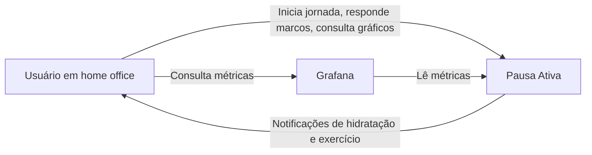
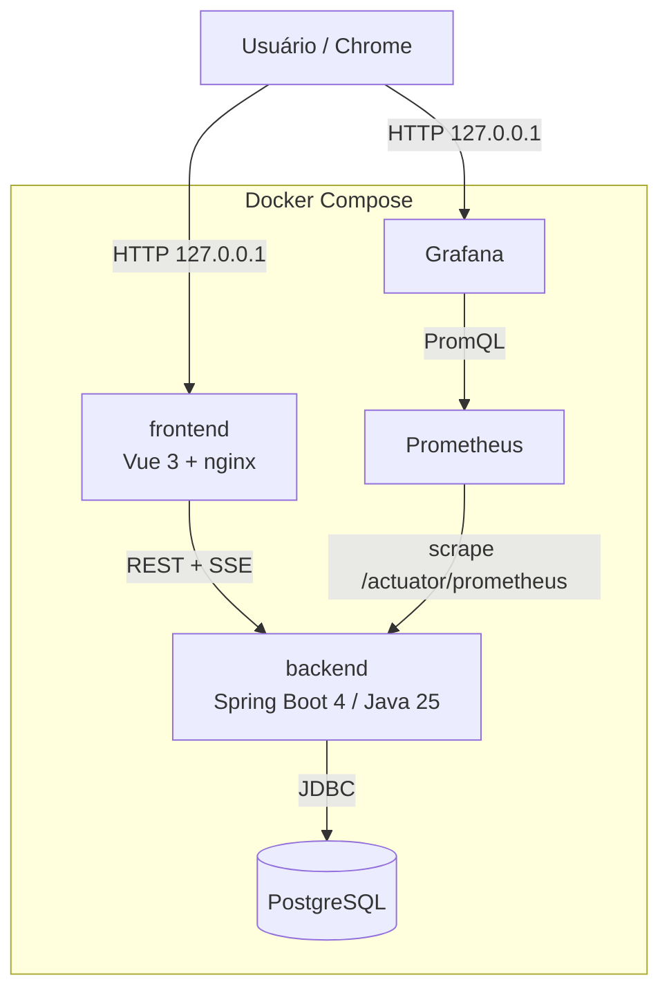

# [ÉPICO] - Pausa Ativa: hidratação e exercício durante a jornada de home office

> Nome de trabalho: **Pausa Ativa**. Documento gerado em 2026-09-30 a partir do refinamento com Tech Lead + PO.
> Metodologia: **SDD (Spec-Driven Development)**. Cada história vira uma spec em `docs/specs/` antes do código e é entregue como uma release própria.

## Contexto / Valor de Negócio

- **Problema:** em home office, o usuário bebe cerca de 1 L de água por dia e só se exercita quando não sai tarde do trabalho.
- **Objetivo:** distribuir hidratação e exercício curto ao longo da jornada, sem atrapalhar o trabalho (pausas de 5 min, ou 10 min em dias tranquilos).
- **Métrica de sucesso:** **≥ 80% dos marcos concluídos por jornada**, medido em separado para Hidratação e Exercício, sustentado por 30 dias de uso.
  - Taxa = `CONCLUIDO / (CONCLUIDO + FALHA)`. Os status `NAO_ENTREGUE` e `NAO_CONCLUIDO` ficam fora do denominador.
- **Stakeholder:** usuário único, máquina local, sem autenticação.

### Base de evidência (pesquisa de 2026-09-30)

| Tema | Achado | Impacto no produto |
|---|---|---|
| Pausas no tempo sentado | Ensaio cruzado (Columbia/Mount Sinai): 5 min de caminhada leve a cada 30 min foi a única dose que reduziu glicemia; todas as doses reduziram a pressão sistólica em 4 a 5 mmHg. Pausas a cada 60 min não mostraram benefício glicêmico. | Exercício ficou em 60 min por decisão do usuário. O marco de hidratação a cada 30 min serve também como pausa para levantar. Ver Perguntas Pendentes. |
| "Exercise snacks" | Revisão narrativa de 2026: blocos de 20 s a poucos minutos (por exemplo, 15 agachamentos ou 2 min de caminhada a cada 30 min) melhoram aptidão cardiorrespiratória em adultos inativos. | Sustenta blocos de 5 min com peso corporal. |
| Ingestão de água | National Academies: ingestão total adequada de cerca de 3,7 L/dia (homens) e 2,7 L/dia (mulheres), somando bebidas e alimentos. EFSA: 2,5 L e 2,0 L. | A meta de 3 L só no expediente fica acima da referência de bebidas do dia inteiro. É decisão do usuário e é configurável. |
| Segurança do ritmo | Rins saudáveis eliminam de 0,8 a 1,0 L de água livre por hora. | 3 L em 8 h equivalem a 375 ml/h, dentro da margem. |

Fontes:
[Columbia](https://www.cuimc.columbia.edu/news/rx-prolonged-sitting-five-minute-stroll-every-half-hour) ·
[Mount Sinai](https://scholars.mssm.edu/en/publications/breaking-up-prolonged-sitting-to-improve-cardiometabolic-risk-dos/) ·
[Exercise snacks (PMC)](https://pmc.ncbi.nlm.nih.gov/articles/PMC13144037/) ·
[National Academies](https://www.nationalacademies.org/news/report-sets-dietary-intake-levels-for-water-salt-and-potassium-to-maintain-health-and-reduce-chronic-disease-risk) ·
[EFSA](https://www.efsa.europa.eu/en/press/news/nda100326) ·
[Water intoxication](https://en.wikipedia.org/wiki/Water_intoxication)

> Este app não substitui orientação médica. O catálogo de exercícios e as metas são pontos de partida.

## Descrição

- **Estado atual:** nada existe. Workspace vazio, sem repositório git.
- **Estado desejado:** aplicação web local, em Docker Compose, em que o usuário inicia a jornada, recebe notificações de hidratação (30 min) e exercício (60 min), registra o resultado de cada marco e acompanha gráficos de sucesso e falha por dia, semana e mês.

### Regras de domínio consolidadas

**Jornada**

| Regra | Definição |
|---|---|
| Início e fim | Botões **Iniciar dia** e **Finalizar dia**. Horário flexível, jornada de referência de 8 h trabalhadas. |
| Duração do bloco | Escolhida ao iniciar o dia: 5 min (padrão) ou 10 min. |
| Pausa | Botão **Pausar / Retomar** (almoço). A contagem de tempo trabalhado congela. |
| Estados | `EM_ANDAMENTO` ⇄ `PAUSADA` → `FINALIZADA` ou `ENCERRADA_AUTOMATICAMENTE` |
| Finalizada | Não reabre. Registros editáveis até 23:59 do mesmo dia, com marcação de "editado". |
| Esquecida aberta | Na próxima subida do backend é fechada como `ENCERRADA_AUTOMATICAMENTE`; marcos restantes viram `NAO_ENTREGUE`. |
| Dia sem início | Não gera dado e não conta como falha. |
| Fechamento | Tela de resumo: água total, concluídos, falhas, não entregues, não concluídos. |

**Marcos** (calculados sobre tempo trabalhado, não sobre relógio de parede)

| Categoria | Frequência | Por jornada | Ações | Conteúdo |
|---|---|---|---|---|
| Hidratação | 30 min | 16 | Concluir, Falhar | `meta ÷ 16`; padrão 3.000 ml, ou 187,5 ml por marco (exibido como ~190 ml) |
| Exercício | 60 min | 8 | Concluir, Adiar, Falhar | Bloco de 5 ou 10 min selecionado do catálogo |

- Na hora cheia, **uma notificação única** com as duas ações independentes.
- **Adiar** (só exercício): no máximo 1 vez por marco; o próximo bloco passa a ter 10 min. Se o próximo for concluído, os dois contam como sucesso; se falhar, os dois contam como falha.
- Marco sem resposta até o marco seguinte da mesma categoria vira `FALHA`.

**Status do marco**

| Status | Quando | Entra na taxa? |
|---|---|---|
| `PENDENTE` | Disparado, aguardando resposta | — |
| `CONCLUIDO` | Usuário confirmou | Sim (sucesso) |
| `ADIADO` | Exercício adiado, aguardando o próximo | Resolvido pelo próximo |
| `FALHA` | Usuário marcou falha, ou recebeu e não respondeu | Sim (falha) |
| `NAO_ENTREGUE` | Backend fora do ar, ou frontend não confirmou recebimento | Não |
| `NAO_CONCLUIDO` | Jornada finalizada antes do disparo | Não |

**Treino**

- Formulário inicial: articulações a poupar (joelho, ombro, punho, lombar, cervical), nível (iniciante, intermediário), equipamentos (apoio de flexão, halteres de 2 kg).
- Seleção por **regras determinísticas**: filtra o catálogo por restrição, equipamento e nível; alterna grupos musculares entre marcos; monta o bloco até preencher a duração.

Catálogo inicial (rascunho para revisão do usuário):

| Exercício | Grupo | Equipamento | Evitar se poupa |
|---|---|---|---|
| Agachamento livre | Pernas | — | Joelho |
| Sentar e levantar da cadeira | Pernas | Cadeira | — |
| Afundo alternado | Pernas | — | Joelho |
| Elevação de panturrilha | Pernas | — | — |
| Ponte de glúteo | Posterior | — | — |
| Flexão na parede | Peito | — | Ombro |
| Flexão inclinada na mesa | Peito | Mesa | Ombro, punho |
| Flexão com apoio | Peito | Apoio de flexão | Ombro |
| Prancha | Core | — | Ombro, punho, lombar |
| Bird-dog | Core | — | Punho, joelho |
| Remada curvada | Costas | Halteres 2 kg | Lombar |
| Desenvolvimento de ombros | Ombros | Halteres 2 kg | Ombro, cervical |
| Elevação lateral | Ombros | Halteres 2 kg | Ombro |
| Rosca direta | Braços | Halteres 2 kg | — |
| Marcha estacionária | Cardio leve | — | — |
| Mobilidade cervical e torácica | Mobilidade | — | — |

## Decisões de Arquitetura

| Tema | Decisão |
|---|---|
| Estilo | Monólito modular, Arquitetura Hexagonal, um único deploy |
| Bounded contexts | **Agenda** (Jornada, marcos, disparo, adiamento), **Treino** (perfil, catálogo, seleção), **Histórico** (registros, agregações) |
| Agregados | `Jornada` (raiz, contém `Marco`), `PerfilFisico`, `Exercicio` (catálogo) |
| Backend | Java 25, Spring Boot 4.x, Maven, Flyway |
| Banco | PostgreSQL em container, sem porta exposta ao host |
| Frontend | Vue 3, Vite, TypeScript, servido por nginx |
| Comunicação | REST (comandos e consultas) + SSE (backend → frontend para disparo de marcos) |
| Notificação | Notification API do Chrome com aba fixada, alerta sonoro configurável |
| Relógio | Backend é o agendador único; tempo acessado por `java.time.Clock` injetado, fuso `America/Sao_Paulo`, persistência em UTC |
| Observabilidade | Logs JSON em stdout, Actuator, Micrometer, Prometheus, Grafana |
| Entrega | Monorepo no GitHub, GitHub Actions (lint e testes), Docker Compose |

**Ports**

| Tipo | Port | Adapter |
|---|---|---|
| Entrada | Casos de uso de Jornada, Marco, Perfil, Histórico | Controllers REST |
| Entrada | Tick do agendador | `@Scheduled` do Spring |
| Saída | `JornadaRepository`, `PerfilRepository`, `CatalogoRepository` | Spring Data JPA + PostgreSQL |
| Saída | `NotificadorDeMarco` | Emissor SSE |
| Saída | `Clock` | `Clock.system(America/Sao_Paulo)` |

**Resiliência**

- **Reconciliação na subida:** fecha jornada esquecida e marca `NAO_ENTREGUE` o que não disparou.
- **Confirmação de recebimento:** o frontend confirma cada evento; sem confirmação, o marco vira `NAO_ENTREGUE` em vez de `FALHA`.
- **SSE:** reconexão automática; ao reconectar, o frontend busca os marcos pendentes por REST.
- **Idempotência:** constraint única `(jornada, categoria, sequência)`; concluir um marco já concluído devolve o estado atual sem erro.
- **Permissão de notificação negada:** aviso fixo na tela.
- **Infra:** healthcheck do Postgres, backend aguarda `service_healthy`, `restart: unless-stopped`, script de `pg_dump`.

### C4 Nível 1: Contexto

### C4 Nível 2: Containers

O Nível 3 (componentes por bounded context) é entregável da História 1, em `docs/arquitetura/`.

## Histórias

Cada história é uma release. Ordem de entrega: 1 → 2 → 3 → 4 → 5.

---

### História 1 — [TECH] Montar a fundação do projeto (release v0.1.0)

**Descrição:** monorepo `backend/` + `frontend/`, `docker-compose.yml` com frontend, backend e Postgres, Flyway com migração inicial, esqueleto hexagonal com os três módulos, CI, README de subida e documentação C4.

**Critérios de Aceitação**

#### Cenário 1: subida do zero
- **Dado** uma máquina com Docker e o repositório clonado
- **Quando** executo `docker compose up -d` seguindo apenas o README
- **Então** frontend, backend e Postgres ficam saudáveis e a página inicial abre em `http://127.0.0.1`

#### Cenário 2: regra de arquitetura protegida
- **Dado** uma classe de domínio que importa Spring ou JPA
- **Quando** a build roda
- **Então** o teste ArchUnit falha e a build quebra

#### Cenário 3: banco indisponível (erro)
- **Dado** o Postgres parado
- **Quando** consulto `/actuator/health`
- **Então** o status é `DOWN` e o backend volta a `UP` sozinho quando o banco retorna

#### Cenário 4: CI
- **Dado** um pull request aberto
- **Quando** o GitHub Actions executa
- **Então** lint, testes de backend e frontend e cobertura mínima de 80% são verificados

**Entregáveis de documentação:** `README.md` (subir a aplicação, para qualquer pessoa), `docs/arquitetura/` (C4 níveis 1 a 3), `docs/releases/v0.1.0.md`.

**Dependências:** conta e repositório no GitHub; Docker Desktop.

---

### História 2 — [FEATURE] Controlar a jornada e registrar hidratação (release v0.2.0)

**Descrição:** iniciar, pausar, retomar e finalizar o dia; agendador de marcos de hidratação a cada 30 min de tempo trabalhado; SSE, notificação do Chrome com som configurável; registro de Concluir ou Falhar; reconciliação.

**Critérios de Aceitação**

#### Cenário 1: marco de hidratação dispara
- **Dado** uma jornada iniciada às 09:00 com meta de 3.000 ml
- **Quando** o relógio chega às 09:30
- **Então** recebo em até 5 s uma notificação pedindo ~190 ml e o marco fica `PENDENTE`

#### Cenário 2: concluir
- **Dado** um marco de hidratação `PENDENTE`
- **Quando** clico em Concluir
- **Então** o marco vira `CONCLUIDO` e o total de água do dia aumenta em 187,5 ml

#### Cenário 3: pausa de almoço
- **Dado** uma jornada pausada às 12:00 com 20 min decorridos desde o último marco
- **Quando** retomo às 13:00
- **Então** o próximo marco dispara às 13:10 e nenhum marco dispara durante a pausa

#### Cenário 4: sem resposta vira falha
- **Dado** um marco `PENDENTE` com recebimento confirmado pelo frontend
- **Quando** o marco seguinte de hidratação dispara
- **Então** o marco anterior vira `FALHA`

#### Cenário 5: notificação não entregue (erro)
- **Dado** uma jornada em andamento e nenhuma aba aberta
- **Quando** um marco dispara e o frontend não confirma o recebimento
- **Então** o marco vira `NAO_ENTREGUE` e não entra na taxa de sucesso

#### Cenário 6: duplo clique (erro)
- **Dado** um marco já `CONCLUIDO`
- **Quando** envio Concluir novamente, inclusive por outra aba
- **Então** recebo o estado atual, sem erro e sem registro duplicado

#### Cenário 7: finalizar antes das 8 h
- **Dado** uma jornada com 5 h trabalhadas
- **Quando** clico em Finalizar dia
- **Então** os marcos ainda não disparados viram `NAO_CONCLUIDO` e a jornada fica `FINALIZADA`

#### Cenário 8: jornada esquecida aberta
- **Dado** uma jornada de ontem em `EM_ANDAMENTO`
- **Quando** o backend sobe hoje
- **Então** ela vira `ENCERRADA_AUTOMATICAMENTE` e seus marcos restantes viram `NAO_ENTREGUE`

**Dependências:** História 1.

---

### História 3 — [FEATURE] Montar e executar blocos de exercício (release v0.3.0)

**Descrição:** formulário de perfil físico, catálogo de exercícios via migração, seleção por regras, marcos de exercício a cada 60 min com Concluir, Adiar e Falhar, notificação combinada na hora cheia.

**Critérios de Aceitação**

#### Cenário 1: seleção respeita restrição
- **Dado** um perfil que poupa joelho e não tem halteres
- **Quando** um bloco de exercício é montado
- **Então** ele não contém agachamento livre, afundo nem exercícios com halteres

#### Cenário 2: notificação combinada
- **Dado** uma jornada iniciada às 09:00
- **Quando** o relógio chega às 10:00
- **Então** recebo uma única notificação com hidratação e exercício, respondíveis de forma independente

#### Cenário 3: adiar
- **Dado** um marco de exercício `PENDENTE` em um dia de blocos de 5 min
- **Quando** clico em Adiar
- **Então** o marco vira `ADIADO` e o próximo bloco tem 10 min

#### Cenário 4: adiado e concluído conta como sucesso
- **Dado** um marco `ADIADO`
- **Quando** concluo o bloco seguinte
- **Então** os dois marcos contam como `CONCLUIDO`

#### Cenário 5: segundo adiamento (erro)
- **Dado** um marco seguinte a um `ADIADO`
- **Quando** tento adiar de novo
- **Então** a ação é recusada com mensagem clara e só Concluir ou Falhar ficam disponíveis

#### Cenário 6: perfil ausente (erro)
- **Dado** que o perfil físico não foi preenchido
- **Quando** tento iniciar o dia
- **Então** sou levado ao formulário antes de a jornada começar

#### Cenário 7: restrições eliminam o catálogo (erro)
- **Dado** um perfil cujas restrições deixam menos exercícios que o necessário
- **Quando** o bloco é montado
- **Então** ele é preenchido com marcha estacionária e mobilidade, que não têm restrição

**Dependências:** História 2; revisão do catálogo pelo usuário.

---

### História 4 — [FEATURE] Visualizar histórico e gráficos (release v0.4.0)

**Descrição:** agregações por dia, semana e mês, por categoria; tela de resumo ao finalizar o dia; edição de registros no mesmo dia.

**Critérios de Aceitação**

#### Cenário 1: taxa de sucesso do dia
- **Dado** uma jornada com 12 hidratações concluídas, 2 falhas e 2 não entregues
- **Quando** abro o gráfico do dia
- **Então** a taxa de hidratação é 85,7% (12 de 14) e as não entregues aparecem como categoria à parte

#### Cenário 2: visão semanal e mensal
- **Dado** jornadas registradas em várias semanas
- **Quando** alterno entre semana e mês
- **Então** vejo concluídos, falhas, não entregues e não concluídos por período, em separado para cada categoria, em menos de 500 ms

#### Cenário 3: resumo de fechamento
- **Dado** uma jornada em andamento
- **Quando** finalizo o dia
- **Então** vejo água total ingerida, marcos por status e se a meta de 80% foi atingida

#### Cenário 4: edição no mesmo dia
- **Dado** um marco de hoje marcado como `FALHA`
- **Quando** o altero para `CONCLUIDO` antes das 23:59
- **Então** o registro é atualizado, fica marcado como editado e os gráficos refletem a mudança

#### Cenário 5: edição fora do prazo (erro)
- **Dado** um marco de ontem
- **Quando** tento editá-lo
- **Então** a ação é recusada e o registro permanece inalterado

#### Cenário 6: período sem dados
- **Dado** uma semana sem nenhuma jornada
- **Quando** abro o gráfico dessa semana
- **Então** vejo um estado vazio explícito, não zeros contados como falha

**Dependências:** Histórias 2 e 3.

---

### História 5 — [TECH] Operar com métricas e backup (release v0.5.0)

**Descrição:** Prometheus e Grafana no compose com dashboard provisionado; métricas de negócio (marcos por status e categoria, atraso de disparo) e técnicas (JVM, HTTP, conexões SSE); scripts de `pg_dump` e restauração.

**Critérios de Aceitação**

#### Cenário 1: dashboard pronto
- **Dado** a stack no ar
- **Quando** abro o Grafana em `127.0.0.1`
- **Então** o dashboard provisionado mostra marcos por status, atraso de disparo e saúde da JVM sem configuração manual

#### Cenário 2: backup e restauração
- **Dado** um banco com histórico
- **Quando** executo o script de dump, recrio o volume e executo o de restauração
- **Então** o histórico volta íntegro

#### Cenário 3: dump com banco parado (erro)
- **Dado** o Postgres parado
- **Quando** executo o script de dump
- **Então** ele termina com código de saída diferente de zero e mensagem clara, sem gerar arquivo vazio

**Dependências:** História 2.

## Definition of Ready (DoR)

- [ ] Spec da história escrita em `docs/specs/` e revisada pelo usuário (SDD)
- [ ] Critérios de aceitação em Gherkin, testáveis com `Clock` controlado
- [ ] Dependências da história anterior entregues
- [ ] Ports e adapters da história identificados
- [ ] Requisitos não-funcionais aplicáveis listados
- [ ] Perguntas pendentes que afetam a história resolvidas
- [ ] Sem impedimentos bloqueantes

Estimativa em story points foi dispensada pelo usuário.

## Definition of Done (DoD)

- [ ] Código implementado conforme os critérios de aceitação
- [ ] Testes unitários de domínio em Java puro (JUnit 5, AssertJ), sem contexto Spring
- [ ] Cobertura de linhas ≥ 80% (JaCoCo), com a build quebrando abaixo disso
- [ ] Testes de integração com Testcontainers + PostgreSQL (sem H2)
- [ ] Testes de controller com MockMvc, incluindo SSE
- [ ] ArchUnit verde: domínio sem Spring nem JPA
- [ ] Frontend com Vitest + Vue Test Utils e lint (ESLint, `vue-tsc`) sem erros
- [ ] Contrato OpenAPI atualizado
- [ ] Migrações Flyway versionadas
- [ ] CI verde no GitHub Actions
- [ ] Logs estruturados e métricas da funcionalidade expostos
- [ ] `docker compose up -d` sobe a stack do zero
- [ ] `README.md` atualizado
- [ ] Diagramas C4 atualizados quando a arquitetura mudar
- [ ] `docs/releases/vX.Y.Z.md` descrevendo o que foi entregue
- [ ] Merge na `main` e tag da release
- [ ] Aceite do usuário (papel de PO e QA)

## Cenários de Teste

### Testes Funcionais
- [ ] Jornada completa de 8 h: 16 marcos de hidratação e 8 de exercício nos instantes corretos
- [ ] Pausa e retomada deslocam os marcos pelo tempo pausado
- [ ] Bloco de exercício respeita perfil, equipamento e duração
- [ ] Adiamento dobra o próximo bloco e resolve os dois marcos juntos
- [ ] Taxa de sucesso ignora `NAO_ENTREGUE` e `NAO_CONCLUIDO`

### Testes de Erro / Edge Cases
- [ ] Iniciar segunda jornada com uma em andamento é recusado
- [ ] Concluir marco duas vezes é idempotente
- [ ] Jornada que atravessa a meia-noite
- [ ] Finalizar com marco `PENDENTE` em aberto
- [ ] Retomar jornada que não está pausada é recusado
- [ ] Permissão de notificação negada exibe aviso fixo
- [ ] Meta de água configurada com valor inválido (zero, negativo) é recusada

### Testes de Integração
- [ ] Reconciliação na subida com jornada antiga aberta (Testcontainers)
- [ ] Constraint única impede marco duplicado sob concorrência
- [ ] Stream SSE entrega o evento e a reconexão recupera o marco pendente
- [ ] Migrações Flyway aplicam do zero em Postgres limpo

## Requisitos Não-Funcionais

| Aspecto | Requisito |
|---|---|
| Pontualidade | Notificação exibida em até 5 s do instante calculado do marco |
| Performance | p95 < 200 ms nas operações de marco; agregação mensal < 500 ms |
| Recursos | Backend limitado a 512 MB no container |
| Segurança | Sem autenticação; portas só em `127.0.0.1`; Postgres sem porta no host; credenciais em `.env` fora do git; Dependabot |
| Escalabilidade | Usuário único, uma instância; fora de escopo |
| Disponibilidade | Sem SLA; `restart: unless-stopped`; sobe com o Docker Desktop |
| Observabilidade | Logs JSON em stdout, Actuator `/health`, Micrometer, Prometheus, Grafana |
| Compatibilidade | Chrome (único browser garantido) |
| Retenção | Histórico mantido indefinidamente; backup por `pg_dump` |

## Dependências

- [ ] Docker Desktop no Windows
- [ ] Repositório no GitHub com Actions habilitado
- [ ] Chrome com permissão de notificação para `127.0.0.1`
- [ ] Revisão do catálogo de exercícios pelo usuário

## Notas Adicionais

- **Limitações conhecidas:** com o Chrome fechado ou o modo "Não incomodar" do Windows ativo, a notificação não aparece. O status `NAO_ENTREGUE` cobre o primeiro caso; o segundo não é detectável e pode virar `FALHA`.
- **Fora de escopo:** autenticação, acesso por celular, E2E com Playwright, geração de treino por LLM, reabertura de jornada.
- **Melhorias futuras:** Push API com service worker para funcionar com a aba fechada; streaks; progressão de carga no catálogo; importação de feriados.

## ⚠️ Perguntas Pendentes para Refinamento

1. **Marco em aberto ao finalizar o dia:** a resposta foi "aceito" para uma pergunta de duas opções. Adotado `NAO_CONCLUIDO` (coerente com "finalizar cedo não é falha"). Confirmar, ou trocar para `FALHA`. Afeta a História 2.
2. **Depois de 8 h trabalhadas:** adotado que os marcos param (16 + 8) e a jornada segue aberta até Finalizar dia. Confirmar, ou continuar disparando em hora extra. Afeta a História 2.
3. **Frequência do exercício:** a evidência favorece pausas a cada 30 min; o usuário escolheu 60 min. Vale orientar no marco de hidratação intermediário que o usuário se levante para buscar a água? Afeta as Histórias 2 e 3.
4. **Meta de 3 L no expediente:** fica acima das referências para bebidas do dia inteiro. Mantida por decisão do usuário; rever após as primeiras semanas de uso.
5. **Catálogo e restrições:** a tabela é rascunho e precisa da revisão do usuário antes da História 3.
