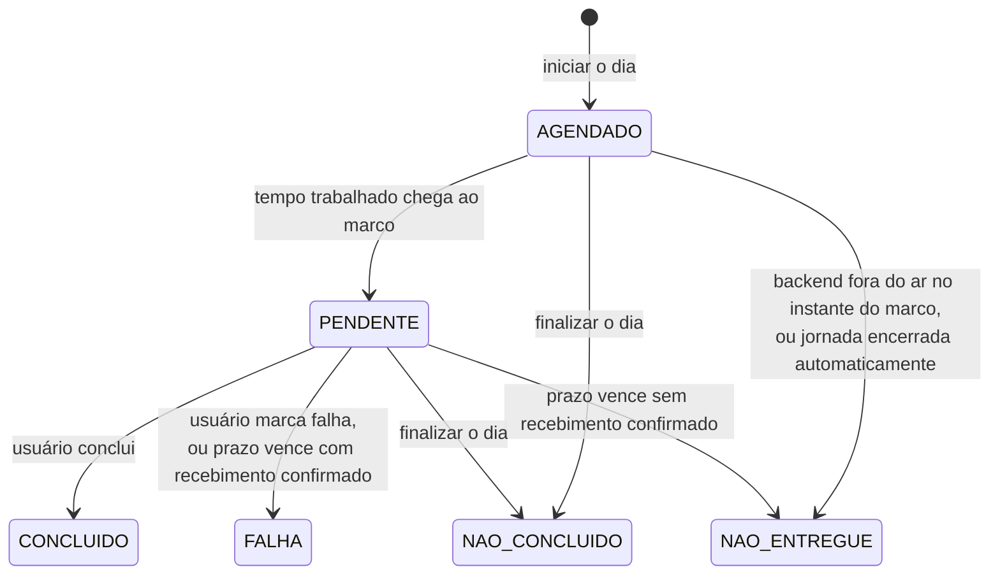

# Spec H2 — Controlar a jornada e registrar hidratação (release v0.2.0)

> **Status:** aprovada pelo usuário em 2026-10-01, com as recomendações D1 a D8 da seção 13. Entregue em 2026-10-02 como v0.2.0, com aceite do usuário; progresso na seção 12.
> **Origem:** História 2 de [`docs/epico-pausa-ativa.md`](../epico-pausa-ativa.md).
> **Depende de:** H1 (v0.1.0), entregue em 2026-10-01.
> **Data:** 2026-10-01.

## 1. Objetivo

Ao fim desta release, o usuário:

- inicia o dia, pausa para o almoço, retoma e finaliza;
- recebe uma notificação do Chrome a cada 30 min de **tempo trabalhado**, pedindo ~190 ml de água;
- responde cada lembrete com **Concluir** ou **Falhar**;
- vê o tempo trabalhado, a água do dia e a situação de cada lembrete;
- não perde dados quando o backend reinicia ou quando esquece a jornada aberta.

O exercício (H3) e os gráficos (H4) ficam fora. A Agenda, porém, já nasce pronta para receber a segunda categoria de marco.

## 2. Escopo

| Dentro | Fora (história que entrega) |
|---|---|
| Iniciar, pausar, retomar e finalizar a jornada | Marcos de exercício, perfil físico, duração do bloco (H3) |
| Meta de água informada ao iniciar (padrão 3.000 ml) | Resumo completo de fechamento, gráficos, edição de registros (H4) |
| 16 marcos de hidratação por jornada, a cada 30 min de tempo trabalhado | Prometheus e Grafana (H5) |
| Concluir e Falhar; idempotência | Botões de ação dentro da notificação (exige service worker; ver seção 13) |
| Confirmação de recebimento; `NAO_ENTREGUE` | |
| Prazo de resposta; `FALHA` sem resposta | |
| Reconciliação: jornada esquecida, backend fora do ar | |
| SSE com reconexão; notificação do Chrome; som configurável | |
| Aviso fixo com a permissão de notificação negada | |
| Modo demonstração para o aceite (seção 9) | |
| Métricas e logs da funcionalidade; regra ArchUnit R6 | |

## 3. Regras de domínio refinadas

O épico define as regras. Esta seção as torna precisas o bastante para o código e os testes. Os pontos que o épico não decidia estão marcados com **(D*n*)** e listados na seção 13.

### 3.1 Tempo trabalhado

- Tempo trabalhado = tempo desde o início − soma das pausas (a pausa em curso conta até agora).
- Durante a pausa, o tempo trabalhado fica congelado: nenhum marco dispara e nenhum prazo corre.
- O tempo continua contando com o backend fora do ar: a pessoa continua trabalhando.

### 3.2 Marcos de hidratação

- Ao iniciar o dia, a jornada cria os **16 marcos** de hidratação com o status **`AGENDADO`** **(D1)**.
- O marco *n* (1 a 16) dispara quando o tempo trabalhado chega a *n* × 30 min. O 16º dispara às 8 h trabalhadas, e depois disso não há mais marcos (pergunta 2 do épico, resolvida).
- Volume de cada marco = meta ÷ 16. Com 3.000 ml, são 187,5 ml, exibidos arredondados para a dezena: "~190 ml".
- Marcos **ímpares** (meia hora: 0:30, 1:30…) orientam: "Levante-se para buscar a água" (pergunta 3 do épico). Os pares coincidem com o exercício a partir da H3.

| Exemplo (início 09:00, sem pausa) | Marco 1 | Marco 2 | Marco 16 |
|---|---|---|---|
| Dispara às | 09:30 | 10:00 | 17:00 |

| Exemplo com pausa (Cenário 3), início às 08:40 | Tempo trabalhado |
|---|---|
| Marco 6 dispara às 11:40 | 3 h 00 |
| Pausa às 12:00, 20 min depois do marco 6 | Congela em 3 h 20 |
| Retomada às 13:00 | Continua de 3 h 20 |
| Marco 7 dispara às **13:10** | 3 h 30 |

### 3.3 Ciclo de vida do marco



| Regra | Definição |
|---|---|
| Prazo de resposta | 30 min de **tempo trabalhado** depois do disparo, que é quando dispara o marco seguinte (Cenário 4). O 16º marco também tem prazo: 8 h 30 de tempo trabalhado **(D2)**. A pausa congela o prazo. |
| Prazo vencido | Com recebimento confirmado pelo frontend → `FALHA`. Sem confirmação → `NAO_ENTREGUE` (Cenário 5). |
| Recebimento | O frontend confirma ao receber o evento, com a aba aberta, mesmo com a permissão de notificação negada (nesse caso, o aviso fixo da tela orienta a liberar). |
| Finalizar o dia | `AGENDADO` e `PENDENTE` → `NAO_CONCLUIDO` (pergunta 1 do épico, resolvida; Cenário 7). |
| Concluir ou Falhar de novo | Repetir a mesma resposta devolve o estado atual, sem erro e sem registro duplicado (Cenário 6). Responder um marco já encerrado com **outro** status é recusado (409), com a mensagem de que a edição no mesmo dia chega na v0.4.0. |
| Água do dia | Soma do volume dos marcos `CONCLUIDO` (Cenário 2: +187,5 ml por marco). |

### 3.4 Jornada

| Regra | Definição |
|---|---|
| Estados | `EM_ANDAMENTO` ⇄ `PAUSADA` → `FINALIZADA` ou `ENCERRADA_AUTOMATICAMENTE` |
| Iniciar | Recusado se já houver jornada `EM_ANDAMENTO` ou `PAUSADA` de hoje. **Uma jornada por dia**: depois de finalizada, não se inicia outra no mesmo dia **(D3)**. |
| Dia da jornada | Data de início no fuso America/Sao_Paulo. Uma jornada que atravessa a meia-noite continua sendo do dia em que começou. |
| Pausar / Retomar | Pausar só em `EM_ANDAMENTO`; retomar só em `PAUSADA`. O contrário é recusado (409). |
| Finalizar | Em `EM_ANDAMENTO` ou `PAUSADA`. Finalizar de novo devolve o estado atual (idempotente). Não reabre. |
| Meta de água | Informada ao iniciar; padrão 3.000 ml. Aceita de 1 a 6.000 ml **(D4)**. Zero, negativo ou acima do teto: recusado (400). |

### 3.5 Reconciliação

| Situação | Quando é verificada | O que acontece |
|---|---|---|
| Jornada esquecida: de um dia anterior **e** sem marco por disparar ou responder, ou pausada desde um dia anterior **(D5, refinada na T2)** | Na subida do backend, ao clicar em Iniciar dia e a cada tick do agendador (T4) | Vira `ENCERRADA_AUTOMATICAMENTE`. Marcos `PENDENTE` seguem a regra do prazo vencido; os `AGENDADO` viram `NAO_ENTREGUE` (Cenário 8). |
| Backend fora do ar no instante de um marco | Na subida do backend | Marcos `AGENDADO` cujo instante já passou viram `NAO_ENTREGUE`, sem disparar atrasado. Evita uma rajada de notificações velhas. |
| Prazo vencido durante a queda | Na subida do backend | Mesma regra do prazo vencido. |

Antes de decidir se a jornada aberta ficou esquecida, ela é **posta em dia** (`Jornada.reconciliar`): prazos vencidos são resolvidos e marcos que passaram sem disparar viram `NAO_ENTREGUE`. Assim, uma jornada de ontem com lembretes parados no estado de ontem não bloqueia o dia de hoje.

**Por que a regra foi refinada (T2).** A versão aprovada considerava esquecida qualquer jornada de um dia anterior. Com isso, quem começa às 22:00 teria a jornada encerrada logo depois da meia-noite, se o backend reiniciasse ou se clicasse em Iniciar dia, e o épico pede que jornadas pela meia-noite funcionem. Com a regra nova, uma jornada que ainda tem marcos pela frente continua valendo; e o agendador pode encerrar a esquecida sozinho, então na manhã seguinte a tela já mostra "Iniciar dia".

## 4. Arquitetura da H2

Toda a funcionalidade fica no módulo **Agenda**. Treino e Histórico continuam vazios.

| Camada | Elementos |
|---|---|
| `agenda.domain` | `Jornada` (raiz do agregado), `Pausa`, `Marco`, `Categoria`, `StatusJornada`, `StatusMarco`, `MetaDeAgua`, `PlanoDeMarcos` (intervalo e quantidade). Calcula tempo trabalhado, disparos, prazos, finalização e encerramento. Recebe o instante atual como parâmetro: o domínio não lê relógio. |
| `agenda.application.port.in` | `IniciarJornada`, `PausarJornada`, `RetomarJornada`, `FinalizarJornada`, `ConsultarJornadaAtual`, `ResponderMarco` (concluir, falhar), `ConfirmarRecebimento`, `AvancarAgenda` (tick), `ReconciliarJornadas` |
| `agenda.application.port.out` | `JornadaRepository`; `JornadaAlterada`, evento do Spring publicado depois de cada gravação com mudança (substitui o `NotificadorDeMarco` previsto, ver abaixo) |
| `agenda.adapter.in.web` | `JornadaController`, `MarcoController`, `EventosController` (SSE) |
| `agenda.adapter.in.agendador` | `AgendadorDaAgenda`: na subida, chama `ReconciliarJornadas` e **só depois** liga o tick de 1 s (`AvancarAgenda`). Com um `@Scheduled` comum, o tick podia rodar antes da reconciliação e disparar atrasados os marcos vencidos com o backend fora. |
| `agenda.adapter.out.persistence` | Entidades JPA, Spring Data, mapeadores para o domínio |
| `agenda.adapter.in.web` (SSE) | `EventosController` e `CanalDeEventos`: conexões `SseEmitter`, heartbeat e envio depois do commit |
| `agenda.adapter.out.metricas` | `ObservabilidadeDaAgenda`: métricas e logs a partir dos eventos de domínio |

**Concorrência.** O tick do agendador e os cliques do usuário podem alterar a mesma jornada ao mesmo tempo, por exemplo o prazo vencendo enquanto o usuário clica em Concluir. Todo caso de uso que altera a jornada a carrega com **lock pessimista**, e a operação seguinte espera a anterior terminar. Com um único usuário, o custo é desprezível. No Postgres, o Hibernate emite `SELECT … FOR NO KEY UPDATE`: serializa as alterações na jornada sem travar inserções que apontam para ela. Dois "Iniciar dia" simultâneos não têm linha para travar; quem barra o segundo é a restrição do banco, traduzida para `JornadaJaIniciadaException`.

**Relógio.** Os casos de uso leem o `Clock` injetado e passam o instante ao domínio. Nos testes, um relógio controlável avança o tempo sem `sleep`. O relógio de produção tem precisão de milissegundos (`Clock.tickMillis`): o Postgres guarda microssegundos, e com nanossegundos a resposta de um comando e a consulta seguinte mostrariam horários diferentes para o mesmo instante (achado na T4).

**Eventos de domínio (T4).** A `Jornada` registra `MarcoDisparado` e `MarcoEncerrado` a cada transição. Depois de gravar, a aplicação publica `JornadaAlterada` (situação + eventos); o SSE e as métricas a recebem com `@TransactionalEventListener`, só depois do commit, para nunca anunciar algo desfeito. Comandos que não mudam nada (resposta repetida) não publicam.

**Comandos põem a jornada em dia.** Pausar, retomar, finalizar, responder e confirmar recebimento chamam `avancar(agora)` antes de agir, como o próximo tick faria. Assim, concluir um marco cujo prazo venceu há menos de um segundo, antes do tick, é recusado como deveria.

**Threads virtuais** (`spring.threads.virtual.enabled=true`): as conexões SSE ficam abertas o dia todo e não devem prender threads de plataforma.

### 4.1 Regras de arquitetura

- **R6 (nova):** nenhuma classe chama `Instant.now()`, `LocalDate.now()`, `LocalDateTime.now()`, `ZonedDateTime.now()`, `OffsetDateTime.now()` ou `System.currentTimeMillis()` sem um `Clock`. Prevista na spec da H1. Ganha fixture como as demais.
- Sai o `allowEmptyShould(true)` das regras, porque a Agenda passa a ter classes.

## 5. Modelo de dados (migração `V2`)

| Tabela | Colunas principais | Restrições |
|---|---|---|
| `jornada` | `id` (uuid), `versao` (controle otimista do JPA), `data_referencia` (date, dia em São Paulo), `status`, `meta_agua_ml`, `iniciada_em`, `finalizada_em` | `unique (data_referencia)` (D3); índice único parcial que permite **uma** jornada com status `EM_ANDAMENTO` ou `PAUSADA` (barra a segunda jornada mesmo sob concorrência); `check (meta_agua_ml between 1 and 6000)` |
| `pausa` | `jornada_id`, `inicio`, `fim` (nulo enquanto pausada) | Chave `(jornada_id, inicio)`; FK para `jornada` |
| `marco` | `id`, `jornada_id`, `categoria`, `sequencia`, `status`, `segundos_trabalhados_previstos`, `segundos_trabalhados_limite`, `volume_ml` (numeric 8,4), `previsto_para`, `disparado_em`, `recebido_em`, `respondido_em` | `unique (jornada_id, categoria, sequencia)` (épico); FK para `jornada` |

Instantes em `timestamptz`, gravados em UTC. Cada marco guarda o próprio prazo (`segundos_trabalhados_limite`): na H3, exercício (60 min) e água (30 min) têm intervalos diferentes. O volume é exato (meta ÷ 16 tem no máximo 4 casas decimais); com uma casa só, metas como 1 ml seriam arredondadas, e a soma da água do dia sairia errada. `previsto_para` é o instante em que o tempo trabalhado cruzou o limiar; `disparado_em - previsto_para` é o atraso de disparo, medido para a H5.

## 6. Contrato REST

Prefixo `/api/v1`. Erros em **Problem Details** (RFC 9457, `application/problem+json`) com mensagem em português no campo `detail`.

| Método e caminho | Corpo | Sucesso | Erros |
|---|---|---|---|
| `GET /jornadas/atual` | — | 200 com a jornada de hoje (ou a aberta de outro dia), 204 se não houver | — |
| `POST /jornadas` | `{ "metaAguaMl": 3000 }` (opcional) | 201 com a jornada | 400 meta inválida; 409 já existe jornada hoje |
| `POST /jornadas/{id}/pausa` | — | 200 | 409 não está em andamento |
| `POST /jornadas/{id}/retomada` | — | 200 | 409 não está pausada |
| `POST /jornadas/{id}/finalizacao` | — | 200 (idempotente) | 404 |
| `POST /marcos/{id}/conclusao` | — | 200 (idempotente) | 404; 409 já encerrado com outro status |
| `POST /marcos/{id}/falha` | — | 200 (idempotente) | 404; 409 já encerrado com outro status |
| `POST /marcos/{id}/recebimento` | — | 204 (idempotente) | 404 |
| `GET /eventos` | — | `text/event-stream` | — |

Os comandos de jornada usam o `id` no caminho, e não "atual", para a repetição ser idempotente: finalizar duas vezes a mesma jornada devolve o mesmo resultado.

Representação da jornada (resumida):

```json
{
  "id": "7d1c…",
  "dataReferencia": "2026-10-02",
  "status": "EM_ANDAMENTO",
  "iniciadaEm": "2026-10-02T09:00:00-03:00",
  "finalizadaEm": null,
  "pausadaDesde": null,
  "tempoTrabalhadoSegundos": 5400,
  "calculadoEm": "2026-10-02T10:30:00-03:00",
  "metaAguaMl": 3000,
  "aguaIngeridaMl": 562.5,
  "marcos": [
    {
      "id": "a3f0…",
      "categoria": "HIDRATACAO",
      "sequencia": 1,
      "status": "CONCLUIDO",
      "volumeMl": 187.5,
      "segundosTrabalhadosPrevistos": 1800,
      "disparadoEm": "2026-10-02T09:30:01-03:00",
      "recebidoEm": "2026-10-02T09:30:01-03:00",
      "respondidoEm": "2026-10-02T09:31:12-03:00",
      "mensagem": "Beba ~190 ml. Levante-se para buscar a água."
    }
  ]
}
```

O frontend usa `tempoTrabalhadoSegundos` e `calculadoEm` para manter o cronômetro andando entre as atualizações, sem depender do relógio do computador para o cálculo.

`pausadaDesde` é o início da pausa em curso, nulo fora dela. Entrou na T5 para a tela mostrar "Pausado desde 12:00": sem ele, o frontend não tinha como saber quando a pausa começou.

**Tipos do frontend gerados do contrato.** O `openapi-typescript` gera `frontend/src/api/contrato.ts` a partir de `docs/api/openapi.json` (`npm run contrato`). O CI regenera e falha se houver diferença. Assim, backend e frontend não divergem.

- O `openapi-typescript` 7.13 declara compatibilidade só com TypeScript 5. Um `overrides` no `package.json` o faz usar o TypeScript 6 do projeto, e a geração foi conferida: campos nulos saem como `string | null` e os status como união de literais. Rever quando sair uma versão que declare o TS 6.
- Campos que podem vir nulos são declarados como `["string", "null"]` (OpenAPI 3.1) nos DTOs de resposta do adapter web (`JornadaResposta`, `MarcoResposta`), que também marcam todos os campos como obrigatórios. Os DTOs ficam no adapter para as anotações do contrato não subirem para a aplicação.
- Limitação conhecida: o springdoc aplica os códigos de erro do `TratamentoDeErrosDaAgenda` (400, 404, 409) a todos os endpoints da Agenda, inclusive onde não ocorrem (como o 409 no `GET /jornadas/atual`). O frontend não depende dessa lista.

## 7. Eventos (SSE)

`GET /api/v1/eventos`, aberto pela página enquanto ela estiver aberta.

| Evento | Quando | Dados |
|---|---|---|
| `marco-disparado` | Um marco virou `PENDENTE` | O marco, com a mensagem |
| `jornada-atualizada` | Qualquer mudança na jornada (pausa, resposta, prazo, finalização) | A jornada completa |
| comentário `: ping` | A cada 20 s | Mantém a conexão viva através do nginx |

- **Várias abas:** todas recebem os eventos. A notificação usa `tag` igual ao id do marco, e o Chrome mostra uma só.
- **Envio:** depois do commit; um `SseEventBuilder` novo por conexão (o `build()` do Spring acrescenta o terminador a cada chamada e não pode ser reaproveitado).
- **Reconexão:** o `EventSource` reconecta sozinho. Ao reconectar, a página busca `GET /jornadas/atual` e mostra os marcos `PENDENTE`, confirmando o recebimento dos que ainda não tinham sido confirmados.
- **nginx:** `proxy_buffering off` e `proxy_read_timeout 1h` já foram configurados na H1.

Detalhes decididos na T6:

- **Quando o navegador desiste.** O `EventSource` reconecta sozinho quando a conexão cai, mas desiste de vez se a resposta não for um stream. É o que acontece com o backend fora: o nginx responde 502. Nesse caso, `useEventos` abre uma conexão nova depois de 2 s, dobrando a espera a cada falha até 30 s. A espera volta a 2 s quando a conexão abre.
- **Toda abertura sincroniza.** Cada vez que a conexão abre, a primeira inclusive, a tela busca `GET /jornadas/atual`. Isso cobre também a janela entre a carga inicial da página e a abertura do stream, em que um evento poderia se perder.
- **Recebimento.** A tela confirma o recebimento de todo lembrete pendente que aparece nela: pelo evento, ao abrir a página ou depois da reconexão. Confirma uma vez por aba e não confirma o que já tem `recebidoEm`. Se a confirmação falhar, tenta de novo na próxima atualização.
- **Notificação e som.** Tocam no `marco-disparado` e, depois de uma queda, para os pendentes que nenhuma aba recebeu. Uma vez por aba. Ao abrir a página, não tocam: a pessoa já está olhando o cartão. Com várias abas abertas, a notificação é uma só (mesma `tag`), mas cada aba toca o som.
- **Limitação conhecida.** O `EventSource` não entrega ao JavaScript os comentários `: ping`. Por isso, a tela não percebe sozinha uma conexão que parou de responder sem fechar, por exemplo depois de o computador dormir, e depende de o navegador notar a queda. Se isso aparecer no uso, o backend pode enviar o ping como evento nomeado e a tela vigiar o intervalo.

## 8. Frontend

Uma tela só, a da jornada. A página de status da v0.1.0 vira um indicador discreto de conexão no rodapé.

| Situação | O que a tela mostra |
|---|---|
| Sem jornada hoje | Campo da meta de água (preenchido com a última usada ou 3.000) e botão **Iniciar dia**. O clique também pede a permissão de notificação, já que o Chrome exige um gesto do usuário. |
| Em andamento | Tempo trabalhado (HH:mm, andando), água do dia sobre a meta, próximo lembrete ("em 12 min"), botões **Pausar** e **Finalizar dia** |
| Pausada | Tempo congelado, indicação "Pausado desde 12:00", botões **Retomar** e **Finalizar dia** |
| Marco pendente | Cartão em destaque com a mensagem e os botões **Concluir** e **Falhar** |
| Lista do dia | Cada marco com horário, volume e status |
| Finalizada | "Dia finalizado às HH:mm", água total e contagem por status. O resumo completo chega na H4. |
| Permissão negada ou não concedida | Aviso fixo no topo explicando como liberar no Chrome |
| Conexão com o servidor caída | Aviso "Reconectando…" e botões desabilitados |

- **Finalizar dia** pede confirmação na própria tela ("Finalizar? Os lembretes restantes não serão contados").
- **Notificação:** título "Hora da água 💧", corpo com a mensagem do marco. Clicar nela traz a aba do Pausa Ativa para a frente, onde ficam os botões **(D6)**.
- **Som:** liga/desliga na tela, salvo no navegador (`localStorage`); padrão ligado. Um tom curto gerado pelo próprio navegador (Web Audio), sem arquivo de áudio. Depois de recarregar a página, o Chrome só libera o som após um clique na página; a tela avisa quando o som estiver bloqueado **(D7)**.
- **Estado:** composables do Vue (`useJornada`, `useEventos`, `useNotificacoes`), sem Pinia nem router, porque ainda é uma tela só.

Detalhes decididos na T5:

- **Cronômetro.** Entre uma atualização e outra, a tela soma ao `tempoTrabalhadoSegundos` o tempo medido por `performance.now()`, que não muda se alguém acertar o relógio do computador. A previsão de horário dos lembretes agendados parte do `calculadoEm` do servidor e só aparece em andamento. Na pausa, a tela não sabe quando o trabalho volta e mostra "—".
- **Resposta atrasada.** Uma situação com `calculadoEm` mais antigo que a da tela, da mesma jornada, é descartada. Isso vale para respostas de comandos, recargas e, na T6, eventos SSE.
- **Comando recusado.** A tela mostra o `detail` do Problem Details. Com 404 ou 409 (prazo venceu, outra aba respondeu), busca `GET /jornadas/atual` para mostrar a situação real. Com 400 (meta inválida), só mostra o motivo. Um segundo clique, enquanto o primeiro comando não volta, é ignorado.
- **Meta de água.** É validada na tela antes de chamar o servidor (inteiro de 1 a 6.000 ml). A última meta usada fica no `localStorage` e preenche o campo no dia seguinte.
- **Rodapé.** A antiga `HomeView` virou o `RodapeDeConexao`. Desde a T6, ele mostra a conexão SSE ("Conectado ao servidor · versão 0.2.0" ou "Reconectando…") e busca a versão a cada conexão, porque depois de uma queda pode ter subido outra.

Detalhes decididos na T6:

- **Som.** Fica num composable próprio, o `useSom`, porque a liberação do áudio e a permissão de notificação são regras diferentes do Chrome. O tom é de 880 Hz e dura 0,35 s. A tela sabe que o som está bloqueado por `navigator.userActivation.hasBeenActive` e o libera no primeiro `pointerdown` ou `keydown`. Enquanto estiver bloqueado, o lembrete não toca: o tom ficaria preso no áudio suspenso e tocaria atrasado no primeiro clique. O aviso de som bloqueado só aparece com a jornada aberta. Ligar o som toca uma amostra.
- **Permissão.** O aviso fixo tem três versões. Ainda não decidida: um botão **Permitir notificações**. Negada: como liberar no Chrome. Navegador sem notificações: manter a aba à vista. A tela acompanha a API de permissões do Chrome, e o aviso some quando a pessoa libera nas configurações do site, sem recarregar.
- **Conexão caída.** Faixa "Sem conexão com o servidor. Reconectando…" no topo. Todos os botões de comando ficam desabilitados até a conexão voltar.

## 9. Modo demonstração

Para o aceite, esperar 30 min por lembrete inviabiliza testar os cenários. Proposta **(D8)**: a propriedade `pausa-ativa.agenda.intervalo` (padrão `30m`) define o intervalo entre os marcos. Um arquivo `docker-compose.demo.yml` a sobrescreve para `1m`:

```sh
docker compose -f docker-compose.yml -f docker-compose.demo.yml up -d --wait
```

Com isso, a jornada inteira de 16 lembretes dura 16 min. O arquivo define o nome de projeto `pausa-ativa-demo`, com banco e porta próprios (`127.0.0.1:38743`): uma jornada de teste não ocupa o dia de hoje na aplicação real, que tem uma jornada por dia (D3). O intervalo usado fica gravado em cada marco (`segundos_trabalhados_previstos`), então trocar a configuração no meio do dia não bagunça a jornada em curso. A tela mostra uma faixa "Modo demonstração" quando o intervalo não é o padrão. Ela deduz o intervalo do primeiro marco da jornada (`segundosTrabalhadosPrevistos` do marco 1), sem endpoint novo, por isso a faixa só aparece depois de iniciar o dia. A porta diferente já distingue as duas aplicações antes disso.

## 10. Observabilidade

| Métrica (Micrometer) | Tipo | Tags |
|---|---|---|
| `pausaativa.marcos.disparados` | contador | `categoria` |
| `pausaativa.marcos.encerrados` | contador | `categoria`, `status` |
| `pausaativa.marcos.atraso.disparo` | timer | `categoria` |
| `pausaativa.sse.conexoes` | gauge | — |

Logs em JSON com `jornadaId` e `marcoId` no contexto (MDC) em cada mudança de estado. Os painéis ficam para a H5.

## 11. Critérios de aceitação: como cada um é verificado

| Cenário do épico | Teste automático | Verificação manual (modo demonstração) |
|---|---|---|
| 1. Marco dispara | Domínio: marco 1 vira `PENDENTE` aos 30 min. Integração: tick com relógio controlado publica `marco-disparado`. | Iniciar o dia; a notificação aparece em ~1 min, em até 5 s do instante |
| 2. Concluir | Domínio e API: `CONCLUIDO`; água do dia +187,5 ml | Clicar em Concluir |
| 3. Pausa de almoço | Domínio: o exemplo da seção 3.2 | Pausar e retomar; o próximo lembrete se desloca pelo tempo pausado |
| 4. Sem resposta vira falha | Domínio: prazo vencido com recebimento → `FALHA` | Ignorar um lembrete com a aba aberta |
| 5. Não entregue | Domínio: prazo vencido sem recebimento → `NAO_ENTREGUE`. Integração: nenhum assinante SSE. | Fechar a aba durante um lembrete |
| 6. Duplo clique | API: duas conclusões, uma linha só, mesmo corpo. Integração: duas requisições simultâneas. | Concluir em duas abas |
| 7. Finalizar antes das 8 h | Domínio e API: `AGENDADO` e `PENDENTE` → `NAO_CONCLUIDO`; jornada `FINALIZADA` | Finalizar no meio da jornada |
| 8. Jornada esquecida | Integração: jornada de ontem gravada no banco; subir o contexto; `ENCERRADA_AUTOMATICAMENTE` | — |

Também da seção "Cenários de Teste" do épico, nesta história:

- Iniciar uma segunda jornada com uma em andamento é recusado.
- Jornada que atravessa a meia-noite continua sendo do dia em que começou.
- Retomar uma jornada que não está pausada é recusado.
- Permissão de notificação negada exibe o aviso fixo.
- Meta inválida (zero, negativa, acima do teto) é recusada.
- Constraint única impede marco duplicado sob concorrência.
- Stream SSE entrega o evento, e a reconexão recupera o marco pendente.

### 11.1 Resultado da verificação ponta a ponta (T7, 2026-10-02)

A verificação usou um Chrome real (headless, dirigido pelo Playwright) contra o compose em modo demonstração. O teste percorreu uma jornada só, com os cenários encadeados no tempo, e terminou com **35 de 35 verificações OK** em 7 min. O roteiro ficou fora do repositório. As APIs de notificação e de áudio eram as reais; o roteiro só gravava as chamadas.

| Cenário | O que se viu |
|---|---|
| 1. Marco dispara | Disparo 0,26 s depois do previsto; notificação "Hora da água 💧" 0,02 s depois do disparo, com a `tag` do marco; som tocado; recebimento confirmado pela tela |
| 2. Concluir | Água do dia 187,5 ml na API e na tela; o cartão some |
| 3. Pausa | "Pausado desde 11:03" nas duas abas; tempo congelado em 183 s durante 30 s; o marco 4 disparou com 240,3 s trabalhados, descontada a pausa |
| 4. Sem resposta | Marco 2 recebido e ignorado com a aba aberta → `FALHA` |
| 5. Não entregue | Abas fechadas antes do marco 4 → `NAO_ENTREGUE`, sem recebimento |
| 6. Duas abas | Concluir ao mesmo tempo em duas abas, uma delas com 400 px de largura: água contada uma vez (375 ml) nas duas |
| 7. Finalizar | Pede confirmação; `FINALIZADA`, nada agendado nem pendente; recarregar mostra o resumo, sem "Iniciar dia" (D3) |

Também conferido no navegador:

- **Aviso de permissão:** aparece num perfil que ainda não decidiu. Com a permissão concedida, não aparece.
- **Reabrir a página com lembrete pendente:** o cartão aparece e o recebimento é confirmado, sem notificação nova.
- **Som bloqueado (D7):** depois de abrir a página, o aviso aparece e some com um clique.
- **Backend fora por 70 s:** a faixa "Reconectando…" aparece e os botões ficam desabilitados. Na volta, o marco 5 virou `FALHA` (prazo vencido com o backend fora, depois de recebido) e o marco 6 virou `NAO_ENTREGUE`, sem disparo atrasado.
- **Tempo de reconexão:** depois de reiniciar o backend, a tela reconectou 3,9 s depois de ele ficar saudável; com o container recriado, 2,9 s.

**Observação.** Com o backend parado, uma tentativa de reconexão do navegador ficou cerca de 60 s esperando o nginx, até receber 504. O nginx ainda tinha guardado o IP do container parado (`valid=10s`) e esperou o `proxy_connect_timeout` padrão de 60 s. Isso não atrasou a volta em nenhum dos três casos medidos. Quando o container volta com o mesmo IP, a conexão pendente se completa. Só atrasaria se o backend voltasse com outro IP em menos de 60 s. Se isso aparecer no uso, a correção é `proxy_connect_timeout 5s` no `location /api/` do nginx.

## 12. Plano de entrega em etapas

Branch `feat/h2-jornada-hidratacao`. A execução para ao fim de cada etapa, e a próxima sessão retoma pela primeira etapa sem ✅.

| # | Etapa | Pronto quando | Status |
|---|---|---|---|
| T1 | Domínio da Agenda em Java puro (seção 3) e regra R6 | Cenários 1 a 5, 7 e 8 cobertos por testes de domínio com relógio controlado | ✅ 2026-10-01 (32 testes; domínio com 95% das linhas e 91% dos ramos) |
| T2 | Persistência: migração `V2`, adapters JPA, lock pessimista, reconciliação na subida | Testes de integração verdes, incluindo concorrência e jornada esquecida | ✅ 2026-10-01 (15 testes de integração; 69 no backend) |
| T3 | API REST, Problem Details, contrato OpenAPI, tipos TypeScript gerados | Testes MockMvc de todos os endpoints; contrato atualizado | ✅ 2026-10-01 (11 testes de API; 80 no backend) |
| T4 | Agendador, SSE, recebimento, métricas, modo demonstração | Evento entregue e reconexão testados; métricas expostas | ✅ 2026-10-01 (101 testes; conferido no modo demonstração: `marco-disparado` pelo nginx em ~60 s, atraso de 0,62 s, métricas e logs JSON) |
| T5 | Frontend: tela da jornada e respostas | Lint, tipos e testes verdes, cobertura ≥ 80% | ✅ 2026-10-02 (73 testes no frontend, 99% das linhas; campo `pausadaDesde` na API, 102 testes no backend) |
| T6 | Frontend: eventos, notificações, som, aviso de permissão, reconexão | Idem, com `EventSource` e `Notification` simulados | ✅ 2026-10-02 (125 testes no frontend, 99% das linhas; `EventSource`, `Notification` e `AudioContext` simulados) |
| T7 | Verificação ponta a ponta no compose, em modo demonstração | Cenários 1 a 7 conferidos na máquina local | ✅ 2026-10-02 (Chrome headless, 35 de 35 verificações; seção 11.1) |
| T8 | README (como usar), C4, release notes, PR e CI | Aceite do usuário; merge e tag `v0.2.0` | ✅ 2026-10-02 (aceite do usuário, merge do PR #5, tag `v0.2.0`) |

## 13. Decisões para o usuário confirmar

Lacunas que o épico não decidia. **O usuário aceitou todas as recomendações em 2026-10-01.**

| # | Decisão | Recomendação | Alternativa |
|---|---|---|---|
| D1 | Como os marcos existem antes de disparar | Criar os 16 ao iniciar o dia, com o novo status **`AGENDADO`**. Facilita finalizar (`NAO_CONCLUIDO`), consultar e garantir a unicidade. | Criar cada marco só no disparo |
| D2 | Prazo do 16º marco, que não tem "marco seguinte" | 30 min de tempo trabalhado, como os demais (vence às 8 h 30). Sem isso, o último lembrete nunca poderia virar falha. | Ficar `PENDENTE` até finalizar (vira `NAO_CONCLUIDO`) |
| D3 | Iniciar outra jornada no mesmo dia depois de finalizar | **Não.** Uma jornada por dia, já que "finalizada não reabre". Evita contar o dia em dobro nos gráficos. | Permitir várias jornadas por dia |
| D4 | Teto da meta de água | **6.000 ml** (750 ml/h em 8 h), abaixo do limite de 0,8 a 1,0 L/h dos rins citado no épico | Sem teto; ou outro valor |
| D5 | Quando fechar a jornada esquecida | Na subida do backend **e** ao clicar em Iniciar dia. Com o Docker Desktop sempre aberto, o backend pode ficar dias sem reiniciar, e a jornada esquecida bloquearia o dia seguinte. **Refinada na T2** (seção 3.5): também a cada tick, e só quando a jornada não tem mais marcos pela frente ou está pausada desde outro dia. | Só na subida do backend, como diz o épico |
| D6 | Onde ficam os botões Concluir e Falhar | Na página. Clicar na notificação traz a aba para a frente. Botões dentro da notificação exigem um service worker, que o épico deixou como melhoria futura. | Incluir o service worker já na H2 |
| D7 | Como funciona o som | Tom gerado pelo navegador, liga/desliga salvo no navegador. Após recarregar a página, é preciso um clique para liberar o som (regra do Chrome). | Arquivo de áudio próprio |
| D8 | Modo demonstração | Intervalo configurável e `docker-compose.demo.yml` com 1 min por lembrete | Testar só com testes automáticos e um dia real de uso |

As perguntas pendentes 1, 2 e 3 do épico foram resolvidas em 2026-10-01 e já estão aplicadas nesta spec.
