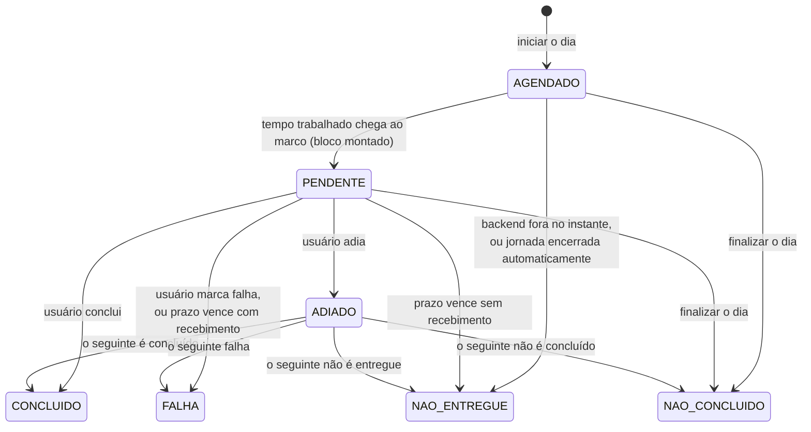
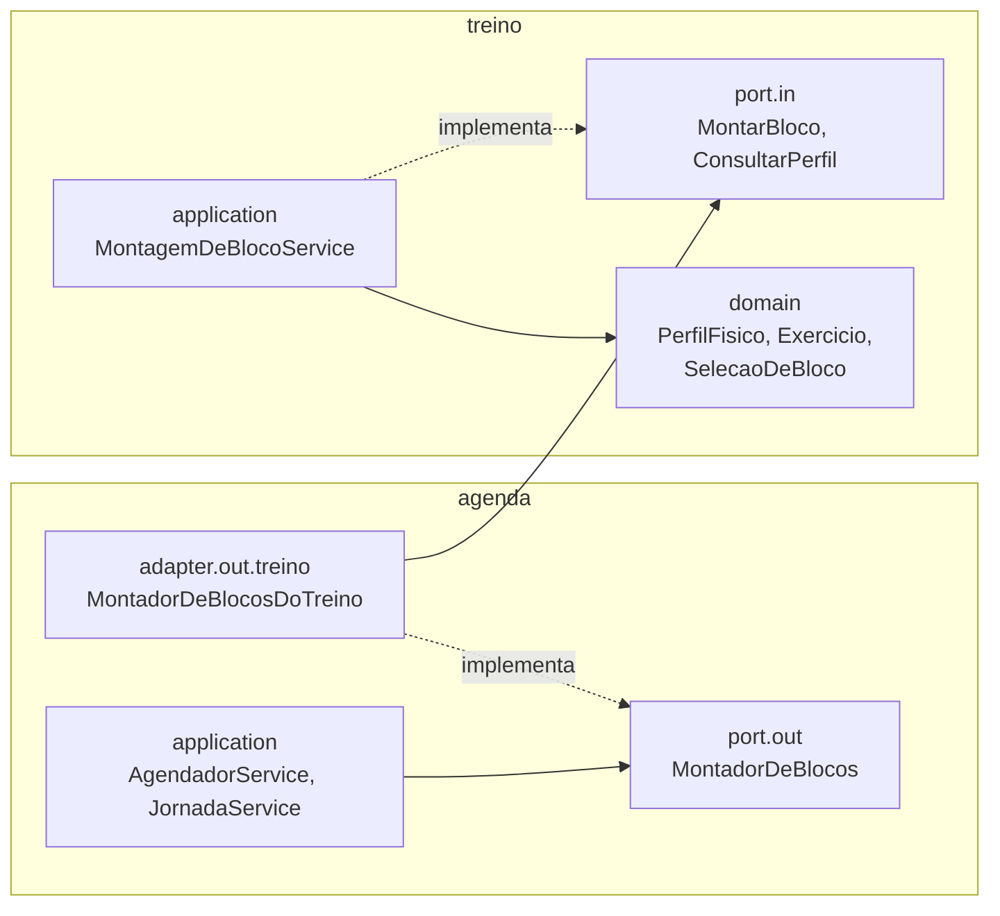

# Spec H3: Montar e executar blocos de exercício (release v0.3.0)

> **Status:** aprovada pelo usuário em 2026-10-02, com as recomendações D1 a D9 da seção 13 e as instruções do apêndice A. Em implementação; progresso na seção 12.
> **Ampliação de 2026-10-05:** a pedido do usuário, a release passa a aplicar a identidade visual Sereno & Balanceado (seção 8.1, etapa T5, Cenário 8). A decisão D10 (só tema escuro) foi confirmada no mesmo dia.
> **Origem:** História 3 de [`docs/epico-pausa-ativa.md`](../epico-pausa-ativa.md). O catálogo foi revisado com o usuário em 2026-10-02.
> **Depende de:** H2 (v0.2.0), entregue em 2026-10-02.
> **Data:** 2026-10-02.

## 1. Objetivo

Ao fim desta release, o usuário:

- preenche uma vez o perfil físico: articulações a poupar, nível, equipamentos e se pode ir ao chão;
- escolhe, ao iniciar o dia, blocos de exercício de 5 min (padrão) ou 10 min;
- recebe a cada 60 min de tempo trabalhado um bloco de exercícios montado para o seu perfil;
- responde cada bloco com **Concluir**, **Adiar** ou **Falhar**, e o adiamento é resolvido pelo bloco seguinte;
- na hora cheia, recebe uma notificação só, com água e exercício, que responde de forma independente na página.

Os gráficos e a taxa de sucesso por categoria ficam para a H4.

## 2. Escopo

| Dentro | Fora (história que entrega) |
|---|---|
| Perfil físico: formulário, edição, obrigatório para iniciar o dia | Gráficos e taxa de sucesso por categoria (H4) |
| Catálogo de 22 exercícios via migração, com instrução curta | Edição do catálogo pela tela; progressão de carga (melhoria futura) |
| Seleção determinística do bloco por perfil, grupo e duração | Cronômetro guiado durante o bloco (melhoria futura) |
| 8 marcos de exercício por jornada, a cada 60 min trabalhados | Edição de respostas no mesmo dia (H4) |
| Concluir, Adiar e Falhar; status `ADIADO` | Prometheus e Grafana (H5) |
| Duração do bloco escolhida ao iniciar (5 ou 10 min) | |
| Notificação combinada na hora cheia | |
| Modo demonstração com exercício a cada 2 min | Ilustrações, menu lateral e avatar do mockup da identidade visual (fora do produto) |
| Métricas e logs dos blocos | Cores dos gráficos (H4, com a mesma paleta) |
| Identidade visual Sereno & Balanceado no frontend (seção 8.1) | |

## 3. Regras de domínio refinadas

O épico define as regras. Esta seção as torna precisas o bastante para o código e os testes. Os pontos que o épico não decidia estão marcados com **(D*n*)** e listados na seção 13.

### 3.1 Perfil físico

| Campo | Valores | Padrão no formulário |
|---|---|---|
| Articulações a poupar | Nenhuma ou várias de: joelho, ombro, punho, lombar, cervical | Nenhuma |
| Nível | Iniciante, intermediário | Iniciante |
| Equipamentos | Nenhum ou vários de: apoio de flexão, halteres de 2 kg | Nenhum |
| Exercícios no chão | Sim ou não | Sim |

- Cadeira e mesa são consideradas disponíveis: estão em todo home office.
- Existe um perfil só, porque o usuário é único. Ele pode ser editado a qualquer momento. A mudança vale para os blocos montados depois dela; os blocos já disparados não mudam.
- Sem perfil, o dia não começa (Cenário 6). A tela leva ao formulário, e o backend também recusa o início **(D7)**.

### 3.2 Catálogo

O catálogo está no [épico](../epico-pausa-ativa.md), seção "Treino": 22 exercícios com grupo, quantidade por nível, equipamento, "no chão" e restrições. Ele entra no banco por migração e não muda pela tela. Cada exercício ganha uma instrução curta de como fazer **(D8)**; a proposta está no [apêndice A](#apêndice-a-instruções-dos-exercícios).

A quantidade é uma de três formas:

| Forma | Exemplo | Texto na tela |
|---|---|---|
| Repetições | Sentar e levantar, 10 | "10 repetições" |
| Repetições por lado | Bird-dog, 6 por lado | "6 por lado" |
| Segundos (por lado ou não) | Prancha, 20 s | "20 s" |

### 3.3 Seleção do bloco

A seleção é determinística: o mesmo perfil, a mesma duração e o mesmo histórico do dia dão sempre o mesmo bloco.

**1. Elegíveis.** Um exercício entra se cumpre todas as condições:

- não tem restrição em comum com as articulações a poupar;
- não exige equipamento, exige cadeira ou mesa, ou exige um equipamento do perfil;
- tem quantidade para o nível do perfil (o afundo e a flexão com apoio são só do intermediário);
- não é "no chão", ou o perfil aceita exercícios no chão.

Os exercícios de reserva (marcha estacionária, mobilidade torácica e os dois alongamentos) cumprem as condições para qualquer perfil. Por isso, nenhum perfil fica sem bloco, e o Cenário 7 resulta da própria regra.

**2. Estimativa de duração (D2).** Cada repetição vale 3 s, e cada segundo vale 1 s. "Por lado" dobra o tempo do exercício, e cada troca de exercício soma 15 s.

| Exemplo (iniciante) | Conta | Estimativa |
|---|---|---|
| Sentar e levantar, 10 | 10 × 3 s + 15 s | 45 s |
| Bird-dog, 6 por lado | 6 × 3 s × 2 + 15 s | 51 s |
| Prancha, 20 s | 20 s + 15 s | 35 s |

**3. Ordem.** Os grupos seguem uma ordem fixa: Pernas, Peito, Costas, Core, Posterior, Ombros, Braços, Mobilidade, Cardio leve.

- O bloco do marco *n* começa pelo grupo da posição (*n* − 1), contada em ciclo. Assim, cada hora começa por um grupo diferente: alternância entre marcos.
- A montagem percorre os grupos em rodízio, pondo no máximo um exercício por grupo a cada volta. Em cada grupo, os candidatos vão do usado há mais tempo no dia para o mais recente. Os nunca usados vêm primeiro, na ordem do catálogo. Assim, os exercícios variam de um bloco para o outro.

**4. Preenchimento.** Em cada grupo, entra o primeiro candidato cuja estimativa ainda cabe na duração do bloco; se nenhum cabe, a montagem passa ao próximo grupo. Nenhum exercício se repete enquanto houver elegível de fora. Quando todos os elegíveis já entraram e ainda sobra tempo, o resto do bloco é preenchido repetindo os exercícios de **reserva** (Cenário 7). A montagem termina quando uma volta inteira pelos grupos não acrescenta nada.

| Exemplo | Bloco montado (estimativa) |
|---|---|
| Iniciante, sem equipamento, aceita o chão, nada a poupar, marco 1, 5 min | Sentar e levantar 10 · Flexão na parede 10 · Anjo na parede 8 · Prancha 20 s · Ponte de glúteo 12 · Mobilidade torácica 8 por lado (≈ 4 min 38 s). Ombros e braços ficam de fora, por falta de halteres. A marcha (75 s) já não cabe nos 22 s restantes. |

O bloco fica gravado no marco no momento do disparo **(D1)**, com nome, quantidade e instrução de cada exercício. Mudanças posteriores no catálogo ou no perfil não alteram blocos já disparados, e o histórico da H4 mostra o que foi proposto de fato.

### 3.4 Marcos de exercício

- Ao iniciar o dia, a jornada cria os **8 marcos de exercício** `AGENDADO`, junto com os 16 de hidratação.
- O marco de exercício *n* (1 a 8) dispara aos *n* × 60 min de tempo trabalhado: na mesma hora cheia que o marco de água 2*n*.
- O prazo é de 60 min de tempo trabalhado, o instante do exercício seguinte. O 8º vence às 9 h trabalhadas **(D6)**, como o 16º de água vence às 8 h 30.
- O bloco tem a duração escolhida ao iniciar o dia (5 ou 10 min). Depois de um adiamento, o bloco seguinte tem 10 min **(D3)**.
- Pausa, finalização, jornada esquecida e backend fora seguem as regras da H2 (seções 3.3 a 3.5), como na água.

### 3.5 Adiar

| Regra | Definição |
|---|---|
| Quem pode | Só um marco de exercício `PENDENTE`. A hidratação não tem Adiar. |
| Limite | Uma vez por cadeia: o marco seguinte a um `ADIADO` não pode ser adiado (Cenário 5; 409 com a mensagem "Este bloco já compensa um adiamento: conclua ou marque falha"). |
| Último marco | O 8º não pode ser adiado: não há bloco seguinte **(D5)**. |
| Efeito | O marco vira `ADIADO`, sem prazo próprio. O bloco seguinte tem 10 min e avisa que compensa o adiado. |
| Resolução | O `ADIADO` segue o destino do marco seguinte. Concluído → os dois `CONCLUIDO` (Cenário 4). Falha → os dois `FALHA`. Não entregue ou não concluído → o adiado fica igual **(D4)**. |
| Idempotência | Adiar de novo o mesmo marco devolve o estado atual. Responder um `ADIADO` diretamente é recusado (409): ele é resolvido pelo seguinte. |

### 3.6 Ciclo de vida do marco de exercício



### 3.7 Notificação combinada

- Na hora cheia, o marco de água e o de exercício disparam no mesmo tick e chegam juntos à tela. A tela junta os dois numa notificação só: "Hora da água e do exercício 💧🏃", com "Beba ~190 ml. Bloco de 5 min: 6 exercícios." (Cenário 2).
- Na página, os dois aparecem em cartões separados, cada um com os seus botões. A resposta de um não muda o outro.
- Nas meias horas, a notificação continua sendo só de água, como na H2.

## 4. Arquitetura da H3

O **Treino** deixa de ser um módulo vazio: ele tem o perfil, o catálogo e a seleção. A **Agenda** ganha a segunda categoria de marco e pede os blocos ao Treino pela porta de entrada dele (regra R4).



| Camada | Elementos |
|---|---|
| `treino.domain` | `PerfilFisico`, `Exercicio`, `Quantidade` (repetições, por lado, segundos), `SelecaoDeBloco` (seção 3.3, Java puro), `BlocoDeExercicio`, `ItemDoBloco` |
| `treino.application.port.in` | `ConsultarPerfil`, `SalvarPerfil`, `MontarBloco` (recebe perfil implícito, duração, número do marco e exercícios usados no dia) |
| `treino.application.port.out` | `PerfilRepository`, `CatalogoRepository` |
| `treino.adapter.in.web` | `PerfilController` |
| `treino.adapter.out.persistence` | Entidades JPA do perfil e do catálogo |
| `agenda.domain` | `Categoria.EXERCICIO`, `StatusMarco.ADIADO`, `PlanoDeMarcos.exercicio`, `DuracaoDoBloco`, `BlocoDoMarco`, `ExercicioProposto`, regras de adiar e de resolução do adiado |
| `agenda.application.port.out` | `MontadorDeBlocos`: `perfilPreenchido()` e `montar(pedido)` |
| `agenda.adapter.out.treino` | `MontadorDeBlocosDoTreino`: implementa a porta da Agenda chamando o `MontarBloco` e o `ConsultarPerfil` do Treino. É a única peça da Agenda que conhece o Treino. |

**O domínio continua puro.** `Jornada.avancar` dispara os marcos como na H2. Para cada marco de exercício disparado, a aplicação pede o bloco ao `MontadorDeBlocos` e o entrega à jornada (`atribuirBloco`), na mesma transação e antes de gravar. Assim, nenhum marco de exercício `PENDENTE` fica sem bloco, e o domínio não faz I/O. O evento `JornadaAlterada` sai depois do commit, como na H2, já com o bloco.

**Dependência entre módulos.** A Agenda depende do Treino, e o Treino não conhece a Agenda: sem ciclos (R5). O pedido de bloco leva os códigos dos exercícios já usados no dia, que a Agenda conhece pelos blocos gravados. Assim, o Treino não precisa consultar a Agenda.

Detalhes decididos na T3:

- **Bloco em dois passos.** No disparo, a jornada cria o `BlocoDoMarco` com a duração e o `compensaAdiamento`, ainda sem exercícios. Depois, `atribuirBloco(marcoId, exercicios)` recebe a lista do Treino. Ele recusa lista vazia, bloco já preenchido e estimativa maior que a duração. O pedido ao Treino usa `bloco.duracao()`, `sequencia()` e `jornada.exerciciosPropostosNoDia()`, com os códigos do bloco mais antigo para o mais recente.
- **Planos.** `Jornada.iniciar` recebe a duração do bloco e a lista de planos. O de água é obrigatório, e há no máximo um por categoria. Na T3, o `JornadaService` passava só o plano de água, porque o banco ainda não aceitava exercício; desde a T4, passa os dois (`ConfiguracaoDaAgenda.planos()`).
- **`podeAdiar(marco)`** fica na jornada, porque depende do marco seguinte (D5).
- **Adiar conta como resposta.** O marco guarda `recebidoEm` e `respondidoEm` do adiamento. Na resolução, só o status muda.
- **Mensagem do exercício:** "Bloco de 5 min: 6 exercícios.", com "Inclui o bloco adiado." quando compensa. Antes do disparo, "Bloco de exercício.".
- **Mensagens de recusa (409):** "Só o bloco de exercício pode ser adiado.", "Este bloco já compensa um adiamento: conclua ou marque falha.", "O último bloco do dia não pode ser adiado: não há bloco seguinte para compensar." e, ao responder um adiado, "Este bloco foi adiado: ele é resolvido pelo bloco seguinte.".
- **Evento `MarcoAdiado`:** fica para a T4, junto com a métrica `pausaativa.marcos.adiados`, que é quem o usa.
- **Contrato:** os enums `EXERCICIO` e `ADIADO` já entram no `openapi.json` e no `contrato.ts`. O frontend ganhou só os rótulos "Adiado" e "Hora do exercício 🏃", para o `vue-tsc` aceitar os enums novos.

## 5. Modelo de dados

**`V3`: Treino**

| Tabela | Colunas principais | Restrições |
|---|---|---|
| `exercicio` | `codigo` (pk), `nome`, `grupo`, `ordem`, `instrucao`, `forma` (`REPETICOES`, `POR_LADO`, `SEGUNDOS`, `SEGUNDOS_POR_LADO`), `quantidade_iniciante` (nulo = só intermediário), `quantidade_intermediario`, `equipamento` (nulo, `CADEIRA`, `MESA`, `APOIO_DE_FLEXAO`, `HALTERES_2KG`), `no_chao`, `reserva` | Os 22 exercícios do catálogo, inseridos pela migração. Um exercício de reserva não tem restrição nem equipamento, não é no chão e tem quantidade para os dois níveis. |
| `exercicio_restricao` | `exercicio_codigo`, `articulacao` | Chave composta; `check` nas articulações |
| `perfil_fisico` | `id` (sempre 1), `nivel`, `aceita_chao`, `atualizado_em` | `check (id = 1)`: um perfil só |
| `perfil_articulacao`, `perfil_equipamento` | `perfil_id` e o valor | O equipamento do perfil aceita só apoio de flexão e halteres |

Restrições e equipamentos ficam em tabelas filhas, e não em arrays do Postgres (mudança da T2). O Hibernate valida o esquema na subida (`ddl-auto: validate`), e a validação de colunas de array costuma falhar. As tabelas filhas também deixam o banco conferir os valores com `check`.

**`V4`: Agenda**

| Mudança | Detalhe |
|---|---|
| `jornada.duracao_bloco_min` | `5` ou `10`; jornadas da v0.2.0 recebem `5` |
| `marco.categoria` | Aceita `EXERCICIO` |
| `marco.status` | Aceita `ADIADO` |
| `marco.volume_ml` | Nulo no exercício: `check ((categoria = 'HIDRATACAO') = (volume_ml is not null))` |
| `marco.duracao_bloco_min`, `marco.compensa_adiamento` | Preenchidos no disparo do exercício |
| Tabela `item_do_bloco` | `marco_id`, `ordem`, `exercicio_codigo`, `nome`, `grupo`, `quantidade_texto`, `segundos_estimados`, `instrucao`. Cópia do catálogo no instante do disparo (D1) |

Uma jornada iniciada na v0.2.0 e ainda aberta na subida da v0.3.0 continua só com água: os marcos de exercício nascem ao iniciar o dia.

## 6. Contrato REST

Prefixo `/api/v1`, erros em Problem Details, como na H2.

| Método e caminho | Corpo | Sucesso | Erros |
|---|---|---|---|
| `GET /perfil` | — | 200 com o perfil; 204 se não preenchido | — |
| `PUT /perfil` | `{ articulacoesPoupadas, nivel, equipamentos, aceitaChao }`; `nivel` e `aceitaChao` obrigatórios, listas opcionais | 200 (idempotente), substitui o perfil inteiro | 400 campo ausente ou valor fora da lista (cadeira e mesa não são aceitas: já contam como disponíveis) |
| `POST /jornadas` | `{ "metaAguaMl": 3000, "duracaoBlocoMin": 5 }` (ambos opcionais) | 201 | 400 duração diferente de 5 ou 10; **409 sem perfil** (D7) |
| `POST /marcos/{id}/adiamento` | — | 200 (idempotente) | 404; 409 hidratação, último marco, segundo adiamento ou marco já encerrado |
| Demais | Como na H2 | | Concluir ou Falhar um `ADIADO`: 409 |

Mudanças na representação:

- **Jornada:** ganha `duracaoBlocoMin`.
- **Marco:** `volumeMl` e `volumeAproximadoMl` passam a ser nulos no exercício. Ganha `bloco` (nulo até o disparo e na hidratação) e `podeAdiar`. O `podeAdiar` é calculado pelo backend, para a tela não repetir a regra.

Detalhes decididos na T4:

- **Ordem dos marcos.** A lista sai em ordem de horário previsto; na hora cheia, a água vem antes do exercício. A tela não precisa reordenar. Na leitura do banco, os marcos voltam na ordem do domínio (água, depois exercício): o `@OrderBy` por categoria ordenaria pelo nome, com `EXERCICIO` antes.
- **Todo avanço monta os blocos.** O `AvancoDaJornada` chama `jornada.avancar` e, para cada exercício disparado, pede o bloco ao Treino e o atribui. Os três caminhos que põem a jornada em dia passam por ele: o tick, os comandos da jornada e as respostas aos marcos. Um exercício que dispara e vence no mesmo avanço (por exemplo, depois de uma pausa sem tick) também ganha o bloco, como manda o D1.
- **Perfil obrigatório.** O `iniciar` confere a meta e a duração (400) antes do perfil (409, `PerfilAusenteException`).
- **Persistência do bloco.** Os itens ficam em `item_do_bloco`, sem chave estrangeira para `exercicio` (D1), e são gravados uma vez só. Um `@BatchSize` carrega os itens de todos os marcos numa consulta, porque o tick lê a jornada a cada segundo. A `V4` também impede `ADIADO` fora do exercício (`ck_marco_adiado`).
- **Bloco anulável no contrato.** O springdoc gerava `bloco` com `$ref` e `type: [object, null]` lado a lado, e o openapi-typescript ignorava o `null`. Um `OpenApiCustomizer` em `OpenApiConfig` reescreve toda propriedade assim como `oneOf: [$ref, null]`, e o tipo TS fica `Bloco | null`.
- **Métricas e logs.** O evento `MarcoAdiado` alimenta `pausaativa.marcos.adiados`. O bloco é registrado (`pausaativa.blocos.montados`, `pausaativa.blocos.itens` e o log com os códigos) a partir do `marco-disparado` do exercício, lendo o bloco na situação publicada, porque ele é montado depois do disparo.
- **Frontend.** Só a fábrica de dados dos testes ganhou os campos novos. A `ListaDeMarcos` ainda mostra o volume de qualquer marco; para o exercício, sairia "~ ml". A correção entra na T7, com a lista por categoria.

```json
{
  "categoria": "EXERCICIO",
  "sequencia": 2,
  "status": "PENDENTE",
  "podeAdiar": true,
  "mensagem": "Bloco de 5 min: 6 exercícios.",
  "bloco": {
    "duracaoMin": 5,
    "segundosEstimados": 278,
    "compensaAdiamento": false,
    "itens": [
      {
        "exercicio": "Sentar e levantar da cadeira",
        "grupo": "Pernas",
        "quantidade": "10 repetições",
        "instrucao": "Sente e levante da cadeira sem usar as mãos, com os pés na largura do quadril."
      }
    ]
  }
}
```

## 7. Eventos (SSE)

Nenhum evento novo. O `marco-disparado` passa a vir também para o exercício, já com o bloco. Na hora cheia chegam dois `marco-disparado` (água e exercício) e depois um `jornada-atualizada`, todos da mesma alteração. A tela usa essa ordem para juntar a notificação (seção 3.7).

## 8. Frontend

| Situação | O que a tela mostra |
|---|---|
| Sem perfil | Formulário do perfil (seção 3.1) antes do "Iniciar dia", com a explicação de para que serve |
| Sem jornada hoje | Meta de água, **duração do bloco** (5 ou 10 min, lembrando a última escolha) e Iniciar dia; link **Editar perfil** |
| Exercício pendente | Cartão "Hora do exercício 🏃": duração, lista de exercícios com quantidade e instrução, e os botões **Concluir**, **Adiar** (só com `podeAdiar`) e **Falhar**. Com `compensaAdiamento`, o cartão avisa que o bloco inclui o adiado. |
| Água e exercício juntos | Os dois cartões, um sobre o outro |
| Exercício adiado | Na lista, "Adiado: resolvido pelo próximo bloco" |
| Lista do dia | Água e exercício na mesma lista, em ordem de horário, com a categoria indicada |
| Resumo | Contagem por categoria e situação |
| Editar perfil | O mesmo formulário, preenchido; vale para os próximos blocos |

A notificação combinada junta os `marco-disparado` que chegam antes do `jornada-atualizada` seguinte (seção 7). A `tag` é formada pelos ids dos marcos, então várias abas continuam mostrando uma notificação só.

Detalhes decididos na T6:

- **Carga.** A tela busca a jornada e o perfil juntos. Sem jornada hoje, ela espera os dois para decidir entre o formulário e o Iniciar dia; com o servidor fora em qualquer um, mostra "Tentar novamente".
- **Formulário.** As quatro perguntas da seção 3.1, cada uma com uma linha de ajuda, e os padrões da spec já marcados. No primeiro preenchimento, o título é "Seu perfil físico" e não há Cancelar. Na edição, o formulário vem preenchido e avisa que vale para os próximos blocos. O rodapé lembra que o app não substitui orientação médica.
- **Iniciar dia.** Mostra a escolha de 5 ou 10 min (lembra a última, como a meta) e uma linha com o resumo do perfil e o botão Editar perfil: "Iniciante · poupa joelho · halteres de 2 kg · com exercícios no chão".
- **Editar durante o dia.** Um link "Editar perfil físico" no rodapé, enquanto há jornada (seção 3.1: o perfil muda a qualquer momento). O formulário ocupa o lugar da jornada até salvar ou cancelar; as notificações continuam chegando.
- **409 por falta de perfil.** Se o backend recusar o início, a tela mostra o motivo e busca o perfil de novo; sem ele, aparece o formulário (Cenário 6).

Detalhes decididos na T7:

- **Notificação combinada.** Os `marco-disparado` entram num lote, fechado pelo `jornada-atualizada` seguinte. Se ele se perder, o lote é anunciado depois de 1 s. O lote vira uma notificação e um som. Com água e exercício, o título é "Hora da água e do exercício 💧🏃", o corpo junta as mensagens com a água primeiro e a `tag` junta os ids com "+". Na reconexão, os pendentes que ninguém recebeu também saem num lote só.
- **Cartão do exercício.** Mostra os exercícios do bloco (nome, quantidade em teal e instrução) e "Cerca de 4 min 38 s, contando as trocas de exercício". O Adiar é um botão secundário, entre Concluir e Falhar, e só aparece com `podeAdiar`. O bloco que compensa um adiado avisa: "concluir ou marcar falha vale para os dois".
- **Lista do dia.** Colunas Horário, Lembrete ("💧 Água 2", "🏃 Exercício 1"), Detalhe ("~190 ml" na água; "5 min · 6 exercícios" no exercício disparado, "Bloco de exercício" antes) e Situação. O adiado aparece como "Adiado: resolvido pelo próximo bloco". Uma borda azul céu ou teal marca a categoria, sem ser o único sinal.
- **Resumo.** Tabela de situações por categoria; a coluna do exercício só aparece se a jornada tem exercício (as da v0.2.0 não têm).
- **Modo demonstração.** A faixa diz "água a cada 1 min e exercício a cada 2 min".

### 8.1 Identidade visual: Sereno & Balanceado

O usuário entregou a definição em 2026-10-05, na pasta [`identidadevisual/`](../../identidadevisual/): o texto com a paleta e uma imagem de referência (mockup de desktop e celular). A paleta usa azuis e ciano análogos, em tema escuro e com contraste suave, para transmitir calma e destacar a hidratação.

Os tokens continuam em `frontend/src/assets/main.css`. Os componentes já usam as cores só por eles, então a troca é feita nesse arquivo, mais os ajustes de componente abaixo.

| Token | Cor | Origem | Uso |
|---|---|---|---|
| `--fundo` | `#1A2238` | Definição | Fundo da página |
| `--fundo-cartao` | `#243156` | Derivado do mockup | Cartões e campos: um tom acima do fundo |
| `--borda` | `#3A4A78` | Derivado do mockup | Bordas e divisórias (decorativas) |
| `--texto` | `#F0F8FF` | Definição | Texto principal |
| `--texto-suave` | `#A8B5CC` | Derivado | Rótulos, horários e textos de apoio |
| `--destaque` | `#20B2AA` | Definição | Botão principal, foco, links, exercício e marcos concluídos |
| `--texto-sobre-destaque` | `#1A2238` | Definição | Texto dos botões teal |
| `--agua` | `#87CEEB` | Definição | Hidratação: cartão, volume e marcador na lista |
| `--alerta` | `#FF8C69` | Definição | Avisos, falha e erro, em uso pontual |
| `--fundo-alerta` | `#352F3E` | Derivado (T5) | Fundo dos avisos: coral a 12% sobre o fundo, em cor sólida para o teste medir |
| `--destaque-realce` | `#3BBBB4` | Derivado (T5) | Botão teal com o mouse em cima |
| `--borda-campo` | `= --texto-suave` | Derivado (T5) | Borda dos campos de formulário |

Os tokens atuais `--sucesso`, `--erro`, `--aviso` e seus fundos passam a apontar para essas cores: sucesso em teal; erro e aviso em coral, com fundo coral translúcido.

**Regras**

- **Tema só escuro (D10).** A definição é de tema escuro, e um tema claro seria uma identidade nova, não definida. O `:root` passa a `color-scheme: dark`, e o bloco `prefers-color-scheme` sai.
- **Botão principal:** fundo teal, texto `#1A2238` e cantos em pílula, como o "Fazer pausa agora" do mockup. Texto gelo sobre teal dá 2,44:1 e reprova o WCAG AA; o azul-escuro dá 6,02:1.
- **Categorias:** água em azul céu e exercício em teal, no cartão (borda) e na lista (marcador). A categoria também aparece em texto ou ícone (💧, 🏃), nunca só pela cor.
- **Coral com moderação**, como pede a definição ("uso sutil"): aviso de permissão, falha na lista, mensagem de erro e o botão **Falhar**, que passa a ser contornado em coral em vez de vermelho cheio.
- **Títulos de cartão** em caixa alta e peso 600, como no mockup. A fonte continua a do sistema.
- **Contraste:** todo texto tem pelo menos 4,5:1 sobre `--fundo` e sobre `--fundo-cartao`. As cores derivadas (cartão, borda e texto suave) não estão na definição: foram tiradas do mockup e escolhidas para cumprir esse mínimo. Podem ser ajustadas.

| Par (texto sobre fundo) | Contraste |
|---|---|
| Texto / fundo · Texto / cartão | 14,72 · 11,87 |
| Texto suave / fundo · Texto suave / cartão | 7,63 · 6,15 |
| Teal / fundo · Teal / cartão | 6,02 · 4,86 |
| Azul céu / fundo · Azul céu / cartão | 9,07 · 7,31 |
| Coral / fundo · Coral / cartão | 6,92 · 5,58 |
| Azul-escuro / teal (botão) | 6,02 |
| Coral / fundo do aviso · Texto / fundo do aviso | 5,66 · 12,03 |
| Borda do campo / cartão (mínimo de 3:1) | 6,15 |

Fica de fora o que é ilustração do mockup: menu lateral, avatar, ilustrações e gráficos. O favicon de gota já combina com a identidade e fica como está.

Detalhes decididos na T5:

- **Tokens de papel.** `--sucesso` e `--exercicio` apontam para o teal; `--erro` e `--aviso`, para o coral. Os componentes continuam usando os nomes de papel, e a paleta muda num lugar só.
- **Campos.** Com `--borda`, a borda do campo teria 1,47:1 com o cartão, abaixo dos 3:1 que o WCAG pede para identificar um campo (1.4.11). Os campos usam `--borda-campo`. Os botões secundários mantêm a borda decorativa, porque o texto já os identifica.
- **Lista.** Coral só na falha. Não entregue, não concluído e adiado ficam em `--texto-suave`, porque não entram na taxa e não são falha. Concluído fica em teal, e pendente, em negrito.
- **Painel.** A água do dia e a barra de progresso ficam em azul céu.
- **Foco e Chrome.** O foco do teclado é um contorno teal. O `index.html` declara `color-scheme: dark` e `theme-color` com o fundo.
- **Contagem no cartão.** O cartão mostrava "Lembrete 1 de 24" no exercício, porque contava todos os marcos desde a T4. Passou a contar por categoria: "2 de 16" na água, "1 de 8" no exercício.
- **Teste.** O `identidadeVisual.spec.ts` lê o `main.css` e os `.vue` do disco, porque o Vitest entrega CSS importado vazio. Ele confere as cinco cores da definição, o tema só escuro, os pares de contraste e que nenhum componente tenha cor fixa.
- **Conferência visual.** Capturas da tela inicial e da jornada com água e exercício pendentes, com a API simulada, no Chrome headless. A comparação com o backend real fica para a T8.

## 9. Modo demonstração

O exercício dispara a cada **dobro do intervalo da água (D9)**: 60 min no uso normal e 2 min no `docker-compose.demo.yml`. Com isso, a hora cheia continua coincidindo com um marco de água par, e o dia inteiro de demonstração continua durando 16 min. Uma propriedade só (`pausa-ativa.agenda.intervalo`) controla as duas categorias.

## 10. Observabilidade

| Métrica | Tipo | Tags |
|---|---|---|
| `pausaativa.marcos.*` (da H2) | — | Já têm `categoria`; o exercício entra sem mudança |
| `pausaativa.marcos.adiados` | contador | — |
| `pausaativa.blocos.montados` | contador | `duracao`, `compensa_adiamento` |
| `pausaativa.blocos.itens` | distribuição | — |

Logs JSON com `jornadaId`, `marcoId` e os códigos dos exercícios do bloco montado.

## 11. Critérios de aceitação: como cada um é verificado

| Cenário do épico | Teste automático | Verificação no Chrome (modo demonstração) |
|---|---|---|
| 1. Seleção respeita restrição | Domínio do Treino: perfil que poupa joelho e sem halteres não recebe agachamento, afundo nem halteres, em todos os 8 marcos | Perfil assim; conferir os blocos do dia |
| 2. Notificação combinada | Domínio: água 2*n* e exercício *n* no mesmo tick. Frontend: uma notificação para os dois eventos | Na hora cheia, uma notificação só e dois cartões |
| 3. Adiar | Domínio e API: `ADIADO`; o seguinte tem 10 min e `compensaAdiamento` | Adiar e conferir o próximo bloco |
| 4. Adiado e concluído | Domínio: concluir o seguinte deixa os dois `CONCLUIDO` | Concluir o bloco seguinte |
| 5. Segundo adiamento | Domínio e API: 409 com a mensagem; `podeAdiar` falso | O botão Adiar não aparece |
| 6. Perfil ausente | API: 409 ao iniciar sem perfil. Frontend: formulário antes do Iniciar dia | Banco limpo: a tela pede o perfil |
| 7. Restrições eliminam o catálogo | Domínio: perfil que poupa todas as articulações, sem equipamento e sem chão recebe só exercícios sem restrição, e o bloco de 10 min termina com a reserva repetida | Perfil assim; conferir o bloco |
| 8. Identidade visual | Frontend: teste que lê os tokens de `main.css` e confere a paleta e o contraste mínimo de 4,5:1 dos pares de texto (seção 8.1) | Capturas das telas de perfil, jornada e resumo, comparadas com o mockup |

Também da seção "Cenários de Teste" do épico, nesta história:

- Jornada completa de 8 h: 16 marcos de água e 8 de exercício nos instantes corretos.
- Bloco respeita perfil, equipamento e duração (estimativa dentro do bloco).
- Adiamento dobra o próximo bloco e resolve os dois marcos juntos.
- A seleção é determinística: mesma entrada, mesmo bloco.

## 12. Plano de entrega em etapas

Branch `feat/h3-blocos-de-exercicio`. A execução para ao fim de cada etapa, e a próxima sessão retoma pela primeira etapa sem ✅.

| # | Etapa | Pronto quando | Status |
|---|---|---|---|
| T1 | Treino, domínio: perfil, catálogo, quantidades e seleção (seção 3.3) | Cenários 1 e 7 e determinismo cobertos em Java puro | ✅ 2026-10-02 (26 testes; domínio do Treino com 97,6% das linhas e 95,7% dos ramos; 128 no backend). Os blocos da spec (278 s, 300 s e 597 s) foram calculados à mão e conferidos pelo código. |
| T2 | Treino: migração `V3` com o catálogo, persistência, `GET`/`PUT /perfil`, porta `MontarBloco` | Testes de integração e MockMvc; contrato atualizado | ✅ 2026-10-02 (9 testes novos; 137 no backend; Treino com 99,7% das linhas). O catálogo do banco é igual ao do épico, campo a campo, e monta o exemplo de 278 s. Restrições e equipamentos foram para tabelas filhas (seção 5). |
| T3 | Agenda, domínio: marcos de exercício, `ADIADO`, adiar e resolução, duração do bloco | Cenários 3 a 5 e jornada de 8 h cobertos em Java puro | ✅ 2026-10-05 (28 testes novos no `JornadaTest`; 165 no backend; domínio da Agenda com 99,2% das linhas e 96,9% dos ramos). Cenários 2 a 5 e D3 a D6 no domínio; detalhes na seção 4. |
| T4 | Agenda: migração `V4`, ligação com o Treino, API (adiamento, bloco, duração, perfil obrigatório), SSE, métricas | Integração com Postgres; contrato e tipos TS atualizados | ✅ 2026-10-05 (13 testes novos; 178 no backend; Agenda com 98,9% das linhas). Cenários 1 a 6 cobertos com Postgres; o bloco do marco 1 bate com o exemplo de 278 s da seção 3.3. Detalhes na seção 6. |
| T5 | Frontend: identidade visual Sereno & Balanceado nas telas da H2 (seção 8.1): tokens, tema escuro, botões, cores por categoria | Teste de contraste dos tokens; lint, tipos e testes verdes | ✅ 2026-10-05 (21 testes novos; 147 no frontend, 99,4% das linhas). Detalhes no fim da seção 8.1. |
| T6 | Frontend: perfil (formulário, edição, obrigatório) e duração do bloco ao iniciar | Lint, tipos e testes verdes, cobertura ≥ 80% | ✅ 2026-10-05 (17 testes novos; 164 no frontend, 99% das linhas). Cenário 6 no frontend; detalhes na seção 8. |
| T7 | Frontend: cartão do exercício, Adiar, notificação combinada, lista e resumo por categoria | Idem | ✅ 2026-10-05 (11 testes novos; 175 no frontend, 99,1% das linhas). Cenários 2 a 5 no frontend; detalhes na seção 8. |
| T8 | Verificação ponta a ponta no Chrome, em modo demonstração | Cenários 1 a 8 conferidos | Pendente |
| T9 | README, C4 (incluindo o nginx 1.31 que entrou depois da v0.2.0), release notes, PR e CI | Aceite do usuário; merge e tag `v0.3.0` | Pendente |

A T5 vem antes das telas novas para que o perfil e o cartão do exercício já nasçam com os tokens da identidade, sem retrabalho.

## 13. Decisões para o usuário confirmar

Lacunas que o épico não decidia. **O usuário aceitou as recomendações D1 a D9 em 2026-10-02.** A D10 veio com a identidade visual e foi confirmada em 2026-10-05: só tema escuro; uma paleta clara fica para um segundo momento.

| # | Decisão | Recomendação | Alternativa |
|---|---|---|---|
| D1 | Quando montar o bloco | **No disparo**, gravado no marco. Usa o perfil do momento, conhece o adiamento anterior e alterna com base nos blocos que já saíram. | Montar os 8 ao iniciar o dia (mostra o plano antes, mas precisa remontar a cada adiamento ou mudança de perfil) |
| D2 | Estimativa de duração | **3 s por repetição e 15 s por troca**; segundos valem o que dizem; "por lado" dobra | Outros valores, por exemplo 4 s por repetição, para blocos mais curtos |
| D3 | Bloco depois de um adiamento, num dia de blocos de 10 min | **Continua 10 min.** O épico diz "o próximo bloco passa a ter 10 min", e o objetivo pede pausas de no máximo 10 min. Num dia de 10 min, adiar só transfere a resposta. | Dobrar sempre: 10 min viram 20 |
| D4 | O adiado quando o seguinte não é entregue ou o dia é finalizado antes | **Segue o seguinte** (`NAO_ENTREGUE` ou `NAO_CONCLUIDO`, fora da taxa), coerente com "finalizar cedo não é falha" | Virar `FALHA`, porque o exercício adiado não foi feito |
| D5 | Adiar o 8º marco | **Não permitido**: não há bloco seguinte para compensar | Permitir, e o adiado do 8º vira `NAO_CONCLUIDO` ao finalizar |
| D6 | Prazo do 8º marco | **9 h trabalhadas**, 60 min como os demais (mesma lógica do D2 da H2) | Ficar pendente até finalizar o dia |
| D7 | Perfil obrigatório | **Na tela e no backend** (409 ao iniciar sem perfil): a regra não depende de quem chama a API | Só na tela |
| D8 | Instrução de cada exercício | **Uma linha de como fazer**, escrita pelo Claude e revisada por você no apêndice A | Só o nome do exercício |
| D9 | Exercício no modo demonstração | **Dobro do intervalo da água** (2 min), com uma propriedade só | Propriedade própria para o exercício |
| D10 | Tema claro (confirmada em 2026-10-05) | **Só tema escuro**, como na definição. Hoje o app segue o tema do sistema; um tema claro precisaria de uma paleta nova | Derivar uma variante clara da paleta e manter `prefers-color-scheme` |

## Apêndice A: instruções dos exercícios

Proposta para revisão (D8). O texto aparece no cartão do bloco.

| Exercício | Como fazer |
|---|---|
| Sentar e levantar da cadeira | Sente e levante da cadeira sem usar as mãos, com os pés na largura do quadril. |
| Agachamento livre | Pés na largura dos ombros; desça como se fosse sentar, com o peito aberto e os joelhos na direção dos pés. |
| Afundo alternado | Dê um passo à frente e desça até os dois joelhos dobrarem perto de 90°; volte e troque de perna. |
| Elevação de panturrilha | Apoiado na mesa ou na parede, suba na ponta dos pés e desça devagar. |
| Ponte de glúteo | Deitado de costas, joelhos dobrados, eleve o quadril contraindo os glúteos e desça devagar. |
| Extensão de quadril em pé, apoiado na mesa | Mãos na mesa, leve uma perna estendida para trás sem arquear a lombar e volte devagar. |
| Flexão na parede | Mãos na parede na altura dos ombros; leve o peito à parede dobrando os cotovelos e empurre de volta. |
| Flexão inclinada na mesa | Mãos na borda de uma mesa firme, corpo reto; desça o peito até a mesa e empurre de volta. |
| Flexão com apoio | No chão, mãos nos apoios e corpo reto da cabeça aos pés; desça o peito e empurre de volta. Apoie os joelhos se precisar. |
| Prancha | Antebraços no chão, corpo reto da cabeça aos pés, abdômen contraído; respire normalmente. |
| Bird-dog | De quatro, estenda um braço à frente e a perna oposta para trás, sem girar o quadril; volte e troque. |
| Remada curvada | Tronco inclinado à frente com a coluna reta; puxe os halteres até a cintura e desça devagar. |
| Anjo na parede | Costas e cabeça na parede, braços em W encostados; deslize os braços para cima e para baixo sem descolar. |
| Retração escapular em pé (segurar 2 s) | Braços ao lado do corpo; junte as escápulas para trás e para baixo, segure 2 s e solte. |
| Desenvolvimento de ombros | Halteres na altura dos ombros; empurre para cima até quase estender os braços e desça devagar. |
| Elevação lateral | Halteres ao lado do corpo; eleve os braços pelas laterais até a altura dos ombros e desça devagar. |
| Rosca direta | Cotovelos parados ao lado do corpo; leve os halteres aos ombros dobrando os braços e desça devagar. |
| Marcha estacionária | Marche no lugar, elevando os joelhos e balançando os braços, num ritmo confortável. |
| Mobilidade torácica (rotação do tronco) | Braços cruzados no peito, gire o tronco devagar para um lado e para o outro, sem mexer o quadril. |
| Mobilidade cervical | Incline a cabeça devagar para cada lado e depois para a frente, sem forçar nem girar rápido. |
| Alongamento de flexores do quadril em pé | Um pé à frente e outro atrás; contraia o glúteo da perna de trás e leve o quadril à frente. |
| Alongamento de punhos e antebraços | Braço estendido, palma para cima; puxe os dedos para baixo com a outra mão, suavemente. Depois repita com a palma para baixo. |

> Este app não substitui orientação médica. As quantidades e as instruções são pontos de partida.
