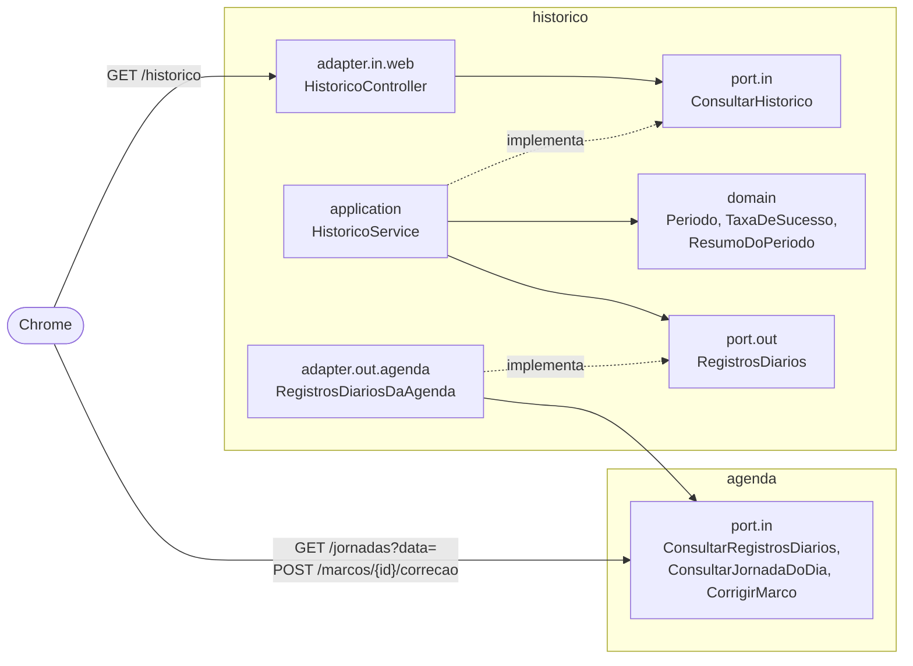

# Spec H4: Visualizar histórico e gráficos (release v0.4.0)

> **Status:** rascunho para revisão do usuário. As decisões em aberto estão na seção 13.
> **Origem:** História 4 de [`docs/epico-pausa-ativa.md`](../epico-pausa-ativa.md).
> **Depende de:** H2 (v0.2.0) e H3 (v0.3.0), entregue em 2026-10-06.
> **Data:** 2026-10-06.

## 1. Objetivo

Ao fim desta release, o usuário:

- vê, ao finalizar o dia, a taxa de sucesso da água e do exercício e se a meta de 80% foi atingida;
- corrige até o fim do dia um lembrete de hoje marcado errado (Concluído ↔ Falha), que fica marcado como "editado";
- abre o **Histórico** e vê, por dia, semana ou mês, as situações e a taxa de cada categoria, num gráfico e numa tabela;
- revê os blocos de exercício que foram propostos num dia passado.

Prometheus e Grafana ficam para a H5.

## 2. Escopo

| Dentro | Fora (história que entrega) |
|---|---|
| Taxa de sucesso por categoria e meta de 80% (seção 3.1) | Prometheus e Grafana (H5) |
| Resumo de fechamento com a taxa e a meta | Sequências de dias na meta (*streaks*, melhoria futura) |
| Correção no mesmo dia, de Concluído para Falha ou o contrário, com a marca "editado" | Correção de dias anteriores (Cenário 5 recusa) |
| Tela Histórico com visões de dia, semana e mês | Exportar os dados (CSV) |
| Gráficos de colunas empilhadas por situação, em SVG, com tabela equivalente | Ranking de exercícios mais feitos (melhoria futura) |
| Estado vazio explícito para períodos sem jornada | Tema claro (melhoria futura, D10 da H3) |
| Consulta da jornada de um dia passado, com os blocos propostos | |
| Dados de exemplo no modo demonstração (D10) | |
| Métricas e logs das correções e das consultas | |

## 3. Regras de domínio refinadas

O épico define as regras. Esta seção as torna precisas o bastante para o código e os testes. Os pontos que o épico não decidia estão marcados com **(D*n*)** e listados na seção 13.

### 3.1 Taxa de sucesso

- **Taxa = Concluídos ÷ (Concluídos + Falhas)**, calculada em separado para a água e para o exercício. **Não entregue** e **Não concluído** ficam fora da conta e aparecem como situações à parte (Cenário 1).
- **Sem dados.** Sem nenhum concluído nem falha, a taxa não existe: a tela mostra "sem dados", nunca 0% (Cenário 6).
- **Exibição.** Percentual com uma casa decimal, **truncado**: 12 ÷ 14 = 85,714… aparece como 85,7%; 79,96% aparece como 79,9%. Assim a tela nunca mostra 80,0% numa taxa abaixo da meta.
- **Meta.** Atingida quando a taxa é de pelo menos 80%, comparando a fração exata (5 × concluídos ≥ 4 × (concluídos + falhas)), e não o número arredondado.
- **Adiado.** Um bloco adiado e já resolvido conta com o destino do seguinte, como na H3: no banco, ele já é Concluído ou Falha.
- **Em aberto.** Na jornada em andamento, marcos agendados, pendentes ou adiados ainda sem destino ficam fora da conta e aparecem como "em aberto".

| Exemplo (Cenário 1) | Conta | Taxa |
|---|---|---|
| Água: 12 concluídos, 2 falhas, 2 não entregues | 12 ÷ 14 | 85,7%, meta atingida |
| Exercício: 5 concluídos, 2 falhas, 1 não entregue | 5 ÷ 7 | 71,4%, meta não atingida |

### 3.2 Períodos

| Período | Definição |
|---|---|
| Dia | O dia da jornada (a data em que ela começou) |
| Semana | **Segunda a domingo (D2)** |
| Mês | O mês do calendário |

- **Dia sem jornada** não gera dado e não conta como falha (regra do épico). Ele aparece no período como "sem jornada", sem coluna no gráfico.
- **Taxa do período:** a soma dos marcos do período, e não a média das taxas de cada dia **(D3)**. Um dia curto, finalizado cedo, não pesa igual a um dia cheio.
- **Dias na meta:** quantos dias com dados na categoria tiveram taxa de pelo menos 80%. Por exemplo, "3 de 4 dias". Liga o histórico à métrica de sucesso do épico (≥ 80% por jornada, sustentado por 30 dias).
- **Hoje em andamento** entra com os números parciais e aparece marcado "em andamento" **(D11)**.
- **Dias futuros** do período (o resto da semana ou do mês corrente) aparecem vazios. Pedir um período a partir de uma data futura é recusado.
- **Jornadas da v0.2.0** não têm exercício: nesses dias, o exercício fica "sem dados".
- **Navegação.** Os períodos anteriores não têm limite; um período sem jornada mostra o estado vazio. O próximo período para no atual.

### 3.3 Correção no mesmo dia

| Regra | Definição |
|---|---|
| O que se corrige | Um marco **Concluído vira Falha, ou o contrário (D4)**. As demais situações não se corrigem: agendado e pendente ainda pedem resposta; não entregue e não concluído não chegaram a ser respondidos. |
| Até quando | Até 23:59:59 do dia em que a jornada começou, no fuso `America/Sao_Paulo` **(D5)**. Depois disso, 409 com "Só dá para corrigir os lembretes de hoje." (Cenário 5). |
| Em que jornada | Em andamento, pausada ou finalizada **(D5)**. Uma jornada encerrada automaticamente é sempre de um dia anterior e não se corrige. |
| Par adiado | Corrigir o bloco que compensou um adiado corrige os dois, e corrigir o adiado resolvido corrige o seguinte **(D6)**. Os dois contam juntos, como na H3. |
| Marca | O marco guarda o instante da correção (`editadoEm`). A lista mostra "editado" ao lado da situação, e a marca fica mesmo se a correção for desfeita. |
| Água do dia | Corrigir para Concluído soma o volume do marco à água do dia; corrigir para Falha tira. |
| Idempotência | Corrigir para a situação atual devolve a jornada sem mudar nada e sem marcar "editado". |
| Tempo real | A correção publica `jornada-atualizada`, como os outros comandos, e as outras abas se atualizam. |

Mensagens de recusa (409): "Só dá para corrigir os lembretes de hoje." e "Só dá para corrigir um lembrete concluído ou com falha.".

### 3.4 Resumo de fechamento

O resumo do dia, que já mostra a água total e as situações por categoria desde a H3, ganha, para cada categoria, a **taxa** e a linha **"Meta de 80%: atingida ✓"**, "não atingida" ou "sem dados" (Cenário 3). A taxa vem do Histórico (seção 4), a mesma regra das outras visões.

## 4. Arquitetura da H4

O **Histórico** deixa de ser um módulo vazio. Ele tem os períodos, a taxa e o resumo de cada período, e lê os registros da Agenda pela porta de entrada dela (regra R4), sem tabela própria **(D1)**. A **Agenda** ganha a correção, a consulta agregada por dia e a consulta da jornada de um dia.



| Camada | Elementos |
|---|---|
| `historico.domain` | `TipoDePeriodo` (dia, semana, mês), `Periodo` (início e fim a partir de uma data, semana de segunda a domingo), `ContagemPorSituacao`, `TaxaDeSucesso` (fração exata, truncamento e meta), `RegistroDoDia`, `ResumoDoPeriodo` (totais, taxas, dias na meta, dias sem jornada). Java puro. |
| `historico.application.port.in` | `ConsultarHistorico`: recebe o tipo de período e uma data dentro dele |
| `historico.application.port.out` | `RegistrosDiarios`: as contagens por dia, categoria e situação num intervalo de datas |
| `historico.adapter.out.agenda` | `RegistrosDiariosDaAgenda`: implementa a porta do Histórico chamando a `ConsultarRegistrosDiarios` da Agenda. É a única peça do Histórico que conhece a Agenda. |
| `historico.adapter.in.web` | `HistoricoController` |
| `agenda.domain` | `Jornada.corrigir(marcoId, situacao, agora)`, com o prazo do dia, o par adiado e o `editadoEm`; `podeCorrigir(marco, agora)` |
| `agenda.application.port.in` | `ConsultarRegistrosDiarios` (contagens por dia num intervalo), `ConsultarJornadaDoDia`, `CorrigirMarco` |
| `agenda.adapter.out.persistence` | Consulta agregada (`group by` data, categoria e situação) sobre `jornada` e `marco` |

**Dependência entre módulos.** O Histórico depende da Agenda, e a Agenda não conhece o Histórico: sem ciclos (R5). A seta já estava planejada no C4 desde a H1.

**Por que a contagem é feita no banco.** Um mês tem no máximo 31 jornadas e 744 marcos; um ano, perto de 9 mil. Um `group by` sobre a restrição única por dia (`uk_jornada_data_referencia`, que já serve de índice) devolve no máximo 31 dias × 2 categorias × 7 situações, ou 434 linhas, por mês. O requisito de 500 ms da agregação mensal fica folgado, e o Histórico não carrega jornadas inteiras.

**O pacote `historico.adapter.out.persistence`**, criado vazio na H1, continua vazio (D1).

## 5. Modelo de dados

**`V5`: Agenda**

| Mudança | Detalhe |
|---|---|
| `marco.editado_em` | `timestamptz`, nulo até a primeira correção |
| Restrição `ck_marco_editado` | `editado_em is null or status in ('CONCLUIDO', 'FALHA')` |

Nenhuma tabela nova. O Histórico não grava nada.

## 6. Contrato REST

Prefixo `/api/v1`, erros em Problem Details, como nas histórias anteriores.

| Método e caminho | Corpo | Sucesso | Erros |
|---|---|---|---|
| `GET /historico?periodo=SEMANA&data=2026-10-06` | — | 200 com o resumo do período que contém a data (`DIA`, `SEMANA` ou `MES`) | 400 período inválido, data inválida ou futura |
| `GET /jornadas?data=2026-10-05` | — | 200 com a jornada do dia, no mesmo formato de `/jornadas/atual`; 204 se não houve jornada | 400 data inválida |
| `POST /marcos/{id}/correcao` | `{ "status": "CONCLUIDO" }` ou `FALHA` | 200 com a jornada (idempotente) | 400 situação inválida; 404; 409 fora do dia ou situação que não se corrige |

Mudanças na representação do **Marco**: ganha `editadoEm` (nulo até a primeira correção) e `podeCorrigir`, calculado pelo backend, como o `podeAdiar`.

Exemplo do Cenário 1:

```json
{
  "periodo": "DIA",
  "inicio": "2026-10-05",
  "fim": "2026-10-05",
  "categorias": [
    {
      "categoria": "HIDRATACAO",
      "concluidos": 12, "falhas": 2, "naoEntregues": 2, "naoConcluidos": 0, "emAberto": 0,
      "taxa": 85.7, "metaAtingida": true, "diasComDados": 1, "diasNaMeta": 1
    },
    {
      "categoria": "EXERCICIO",
      "concluidos": 5, "falhas": 2, "naoEntregues": 1, "naoConcluidos": 0, "emAberto": 0,
      "taxa": 71.4, "metaAtingida": false, "diasComDados": 1, "diasNaMeta": 0
    }
  ],
  "dias": [
    {
      "data": "2026-10-05",
      "jornada": "FINALIZADA",
      "categorias": [
        { "categoria": "HIDRATACAO", "concluidos": 12, "falhas": 2, "naoEntregues": 2, "naoConcluidos": 0, "emAberto": 0, "taxa": 85.7, "metaAtingida": true },
        { "categoria": "EXERCICIO", "concluidos": 5, "falhas": 2, "naoEntregues": 1, "naoConcluidos": 0, "emAberto": 0, "taxa": 71.4, "metaAtingida": false }
      ]
    }
  ]
}
```

- `dias` traz **todos** os dias do período, em ordem. Um dia sem jornada vem com `"jornada": null` e `categorias` vazio; um dia futuro também, com `"futuro": true`.
- `taxa` vem truncada em uma casa e é nula sem dados; `metaAtingida` também é nula sem dados. A tela só formata o número com vírgula.

## 7. Eventos (SSE)

Nenhum evento novo. A correção publica `jornada-atualizada`. Com o Histórico aberto num período que inclui hoje, a tela busca o período de novo a cada `jornada-atualizada`, no máximo uma vez a cada 2 s.

## 8. Frontend

| Situação | O que a tela mostra |
|---|---|
| Navegação | Duas abas no topo, **Hoje** e **Histórico (D9)**. A aba ativa fica no endereço (`#historico`), e recarregar volta para ela. |
| Hoje | A tela de sempre. A aba continua viva quando o Histórico está aberto: eventos, notificações e som seguem funcionando. |
| Lembrete pendente com o Histórico aberto | A aba Hoje mostra um contador ("Hoje · 1"), e uma faixa no Histórico avisa, com um botão que volta para Hoje |
| Histórico | Uma linha de filtros no topo: **Dia, Semana ou Mês**, os botões ‹ e › e o período por extenso ("29 set – 5 out 2026", "outubro de 2026"), mais **Voltar para hoje** |
| Resumo do período | Para cada categoria: a taxa em destaque (ou "sem dados"), "Meta de 80%: atingida ✓" ou "não atingida", "Dias na meta: 3 de 4" (na semana e no mês) e as situações com as quantidades |
| Gráfico (semana e mês) | Um por categoria, com as colunas empilhadas por situação, uma por dia (seção 8.1). Clicar numa coluna abre o dia. |
| Dia | O resumo do dia, com a taxa e a meta, e a lista dos lembretes, só para leitura. Cada bloco de exercício abre a lista dos exercícios propostos naquele dia. |
| Período sem jornada | "Nenhuma jornada nesta semana." (ou neste mês, ou neste dia), sem gráfico e sem zeros (Cenário 6) |
| Categoria sem dados no período | "Exercício: sem dados neste período", no lugar do gráfico dessa categoria |
| Corrigir (aba Hoje) | Na lista do dia, os lembretes com `podeCorrigir` ganham **Corrigir**. A confirmação aparece na própria linha: "Marcar como concluído?" ou "Marcar como falha?", com **Sim** e **Cancelar**. Depois, a situação nova aparece com "editado". |
| Resumo de fechamento | O resumo do dia ganha a taxa e a meta de cada categoria (seção 3.4) |

- **Troca de período.** Enquanto a tela busca o período novo, o gráfico anterior fica com opacidade reduzida, sem esqueleto nem salto de layout. Trocar entre semana e mês leva menos de 500 ms (Cenário 2).
- **Celular (400 px).** O gráfico do mês cabe sem rolar para o lado: as colunas ficam mais finas, e o eixo mostra um dia a cada cinco. A verificação no Chrome inclui capturas em 400 px, como na T8 da H3.

### 8.1 Gráficos

As escolhas seguem um método de visualização com checagens calculadas, e não escolhidas a olho. As cores foram validadas com um script de daltonismo e contraste sobre o cartão (`#243156`).

**Forma (D7).** Colunas empilhadas por situação, uma coluna por dia, **um gráfico por categoria**. A água vai até 16 marcos por dia e o exercício até 8, então cada gráfico tem a sua escala, e nunca dois eixos no mesmo gráfico. A coluna mostra de baixo para cima: concluído, falha, não entregue e não concluído. Os dias que bateram a meta ganham um **✓** acima da coluna, em texto: a meta não depende só da cor.

**Cores dos segmentos.** A situação tem significado (bom, ruim, fora da conta), então cada segmento usa a cor da situação, e não uma cor de série:

| Segmento | Cor | Token |
|---|---|---|
| Concluído | A cor da categoria: azul céu na água, teal no exercício | `--agua`, `--exercicio` |
| Falha | Coral | `--erro` |
| Não entregue | Cinza claro | `--nao-entregue` = `--texto-suave` (`#A8B5CC`) |
| Não concluído | Cinza médio | `--nao-concluido` (`#7684A8`, novo) |

| Checagem (sobre o cartão) | Água | Exercício |
|---|---|---|
| Daltonismo, pior par vizinho (meta ≥ 8, OKLab × 100) | 13,7 (não entregue × falha) | 8,7 (falha × concluído) |
| Visão normal, pior par vizinho (mínimo 15) | 15,7 (não concluído × não entregue) | 15,7 |
| Contraste das marcas com o cartão (mínimo 3:1) | Todas passam | Todas passam |

O cinza do não concluído foi escolhido entre três candidatos: `#6B7A9E` ficava com 2,97:1 de contraste, e `#7A88AB` chegava perto demais do cinza claro (14,4). As checagens de faixa de luminosidade e de saturação do método não se aplicam: elas valem para paletas de identidade, e aqui as cores da marca são fixas e os cinzas são neutros de propósito.

**Marcas.** Colunas de no máximo 24 px, com cantos de 4 px no topo e base reta; 2 px da cor do cartão entre os segmentos, sem contorno; linhas de grade finas e contínuas, na cor da borda; eixo Y em números redondos (0, 4, 8, 12, 16 na água; 0, 2, 4, 6, 8 no exercício). O texto usa os tokens de texto, nunca a cor da série.

**Acessibilidade.**

- **Legenda** sempre visível acima de cada gráfico, com as quatro situações.
- **Dica de valores** ao passar o mouse ou focar uma coluna pelo teclado: a data, a taxa e as quantidades de cada situação. A área de toque é a faixa inteira do dia, não só a coluna pintada.
- **Tabela equivalente:** "Ver como tabela" mostra os mesmos números, um dia por linha. A dica nunca é o único caminho para um valor.
- O SVG tem título e descrição (`role="img"`), por exemplo "Água, semana de 29 set a 5 out: 52 concluídos, 9 falhas; taxa de 85,2%".
- O `identidadeVisual.spec.ts` passa a conferir os dois tokens novos e o contraste mínimo de 3:1 das marcas sobre o cartão.

**Como desenhar (D8).** SVG em componentes Vue próprios, sem biblioteca. As colunas empilhadas são simples, as cores vêm dos tokens, e o jsdom consegue testar o que o componente desenha.

## 9. Modo demonstração

Na demonstração, o histórico começaria vazio, e cada dia de demonstração vira uma jornada só. Por isso, a demonstração ganha **dados de exemplo (D10)**: com `PAUSA_ATIVA_DEMO_HISTORICO=true`, ligada só no `docker-compose.demo.yml`, o backend cria na subida jornadas fictícias nos 45 dias anteriores a hoje, se o banco ainda não tiver nenhuma jornada passada.

- Dias úteis, com algumas faltas, dias finalizados cedo, dias com lembretes não entregues e semanas acima e abaixo da meta.
- As respostas são determinísticas (semente fixa): a mesma subida gera os mesmos dados.
- As jornadas são montadas pelo próprio domínio da Agenda, com o instante de cada passo passado como parâmetro, como nos testes. Os blocos de exercício usam um perfil de exemplo.
- Hoje fica livre para a jornada ao vivo. O compose de uso diário nunca liga essa propriedade.

## 10. Observabilidade

| Métrica | Tipo | Tags |
|---|---|---|
| `pausaativa.marcos.corrigidos` | contador | `categoria`, `para` (`CONCLUIDO` ou `FALHA`) |
| `pausaativa.historico.consultas` | timer | `periodo` (mede o requisito de 500 ms) |

Logs JSON da correção com `jornadaId`, `marcoId`, a situação anterior e a nova.

## 11. Critérios de aceitação: como cada um é verificado

| Cenário do épico | Teste automático | Verificação no Chrome (modo demonstração) |
|---|---|---|
| 1. Taxa de sucesso do dia | Domínio: 12 concluídos, 2 falhas e 2 não entregues dão 85,7%; os não entregues aparecem à parte | Abrir um dia de exemplo e conferir a taxa e as situações com a API |
| 2. Visão semanal e mensal | Domínio: períodos, totais e dias na meta. Integração: o mês com um ano de dados no Postgres responde em menos de 500 ms | Alternar entre semana e mês: as quantidades por categoria batem com a API, em menos de 500 ms |
| 3. Resumo de fechamento | Frontend: o resumo mostra água, situações, taxa e meta por categoria | Finalizar o dia ao vivo e conferir o resumo |
| 4. Edição no mesmo dia | Domínio e API: Falha → Concluído muda a situação, marca `editadoEm`, soma a água e corrige o par adiado | Corrigir um lembrete de hoje: "editado" na lista, e o Histórico do dia muda |
| 5. Edição fora do prazo | Domínio e API: corrigir um marco de ontem dá 409 e não muda nada | Um dia de exemplo não tem Corrigir; a API recusa |
| 6. Período sem dados | Domínio: semana sem jornada sai sem taxa e sem zeros. Frontend: estado vazio | Navegar até uma semana anterior aos dados de exemplo |

Também da seção "Cenários de Teste" do épico, nesta história:

- A taxa de sucesso ignora `NAO_ENTREGUE` e `NAO_CONCLUIDO`.
- Requisito não funcional: agregação mensal em menos de 500 ms.

## 12. Plano de entrega em etapas

Branch `feat/h4-historico-e-graficos`. A execução para ao fim de cada etapa, e a próxima sessão retoma pela primeira etapa sem ✅.

| # | Etapa | Pronto quando | Status |
|---|---|---|---|
| T1 | Histórico, domínio: períodos, taxa (truncamento e meta exata), resumo do período, dias na meta, dias sem jornada | Cenários 1, 2 e 6 cobertos em Java puro | Pendente |
| T2 | Agenda, domínio: correção (Concluído ↔ Falha, prazo do dia, par adiado, `editadoEm`, `podeCorrigir`) | Cenários 4 e 5 cobertos em Java puro | Pendente |
| T3 | Agenda e Histórico: migração `V5`, consulta agregada por dia, `GET /historico`, `GET /jornadas?data=`, `POST /correcao`, métricas | Integração com Postgres; mês com um ano de dados em menos de 500 ms; contrato e tipos TS atualizados | Pendente |
| T4 | Modo demonstração: dados de exemplo (seção 9) | A demonstração sobe com 45 dias de histórico; o compose de uso diário, sem nenhum | Pendente |
| T5 | Frontend: abas Hoje e Histórico, filtros, resumo do período, visão do dia com os blocos, estado vazio | Lint, tipos e testes verdes, cobertura ≥ 80% | Pendente |
| T6 | Frontend: gráficos em SVG (seção 8.1), legenda, dica de valores pelo mouse e pelo teclado, tabela equivalente, tokens novos no teste da identidade | Idem | Pendente |
| T7 | Frontend: taxa e meta no resumo de fechamento; Corrigir e "editado" na lista | Idem; Cenários 3 a 5 no frontend | Pendente |
| T8 | Verificação ponta a ponta no Chrome, em modo demonstração com os dados de exemplo | Cenários 1 a 6 e os 500 ms conferidos; capturas em 760 e 400 px | Pendente |
| T9 | README, C4 (Histórico por dentro), release notes, PR e CI | Aceite do usuário; merge e tag `v0.4.0` | Pendente |

## 13. Decisões para o usuário confirmar

Lacunas que o épico não decidia. A recomendação vem primeiro.

| # | Decisão | Recomendação | Alternativa |
|---|---|---|---|
| D1 | Onde ficam os dados do histórico | **O Histórico lê a Agenda** pela porta de entrada dela, com a contagem feita no banco da Agenda. O Histórico calcula períodos e taxas, sem tabela própria. | Tabela própria no Histórico, atualizada a cada alteração da jornada: mais rápida com anos de dados, mas duplica o estado e precisa ser refeita se uma regra mudar |
| D2 | Início da semana | **Segunda-feira** (semana de segunda a domingo, como o calendário de trabalho) | Domingo |
| D3 | Taxa do período | **Soma dos marcos do período**, mais "dias na meta: X de Y" | Média das taxas de cada dia (um dia curto pesa igual a um dia cheio) |
| D4 | O que se corrige | **Só Concluído ↔ Falha** | Também Não entregue e Não concluído → Concluído (por exemplo, bebeu água sem o lembrete chegar). Sobe a taxa sem um lembrete respondido. |
| D5 | Quando se corrige | **Até 23:59:59 do dia em que a jornada começou, com ela em andamento, pausada ou finalizada** | Só depois de finalizar o dia, como o épico descreve para a jornada finalizada |
| D6 | Corrigir um bloco de um par adiado | **Corrige os dois**, que contam juntos desde a H3 | Corrige só o escolhido; o par pode ficar com situações diferentes |
| D7 | Forma do gráfico | **Colunas empilhadas por situação**, um gráfico por categoria, com ✓ nos dias que bateram a meta | Colunas da taxa de cada dia (0 a 100%) com uma linha na meta de 80%; as situações ficam só na tabela |
| D8 | Como desenhar os gráficos | **SVG em componentes próprios**, sem biblioteca: usa os tokens, é testável no jsdom e não aumenta o pacote | Chart.js: uma dependência a mais, desenha em canvas, que é menos acessível e não é testável no jsdom |
| D9 | Navegação | **Abas Hoje e Histórico, sem router**, com a aba no endereço (`#historico`); a aba Hoje continua viva para as notificações | `vue-router` com duas rotas: mais estrutura do que duas telas pedem, e é preciso cuidar para os eventos não pararem ao trocar de rota |
| D10 | Dados de exemplo na demonstração | **Gerados pelo backend na subida da demonstração** (45 dias, determinísticos), só com uma propriedade ligada no `docker-compose.demo.yml` | Um script SQL rodado à mão; ou nenhum dado de exemplo, e o histórico só mostra os dias de demonstração vividos (um por dia) |
| D11 | Hoje no histórico | **Entra com os números parciais**, marcado "em andamento" | Mostrar só os dias já encerrados |
