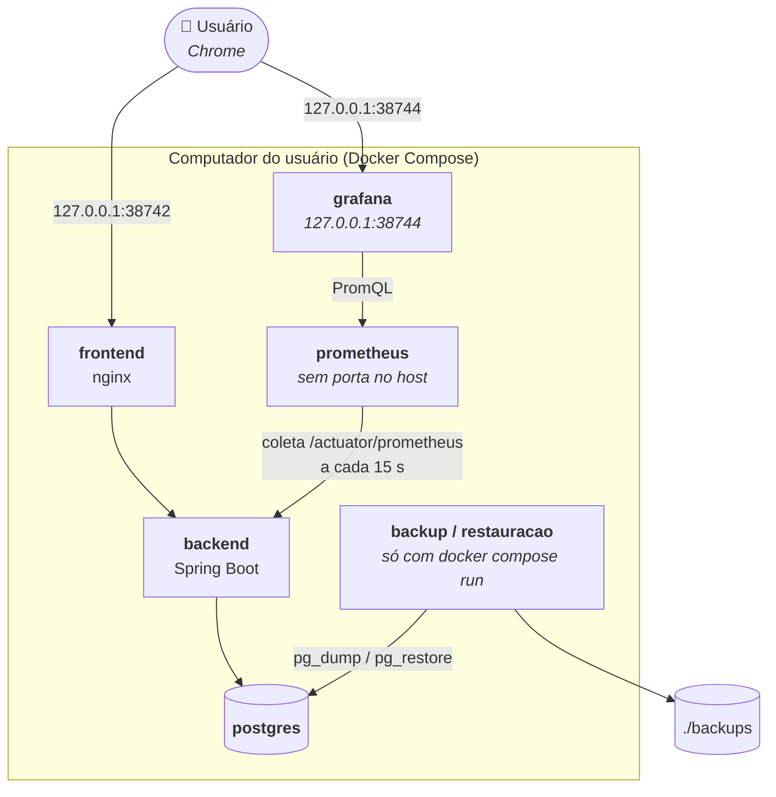

# Spec H5: Operar com métricas e backup (release v0.5.0)

> **Status:** aprovada pelo usuário em 2026-10-07, com as recomendações D1 a D12 da seção 11. Em implementação; progresso na seção 9.
> **Origem:** História 5 de [`docs/epico-pausa-ativa.md`](../epico-pausa-ativa.md).
> **Depende de:** H2 (v0.2.0). As métricas que o painel mostra vêm da H2 à H4, entregue em 2026-10-07.
> **Data:** 2026-10-07.

## 1. Objetivo

Ao fim desta release, o usuário:

- abre o **Grafana** em `127.0.0.1` e vê, sem configurar nada, um painel com os lembretes por situação, o atraso dos disparos e a saúde da aplicação;
- faz um **backup** do banco com um comando só, em qualquer terminal;
- **restaura** um backup e encontra o histórico como estava;
- recebe um erro claro, e nenhum arquivo vazio, se tentar o backup com o banco parado.

## 2. Escopo

| Dentro | Fora |
|---|---|
| Prometheus no compose, coletando o `/actuator/prometheus` do backend pela rede interna | Alertas (Alertmanager, notificação de métrica fora do limite) |
| Grafana no compose, com a fonte de dados e o painel provisionados como arquivos | Logs no Grafana (Loki): os logs seguem em JSON no `docker compose logs` |
| Histogramas nas métricas de tempo, para o painel mostrar o p95 contra os limites do épico | Taxa de sucesso no Grafana (D5): a oficial é a do Histórico |
| Backup e restauração por serviços do compose, iguais no PowerShell, no Git Bash, no Linux e no macOS | Backup automático agendado (D7) |
| Os dois serviços novos também no modo demonstração | Link para o painel na tela da aplicação (D12) |
| Verificação dos três cenários no CI, no job do compose | Mudanças no frontend |

## 3. Comportamento

### 3.1 Prometheus

| Item | Definição |
|---|---|
| Coleta | `backend:8080/actuator/prometheus` a cada 15 s, pela rede interna. O nginx continua devolvendo 404 para esse caminho no host. |
| Porta no host | Nenhuma **(D2)**. O Grafana lê o Prometheus pela rede interna. |
| Retenção | 90 dias ou 1 GB, o que vier primeiro **(D4)**, no volume `prometheus-dados` |
| Recursos | Limite de memória de 256 MB, conferido na verificação (T5) |
| Saúde | Healthcheck em `/-/ready`. O backend não depende do Prometheus: com ele fora, a aplicação segue igual. Com o backend fora, a métrica `up` vira 0, e o painel mostra isso. |
| Reinício do backend | Os contadores voltam a zero a cada subida. O painel usa `increase()` e `rate()`, que tratam o recomeço. |

Detalhes decididos na T2:

- **Imagem.** `prom/prometheus:v3.15.0`, a estável mais recente em 2026-10-07. A imagem só publica a tag completa, sem `v3.15`, e o Dependabot do compose acompanha as próximas.
- **Configuração.** O `command` repete o arquivo de configuração e o caminho dos dados, que a imagem já define, e acrescenta a retenção. O healthcheck usa o `wget` do BusyBox da imagem, a cada 5 s.
- **Demonstração.** Nada muda no `docker-compose.demo.yml`: o Prometheus não tem porta, e o projeto `pausa-ativa-demo` tem volume próprio.
- **CI.** O passo do nginx confere que o `/actuator/prometheus` responde 404 no host. Um passo novo consulta o Prometheus pela rede interna até ver o alvo `up` e a faixa de 200 ms do histograma das requisições, por até 60 s.
- **Medido na demonstração:** o alvo `up`, 492 séries com a tag `application`, 33 MiB de memória, nenhuma porta 9090 no host. O passo novo do CI rodou contra a demonstração num container com `jq`, e o workflow passou no `actionlint` (com `shellcheck`). No GitHub, o CI só roda com o pull request aberto.

### 3.2 Grafana e o painel

| Item | Definição |
|---|---|
| Endereço | `http://127.0.0.1:38744` (`GRAFANA_PORT` no `.env`); na demonstração, `38745` **(D2)** |
| Acesso | Anônimo, como leitor, sem tela de login **(D3)**. O painel abre direto na página inicial. |
| Provisionamento | A fonte de dados (Prometheus, com `uid` fixo) e o painel são arquivos do repositório, carregados na subida. Mudar o painel é mudar o JSON. |
| Sem internet | Desligados o relatório de uso, a busca de atualizações, o feed de notícias e a instalação de plugins: o épico diz que nada depende de serviço externo. |
| Aparência | Tema escuro, interface em português e as cores da identidade Sereno & Balanceado nas séries **(D10)** |
| Recursos | Limite de memória de 512 MB (medido na T3: com 256 MB, o Grafana 13 vivia no limite); volume `grafana-dados` para o banco interno do Grafana |

**Painel "Pausa Ativa".** O intervalo padrão é "hoje" (`now/d` até agora), e o seletor de tempo do Grafana troca para a semana ou o mês.

| Linha | Painel | O que mostra | Métrica | Limite marcado |
|---|---|---|---|---|
| Lembretes | Água por situação | Lembretes encerrados por situação, em barras empilhadas por hora (ou por dia, em intervalos longos) | `pausaativa.marcos.encerrados{categoria="HIDRATACAO"}` | — |
| | Exercício por situação | O mesmo, para o exercício | `pausaativa.marcos.encerrados{categoria="EXERCICIO"}` | — |
| | Atraso do disparo | p95 e máximo do atraso entre o instante calculado e o disparo, por categoria | `pausaativa.marcos.atraso.disparo` | 5 s (pontualidade do épico) |
| | No período | Lembretes disparados, adiados e corrigidos, e blocos montados | `pausaativa.marcos.disparados`, `.adiados`, `.corrigidos`, `pausaativa.blocos.montados` | — |
| | Abas conectadas | Conexões SSE abertas: sem nenhuma, os lembretes viram não entregues | `pausaativa.sse.conexoes` | — |
| Aplicação | Backend no ar | `up` do alvo: no ar ou fora | `up{job="pausa-ativa"}` | — |
| | Tempo das operações | p95 por rota da API, com as operações de lembrete em destaque | `http.server.requests` | 200 ms (performance do épico) |
| | Consulta do histórico | p95 por período | `pausaativa.historico.consultas` | 500 ms (agregação mensal do épico) |
| | Erros da API | Respostas 5xx por minuto | `http.server.requests{outcome="SERVER_ERROR"}` | — |
| | Memória da JVM | Heap usado e máximo, e o resto da memória da JVM | `jvm.memory.used`, `jvm.memory.max` | 384 MB, os 75% do limite de 512 MB do container |
| | CPU e pausas do GC | Uso de CPU do processo e tempo em pausa do GC | `process.cpu.usage`, `jvm.gc.pause` | — |
| | Conexões do banco | Conexões do Hikari ativas, ociosas e esperando | `hikaricp.connections.*` | — |

Cores das situações, iguais às dos gráficos do Histórico: concluído na cor da categoria (azul céu na água, teal no exercício), falha em coral, não entregue em cinza claro e não concluído em cinza médio. Os valores vêm dos tokens de `frontend/src/assets/main.css`, copiados para o JSON do painel.

Detalhes decididos na T3:

- **Imagem.** `grafana/grafana:13.2.3`, a estável mais recente em 2026-10-07, fixada na tag completa, como o Prometheus.
- **Arquivos.** As pastas de `observabilidade/grafana/provisioning` têm os nomes que o Grafana exige (`datasources`, `dashboards`, e `plugins` e `alerting` vazias, para o log não acusar erro). O painel fica em `observabilidade/grafana/paineis/pausa-ativa.json`, montado em `/etc/grafana/paineis`.
- **Página inicial.** O endereço raiz abre o painel: o Grafana o carrega como página inicial (`/d/default-home-dashboard/home`). O painel também tem o endereço fixo `/d/pausa-ativa`.
- **Sem internet.** Ficam desligados o relatório de uso, as buscas de atualização do Grafana e dos plugins, os links de feedback, o feed de notícias, os snapshots externos e a pré-instalação de plugins.
- **Sem alertas.** O motor de alertas também fica desligado, porque alertas estão fora desta versão.
- **Memória.** O Grafana 13 usa uns 250 MB de memória própria. Com o limite de 256 MB, ele vivia no limite, e o kernel reclamava memória o tempo todo. Com 512 MB, estabilizou em uns 340 MiB, sem aperto.
- **Séries que nascem zeradas.** O Micrometer só cria um medidor no primeiro evento, e a série já nasce valendo 1: o `increase()` do painel perdia esse primeiro evento depois de cada subida do backend. Agora a Agenda (contadores dos lembretes e dos blocos, e o atraso do disparo) e o Histórico (tempo da consulta de cada período) criam as séries zeradas na subida.
- **Barras da hora corrente.** O Grafana alinha o fim da consulta ao último intervalo cheio, então a hora corrente só apareceria quando terminasse. Cada barra mede o intervalo que começa no seu instante (`increase(...[$__interval] offset -$__interval)`), e a hora corrente aparece enquanto acontece.
- **Atraso do disparo.** Sem disparos no período, o painel diz "sem disparos". O p95 é estimado pelas faixas do histograma e pode passar um pouco do maior atraso medido; a descrição do painel diz isso.
- **Operações da API em tabela.** Com muitas rotas, as barras ficavam ilegíveis. A tabela fica ordenada pelo p95, com a cor do limite na célula.
- **D5 na prática.** As barras contam a resposta original: um lembrete corrigido de concluído para falha continua como concluído na barra, e a correção aparece em "Respostas corrigidas". A descrição dos painéis manda para a aba Histórico, que tem a taxa oficial.
- **CI.** Um passo novo confere o Grafana, o painel provisionado com os 15 itens (13 painéis e 2 linhas) aberto sem login, e roda as consultas do painel no Prometheus (29 depois da T5), com as variáveis do Grafana trocadas por valores fixos. Testado localmente contra a demonstração; uma consulta quebrada de propósito foi recusada, então o passo pega erro de verdade.
- **Na demonstração, com um dia ao vivo:** água com 2 concluídos, 1 falha e 13 não concluídos, e exercício com 1, 1 e 6, iguais ao que foi feito. Atraso do disparo abaixo de 1 s, backend no ar e todas as rotas abaixo de 200 ms.

Ajuste da T5:

- **Consulta do histórico em números.** O painel era uma barra por período. Com um período só (o comum no começo do dia), a barra ocupava o painel inteiro e o Grafana escondia o nome do período. Agora são três números, Dia, Semana e Mês, sempre com o nome e nessa ordem (uma consulta por período), em coral acima de 500 ms, como o atraso do disparo.

### 3.3 Backup

| Item | Definição |
|---|---|
| Comando | `docker compose run --rm backup` **(D6)** |
| O que faz | `pg_dump` em formato custom (comprimido), com a mesma imagem do banco (`postgres:18-alpine`): a versão do `pg_dump` sempre bate com a do servidor |
| Onde grava | `./backups/pausa-ativa-AAAA-MM-DD-HHMMSS.dump`, no fuso de São Paulo. A pasta muda com `BACKUP_DIR` no `.env` **(D8)**, por exemplo para uma pasta sincronizada com a nuvem. |
| Sem arquivo vazio | Grava primeiro em `.parcial` e só renomeia depois de o `pg_dump` terminar bem. Se falhar, apaga o parcial (Cenário 3). |
| Banco parado | O serviço não sobe o Postgres sozinho. Com o banco fora, termina com código 1 e a mensagem "O banco não respondeu. Suba a aplicação com `docker compose up -d --wait` e tente de novo." (Cenário 3) |
| Saída | O caminho do arquivo, o tamanho e quantas jornadas o backup tem |
| Frequência | Manual **(D7)**. O README sugere um backup por semana e uma cópia fora do computador. |

### 3.4 Restauração

| Item | Definição |
|---|---|
| Comando | `docker compose run --rm restauracao <arquivo>`, com o nome de um arquivo da pasta de backups |
| Antes | O backend precisa estar parado (`docker compose stop backend`). Com outra conexão aberta no banco, a restauração recusa e diz o comando **(D9)**. |
| Confirmação | Pergunta o que vai acontecer e pede para digitar `RESTAURAR`. Para scripts e para o CI, `--sim` pula a pergunta **(D9)**. |
| Rede de segurança | Se o banco tiver dados, grava antes um backup dele, `antes-da-restauracao-AAAA-MM-DD-HHMMSS.dump` **(D9)** |
| Como restaura | O esquema é apagado e recriado a partir do backup, numa transação só: ou volta tudo, ou nada muda (detalhes da T4 abaixo) |
| Depois | `docker compose up -d --wait`. O Flyway confere o esquema; um backup de uma versão anterior é migrado para a atual na subida. |
| Volume novo (Cenário 2) | `docker compose down -v`, `docker compose up -d --wait postgres`, a restauração e `docker compose up -d --wait`. Sem o backend no ar, ninguém escreve no banco vazio antes da restauração. |
| Saída | Quantas jornadas e qual o último dia do banco restaurado |

Detalhes decididos na T4:

- **Esquema recriado, em vez do `--clean`.** A restauração apaga o esquema `public` e o recria a partir do backup, na mesma transação. O `pg_restore --clean` só remove o que está no backup: uma tabela criada por uma versão mais nova sobraria, e o Flyway falharia ao migrar o backup. O "ou volta tudo, ou nada muda" continua valendo.
- **O backup vira SQL antes de tocar no banco.** Ligado direto ao `psql`, um arquivo corrompido no meio deixaria o `psql` confirmar a parte que chegou. Por isso, o `pg_restore` gera o SQL inteiro antes, e só então a transação começa.
- **Sem dependência do Postgres.** Os serviços `backup` e `restauracao` não declaram `depends_on`, e o `docker compose run` não sobe o banco sozinho: com o banco parado, o backup recusa de verdade (Cenário 3).
- **Mensagens.** Os scripts recebem o caminho da pasta no computador (`PASTA_DE_BACKUPS`) para dizer onde gravaram, rodam com `TZ=America/Sao_Paulo` para o nome do arquivo usar a hora local, e silenciam os avisos do `drop ... cascade`.
- **Linux.** Se a pasta de backups não existir, o Docker a cria como `root`. Os arquivos ficam legíveis (644), mas para apagá-los é preciso criar a pasta antes (`mkdir backups`). O README da T6 diz isso.
- **Verificação.** Os Cenários 2 e 3 estão em `.github/scripts/verificar-backup.sh`, que o CI roda na demonstração e que roda igual no Git Bash. O script também confere a recusa com o backend no ar, o cancelamento sem a confirmação e o backup de segurança ao restaurar por cima de dados. O `shellcheck` confere os três scripts no CI.
- **Rodado localmente na demonstração:** 30 jornadas, 720 marcos e 1.213 exercícios propostos; backup de 64 KB. A impressão digital do banco e o Histórico do mês voltaram iguais depois do `down -v`. No GitHub, a verificação roda quando o pull request abrir.

Ajustes da T5:

- **O backend para de forma limpa com uma aba aberta.** O `docker compose stop backend` terminava com SIGKILL (código 137) sempre que havia uma aba da aplicação aberta: o encerramento gracioso do Spring espera as requisições ativas terminarem, e a conexão SSE da aba nunca termina sozinha. Agora, ao receber o sinal de parada, o backend fecha as conexões SSE antes do encerramento gracioso, e para em menos de 1 s com o código 143. A aba reconecta sozinha quando o backend volta. O problema existia desde a H2; a T5 o achou porque a restauração pede essa parada. (No computador da verificação, o Docker dá 1 s antes do SIGKILL a qualquer container; o padrão é 10 s.)
- **A confirmação só olha as letras.** Pelo pipe do PowerShell 5.1, a resposta chega com um BOM antes da palavra e `\r\n` no fim, e `RESTAURAR` não era aceito. O script agora compara só as letras da resposta. Para scripts, o `--sim` continua sendo o caminho.

## 4. Arquitetura

Arquivos novos:

| Caminho | Conteúdo |
|---|---|
| `observabilidade/prometheus/prometheus.yml` | O alvo `pausa-ativa` (`backend:8080`, `/actuator/prometheus`, 15 s) |
| `observabilidade/grafana/provisioning/datasources/prometheus.yml` | A fonte de dados, com `uid: prometheus` |
| `observabilidade/grafana/provisioning/dashboards/pausa-ativa.yml` | Onde o Grafana procura os painéis |
| `observabilidade/grafana/paineis/pausa-ativa.json` | O painel da seção 3.2 |
| `scripts/backup.sh`, `scripts/restaurar.sh` | Os scripts que os serviços rodam, em `sh` (POSIX). Montados só para leitura e chamados com `sh`, sem depender do bit de execução no Windows. |

**No `docker-compose.yml`:** os serviços `prometheus` e `grafana`, sempre no ar **(D1)**, e `backup` e `restauracao` no perfil `ferramentas`, que o `up` não sobe; o `docker compose run` sobe o serviço pedido. O `grafana` espera o `prometheus` saudável. O `backend` não depende de nenhum dos dois.

**No `.env.example`:** `GRAFANA_PORT=38744` e `BACKUP_DIR=./backups`, ambos com padrão no compose. Um `.env` da v0.4.0 continua valendo sem mudança.

## 5. Métricas (backend)

O backend já publica as métricas (H2 a H4). Para o painel mostrar o p95 contra os limites do épico, as de tempo passam a publicar histogramas:

| Métrica | Histograma | Faixas que marcam os limites |
|---|---|---|
| `http.server.requests` | Sim, até 5 s | 200 ms |
| `pausaativa.marcos.atraso.disparo` | Sim, até 30 s | 1 s e 5 s |
| `pausaativa.historico.consultas` | Sim, até 5 s | 500 ms |

E todas ganham a tag `application="pausa-ativa"`. A configuração fica no `application.yml` (`management.metrics.distribution`). Nenhuma métrica de negócio nova.

O `/actuator/prometheus` continua fora do host: só o Prometheus, na rede interna, o lê.

Detalhes decididos na T1:

- **Mínimo de 1 ms no `http.server.requests`.** As chaves de `management.metrics.distribution` valem por prefixo, e a do `http.server.requests` também pega o `http.server.requests.active`, de tarefas longas, cujo mínimo padrão é de 2 min. Com o teto de 5 s abaixo desse mínimo, o Micrometer recusava a configuração na primeira requisição. O teste novo pegou o problema antes de ele chegar à aplicação.
- **Testes de integração com as métricas de produção.** O `@TesteDeIntegracao` ganhou o `@AutoConfigureMetrics`, porque o Spring Boot desliga o `/actuator/prometheus` nos testes. Ganhou também o `@AutoConfigureMockMvc`, que oferece um `MockMvcTester` com os filtros da aplicação: o `http.server.requests` é medido por um filtro, e o `MockMvcTester.from(contexto)` não passa por ele. Todos os testes de integração continuam num contexto só.
- **Teste.** O `MetricasPrometheusTest` faz uma requisição, uma consulta do Histórico e um disparo, lê o `/actuator/prometheus` e confere as faixas de 200 ms, 1 s, 5 s e 500 ms, os tetos e a tag `application` nas séries.

## 6. Modo demonstração

O `docker-compose.demo.yml` sobe os cinco serviços no projeto `pausa-ativa-demo`, com o Grafana em `127.0.0.1:38745`. Com um lembrete por minuto, o painel mostra um dia inteiro em 16 min. O histórico de exemplo da H4 não passa pelas métricas, então o painel começa vazio e enche com o dia ao vivo.

O backup e a restauração também funcionam na demonstração, com `-f docker-compose.yml -f docker-compose.demo.yml` antes do `run`. É assim que o CI confere o Cenário 2: o histórico de exemplo dá 45 dias de dados para o backup.

## 7. Segurança e recursos

- O Grafana só escuta em `127.0.0.1`. Sem login, qualquer programa do próprio computador pode ler o painel, como já acontece com a aplicação.
- O Prometheus e o Actuator completo continuam sem porta no host.
- Os backups ficam fora do git (`backups/` no `.gitignore` desde a H1). Eles têm os dados da aplicação e nenhuma senha.
- A stack sobe de três para cinco containers. A soma dos limites de memória passa de 512 MB (backend) para 1,28 GB (backend e Grafana com 512 MB, Prometheus com 256 MB). Na demonstração, a T3 mediu uns 380 MB a mais de uso real: o Grafana com uns 340 MiB e o Prometheus com uns 37 MiB. A T5 mediu uns 350 MiB a mais, com o painel aberto: o Grafana com 311 MiB (61% do limite) e o Prometheus com 39 MiB (15%); o backend ficou com 298 MiB, o Postgres com 44 MiB e o nginx com 15 MiB.

## 8. Critérios de aceitação: como cada um é verificado

| Cenário do épico | Teste automático | Verificação manual (T5) |
|---|---|---|
| 1. Dashboard pronto | Backend: o `/actuator/prometheus` publica os histogramas e as faixas da seção 5. CI: com a stack no ar, o alvo do Prometheus está `up`, o Grafana responde, o painel aparece na API do Grafana, e cada consulta do painel roda no Prometheus sem erro | Demonstração no Chrome: o painel abre sem login, com lembretes por situação, atraso do disparo e memória da JVM de um dia ao vivo; capturas |
| 2. Backup e restauração | CI, na demonstração: backup dos 45 dias de exemplo, `down -v`, restauração num volume novo e subida; a contagem e a impressão digital (`md5`) das jornadas e dos marcos, e o mês do Histórico pela API, iguais antes e depois | No PowerShell do Windows: backup, `down -v`, restauração e o Histórico conferido na tela |
| 3. Dump com banco parado | CI: com o Postgres parado, o backup termina com código diferente de zero, a mensagem da seção 3.3 e nenhum arquivo novo na pasta | O mesmo no PowerShell |

Também:

- O `shellcheck` confere os dois scripts no CI.
- A restauração recusa com o backend conectado, e pede a confirmação sem `--sim` (CI e manual).
- A aplicação continua no ar com o Prometheus e o Grafana parados (manual).

**Resultado da verificação (T5, 2026-10-08).** Na demonstração recriada com `down -v`, com o Chrome (headless, roteiro Playwright fora do repositório) e o PowerShell 5.1 do Windows:

| Cenário | O que foi feito | Resultado |
|---|---|---|
| 1. Dashboard pronto | Um dia ao vivo respondido pela tela, passando por todas as situações: água concluída, com falha, não entregue (aba fechada no disparo) e vencida no prazo; exercício adiado, concluído com o bloco seguinte e com falha; uma correção; o dia finalizado | O painel abre sem login na página inicial, no intervalo "hoje", em 1400 e 400 px. Os encerrados do Prometheus batem com a API, com a correção desfeita (D5): água 4 concluídos, 2 falhas, 1 não entregue e 9 não concluídos; exercício 2, 1, 0 e 5. No período: 10 disparados, 3 blocos, 1 adiado e 1 corrigido. Abas abertas em 0 com a aba fechada. Atraso do disparo com p95 de 783 ms e máximo de 798 ms. Rotas da API abaixo de 37 ms. Com o backend parado, o painel mostra "Fora do ar". |
| 2. Backup e restauração | No PowerShell: backup, `down -v`, só o Postgres no ar, restauração com a confirmação e subida | Backup de 64 KB com 31 jornadas. Impressão digital do banco (31 jornadas, 744 marcos, 1.262 exercícios) igual antes e depois. O Histórico do mês igual na tela e na API. O Flyway validou as 5 migrações. |
| 3. Dump com banco parado | No PowerShell: Postgres parado e backup | Código 1, a mensagem da seção 3.3, nenhum arquivo novo, e o Postgres continuou parado. |

Também: a restauração recusou com o backend no ar e cancelou com outra resposta que não `RESTAURAR`. Com o Prometheus e o Grafana parados, a aplicação respondeu normalmente, sem erro no log. A verificação do CI (`verificar-backup.sh`) passou de novo pelo Git Bash, depois dos ajustes. A T5 achou e corrigiu três problemas: a parada do backend com uma aba aberta e a confirmação pelo pipe do PowerShell (seção 3.4), e o painel da consulta do histórico (seção 3.2).

## 9. Plano de entrega em etapas

Branch `feat/h5-metricas-e-backup`. A execução para ao fim de cada etapa, e a próxima sessão retoma pela primeira etapa sem ✅.

| # | Etapa | Pronto quando | Status |
|---|---|---|---|
| T1 | Backend: histogramas e faixas das métricas de tempo, tag `application` | `verify` verde; teste de integração lendo o `/actuator/prometheus` | ✅ 2026-10-07 (4 testes novos; 258 no backend). Detalhes na seção 5. |
| T2 | Prometheus no compose e na demonstração: configuração, volume, retenção, limite de memória e healthcheck | `docker compose up -d --wait` com o alvo `up`; o CI confere | ✅ 2026-10-07 (na demonstração: alvo `up`, 492 séries, 33 MiB). Detalhes na seção 3.1. |
| T3 | Grafana: fonte de dados e painel provisionados, acesso anônimo, sem internet, em português e com a paleta | O painel abre sem login com dados; o CI confere o painel e as consultas | ✅ 2026-10-07 (2 testes novos, 260 no backend; painel conferido no Chrome com um dia ao vivo na demonstração). Detalhes na seção 3.2. |
| T4 | Backup e restauração: scripts, serviços `backup` e `restauracao`, `BACKUP_DIR`, `shellcheck` | Cenários 2 e 3 no CI, com a demonstração | ✅ 2026-10-07 (verificação em script, rodada localmente contra a demonstração; no GitHub, roda com o PR). Detalhes na seção 3.4. |
| T5 | Verificação ponta a ponta: Grafana no Chrome com um dia ao vivo, backup e restauração no PowerShell, banco parado, memória dos cinco containers | Cenários 1 a 3 conferidos, com capturas | ✅ 2026-10-08 (1 teste novo, 261 no backend; três ajustes). Resultado na seção 8. |
| T6 | README, C4 (Prometheus e Grafana deixam de ser planejados), release notes, PR e CI | Aceite do usuário; merge e tag `v0.5.0` | Pendente |

## 10. Riscos

| Risco | Como a spec trata |
|---|---|
| Os contadores recomeçam a cada subida do backend | O painel usa `increase()` e `rate()`; o número oficial do dia continua no Histórico |
| Histogramas multiplicam as séries | Faixas limitadas (até 5 s ou 30 s) e só três métricas; com um usuário, são poucas centenas de séries |
| Script com CRLF quebra no container | O `.gitattributes` normaliza para LF, e os scripts são chamados com `sh` |
| Restaurar por cima de dados novos sem querer | Confirmação digitada e backup automático do banco atual antes de restaurar |
| Backup no mesmo disco da aplicação | O README recomenda uma cópia fora do computador, e o `BACKUP_DIR` aponta para outra pasta |

## 11. Decisões para o usuário confirmar

Lacunas que o épico não decidia. A recomendação vem primeiro.

| # | Decisão | Recomendação | Alternativa |
|---|---|---|---|
| D1 | Quando o Prometheus e o Grafana sobem | **Sempre, com a aplicação** (`docker compose up`), como o épico desenha a stack. Custo estimado na spec: até ~500 MB a mais de limite de memória. Medido na T3: 768 MB a mais de limite e uns 380 MB a mais de uso real | Num perfil opcional (`--profile observabilidade`), ligado só quando quiser ver o painel |
| D2 | Portas | **Grafana em `127.0.0.1:38744`** (demonstração: `38745`); **Prometheus sem porta**, lido só pelo Grafana | Expor também o Prometheus em `127.0.0.1`, para consultas avulsas |
| D3 | Acesso ao Grafana | **Anônimo, como leitor, sem login.** O painel é código: mudar é mudar o JSON | Login de administrador, com a senha no `.env`, para editar o painel pela tela |
| D4 | Quanto tempo de métricas guardar | **90 dias ou 1 GB.** O histórico de negócio fica no banco, sem limite | O padrão do Prometheus, 15 dias |
| D5 | Taxa de sucesso no Grafana | **Não.** As métricas contam o encerramento e não acompanham as correções; a taxa oficial é a do Histórico, que lê o banco | Calcular a taxa a partir dos contadores, sabendo que ela pode divergir do Histórico |
| D6 | Como rodar o backup e a restauração | **Serviços do compose** (`docker compose run --rm backup`): o mesmo comando em qualquer terminal, só com o Docker | Scripts no computador, um `.sh` e um `.ps1` para cada operação |
| D7 | Backup automático | **Manual**, por comando, com a sugestão de um por semana no README | Um serviço que faz backup todo dia e guarda os últimos 7 |
| D8 | Onde ficam os backups | **`./backups`, configurável com `BACKUP_DIR`** no `.env` | Sempre em `./backups` |
| D9 | Proteções da restauração | **Exige o backend parado, pede a confirmação digitada e guarda antes um backup do banco atual** | Restaurar direto, sem perguntar |
| D10 | Aparência do painel | **Tema escuro, interface em português e as cores da identidade** | O padrão do Grafana |
| D11 | Verificação no CI | **Estender o job do compose** com os três cenários, usando a demonstração para ter dados (alguns minutos a mais de CI) | Verificar só manualmente |
| D12 | Link para o painel na aplicação | **Não nesta release.** O endereço fica no README; a porta é configurável, e a tela não a conhece | Um link "Painel de métricas" no rodapé |
